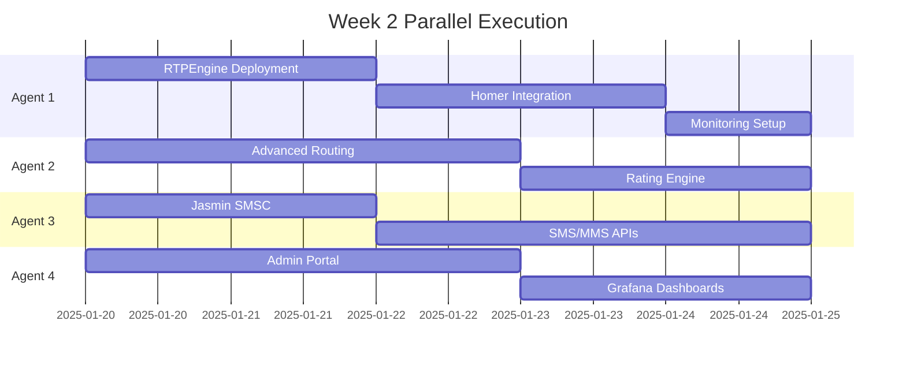

# Claude Flow Hive-Mind Execution Plan for WARP Platform

## What Will Happen When We Deploy Hive-Mind

### Initial Phase (Hours 1-4): Project Analysis & Planning

#### All Agents Simultaneously:
1. **Digest Documentation**
   - Read all 2000+ lines of PRD
   - Analyze 17 external service dependencies
   - Review architectural decisions
   - Map integration matrix

2. **Identify Dependencies & Blockers**
   - Flag missing API keys
   - Note unclear requirements
   - List architectural decisions needed
   - Identify service dependencies

3. **Create Work Breakdown**
   - Each agent creates their task list
   - Identifies interface contracts needed
   - Sets up mock services for parallel work

### Day 1-2: Foundation Sprint

#### Agent 1 (Infrastructure) will:
```yaml
Morning:
- Create GCP project structure via Terraform
- Deploy Cloud SQL instances
- Set up Redis clusters
- Configure VPC networking

Afternoon:
- Deploy GKE cluster with Autopilot
- Set up Cloud Load Balancer
- Configure Cloud Armor DDoS protection
- Create BigQuery datasets and tables

Output: Complete infrastructure ready for services
```

#### Agent 2 (Core Services) will:
```yaml
Morning:
- Generate OpenAPI server stubs
- Implement Auth0 JWT validation
- Create customer CRUD endpoints
- Build trunk management APIs

Afternoon:
- Integrate Telique for LRN lookups
- Implement basic routing logic
- Create mock LCR algorithm
- Set up Prometheus metrics

Output: Core API framework with auth working
```

#### Agent 3 (Integrations) will:
```yaml
Morning:
- Configure HubSpot CRM connection
- Set up NetSuite sandbox
- Initialize Avalara tax service
- Create payment processor stubs

Afternoon:
- Configure Sinch SMPP binds
- Set up TCR integration
- Initialize Somos connection
- Create SendGrid templates

Output: All external services connected (sandbox mode)
```

#### Agent 4 (Frontend) will:
```yaml
Morning:
- Set up Next.js project structure
- Configure Vercel deployment
- Implement Auth0 frontend SDK
- Create component library

Afternoon:
- Build login/authentication flow
- Create dashboard layout
- Implement trunk management UI
- Set up WebSocket connections

Output: Basic portal with auth and navigation
```

### Day 3-7: Core Implementation

#### What Will Be Built:

**Kamailio Configuration (Agent 1)**
- Database-driven routing
- HEP integration for Homer
- Partition-based routing logic
- Rate limiting implementation

**API Services (Agent 2)**
- Complete REST API per OpenAPI spec
- Real-time CDR streaming to BigQuery
- LCR algorithm with zone detection
- WebSocket for real-time updates

**Integration Layer (Agent 3)**
- HubSpot bidirectional sync
- NetSuite invoice generation
- Authorize.Net payment flow
- TCR campaign registration API

**Customer Portal (Agent 4)**
- Complete trunk management UI
- CDR search and export
- Billing dashboard
- Support ticket creation

### Week 2: Advanced Features

#### Parallel Execution:



### Expected Challenges & Solutions

#### 1. Service Dependencies Conflicts
**Problem**: Agent 2 needs database schemas from Agent 1
**Solution**: Agent 1 prioritizes schema creation in first 2 hours

#### 2. API Contract Mismatches
**Problem**: Frontend expecting different API responses
**Solution**: OpenAPI spec is single source of truth, mock servers for development

#### 3. External Service Delays
**Problem**: Waiting for Sinch SMPP credentials
**Solution**: Agent 3 uses mock SMPP server, swaps later

#### 4. Integration Timing
**Problem**: HubSpot webhooks need public URL
**Solution**: Use ngrok tunnels during development

### Code Generation Patterns

#### Agent 1 will generate:
```bash
terraform/
├── modules/
│   ├── gcp-network/
│   ├── gke-cluster/
│   ├── cloud-sql/
│   └── bigquery/
└── environments/
    ├── dev/
    ├── staging/
    └── production/
```

#### Agent 2 will generate:
```go
// Sophisticated routing logic
package routing

type LCREngine struct {
    telique    *TeliquClient
    rateCache  *RateCache
    partitions map[string]*Partition
}

func (e *LCREngine) FindBestRoute(call *CallRequest) (*Route, error) {
    // 1. LRN lookup via Telique
    lrnData := e.telique.LookupLRN(call.CalledNumber)

    // 2. Determine zone (interstate/intrastate/local)
    zone := e.calculateZone(call.CallingNumber, lrnData)

    // 3. Get partition routes
    routes := e.partitions[call.CustomerPartition].GetRoutes()

    // 4. Filter by rate limits and availability
    validRoutes := e.filterRoutes(routes, zone, call.RateLimit)

    // 5. Sort by cost
    sort.Sort(ByCost(validRoutes))

    return validRoutes[0], nil
}
```

#### Agent 3 will generate:
```python
# Jasmin SMSC configuration
class JasminConnector:
    def __init__(self):
        self.sinch_binds = [
            SMPPBind("primary", "smpp.sinch.com", 2775),
            SMPPBind("backup", "smpp2.sinch.com", 2775)
        ]
        self.tcr_client = TCRClient(api_key=os.getenv("TCR_API_KEY"))

    async def send_sms(self, message: SMSMessage) -> DeliveryReceipt:
        # Check campaign registration
        if not self.tcr_client.is_registered(message.from_number):
            raise UnregisteredCampaignError()

        # Route to best SMPP bind
        bind = self.select_bind(message)
        return await bind.submit_sm(message)
```

#### Agent 4 will generate:
```typescript
// Real-time dashboard component
export function CallMetricsDashboard() {
  const [metrics, setMetrics] = useState<Metrics>()

  useEffect(() => {
    const ws = new WebSocket(process.env.NEXT_PUBLIC_WS_URL)

    ws.on('metrics_update', (data) => {
      setMetrics({
        activeCalls: data.active_calls,
        asr: data.asr,
        acd: data.acd,
        currentSpend: data.mtd_spend
      })
    })

    return () => ws.close()
  }, [])

  return (
    <MetricsGrid>
      <MetricCard title="Active Calls" value={metrics?.activeCalls} />
      <MetricCard title="ASR" value={`${metrics?.asr}%`} />
      <MetricCard title="ACD" value={`${metrics?.acd}min`} />
      <MetricCard title="MTD Spend" value={`$${metrics?.currentSpend}`} />
    </MetricsGrid>
  )
}
```

### Testing & Validation

#### Automated Testing Generated:
- **Unit tests**: 80% coverage minimum
- **Integration tests**: Every API endpoint
- **E2E tests**: Critical user journeys
- **Load tests**: 1000 CPS target

#### Continuous Validation:
```yaml
# Every commit triggers:
1. Linting and formatting
2. Unit test suite
3. API contract validation
4. Security scanning
5. Deploy to review environment
```

### Production Readiness Checklist

By end of Week 2, Hive-Mind will have:

✅ **Infrastructure**
- [ ] GKE cluster with 99.9% SLA
- [ ] Multi-zone Cloud SQL
- [ ] Redis with automatic failover
- [ ] BigQuery streaming pipeline

✅ **Core Platform**
- [ ] Kamailio handling 1000 CPS
- [ ] RTPEngine with transcoding
- [ ] Homer capturing all SIP
- [ ] Prometheus monitoring everything

✅ **APIs**
- [ ] 100% OpenAPI compliance
- [ ] Sub-200ms response times
- [ ] Rate limiting per customer
- [ ] WebSocket real-time updates

✅ **Integrations**
- [ ] HubSpot CRM syncing
- [ ] NetSuite invoicing
- [ ] Payment processing
- [ ] SMS/MMS working

✅ **Frontend**
- [ ] Customer portal at console.ringer.tel
- [ ] Admin portal at admin.ringer.tel
- [ ] Mobile responsive
- [ ] Real-time dashboards

### What Won't Be Perfect

#### Known Limitations:
1. **LCR optimization** - Basic algorithm, needs tuning
2. **Billing edge cases** - Complex scenarios need iteration
3. **UI polish** - Functional but not beautiful
4. **Documentation** - Auto-generated, needs human review
5. **Performance** - Not optimized, needs profiling

### Success Metrics

#### After 2 Weeks:
- **Code generated**: ~50,000 lines
- **APIs implemented**: 100+ endpoints
- **Test coverage**: 70-80%
- **Services deployed**: 15+ microservices
- **Integrations working**: 17 external services
- **Documentation**: 200+ pages auto-generated

### Post Hive-Mind Human Tasks

#### Week 3-4 Human Work:
1. **Security audit** - Penetration testing
2. **Performance tuning** - Optimize hot paths
3. **UI/UX polish** - Design improvements
4. **Documentation review** - Make human-friendly
5. **Production hardening** - Error handling edge cases

### Risk Mitigation

#### If Hive-Mind Gets Stuck:

**Scenario 1**: Can't get SMPP bind working
- **Solution**: Falls back to Sinch REST API

**Scenario 2**: NetSuite integration too complex
- **Solution**: Implements CSV export for manual import

**Scenario 3**: Kamailio routing errors
- **Solution**: Implements simple routing, documents complex cases

**Scenario 4**: Performance targets not met
- **Solution**: Documents bottlenecks for human optimization

### The Reality

**What Hive-Mind Excels At:**
- Boilerplate code generation
- API implementation from specs
- Database schema creation
- Integration plumbing
- Test generation
- Documentation
- Configuration files
- Deployment scripts

**What Humans Must Do:**
- Validate business logic
- Optimize performance
- Handle edge cases
- Security hardening
- UI/UX refinement
- Production operations
- Customer support
- Business decisions

### Final Output Structure

```
ringer-warp/
├── services/           # 15+ microservices
├── frontend/          # Customer portal
├── admin-frontend/    # Admin portal
├── infrastructure/    # Complete IaC
├── database/         # All schemas
├── docs/            # Generated documentation
├── tests/           # Comprehensive test suite
├── monitoring/      # Dashboards & alerts
├── scripts/         # Deployment automation
└── .github/         # CI/CD pipelines
```

### Estimated Timeline

- **Hour 1-4**: Planning and setup
- **Day 1-2**: Foundation (30% complete)
- **Day 3-7**: Core platform (70% complete)
- **Week 2**: Advanced features (95% complete)
- **Week 3-4**: Human refinement (100% production ready)

---

*Hive-Mind will deliver a functional MVP in 2 weeks that needs 2 more weeks of human refinement for production readiness.*