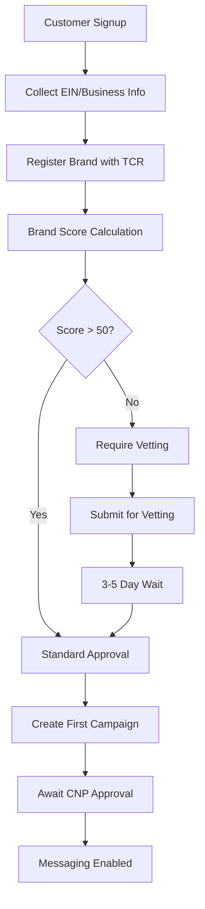
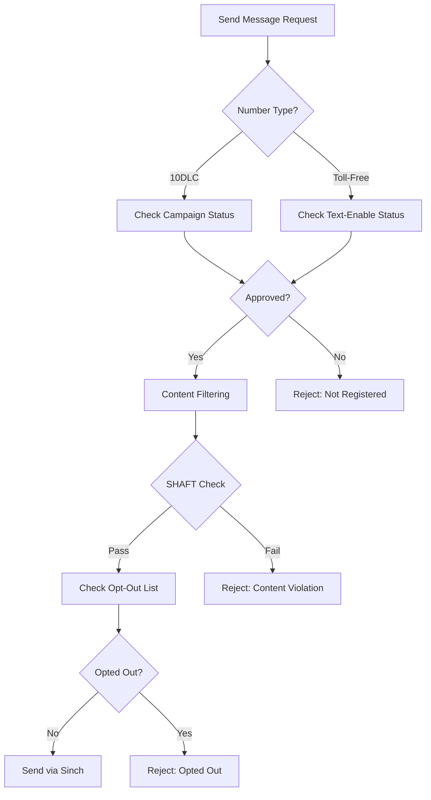

# SMS Compliance Requirements for WARP Platform

## Overview
SMS messaging in the US requires strict compliance with carrier regulations, particularly for A2P (Application-to-Person) messaging. This document outlines all compliance requirements and integration points.

## 10DLC (10-Digit Long Code) Requirements

### The Campaign Registry (TCR) Integration

#### Brand Registration Process
1. **Customer Onboarding**
   ```javascript
   POST /api/v1/messaging/brands
   {
     "company_name": "Customer Corp",
     "ein": "12-3456789",
     "company_type": "PRIVATE_PROFIT",
     "address": {...},
     "website": "https://customer.com",
     "vertical": "TECHNOLOGY",
     "contact": {...}
   }
   ```

2. **Brand Vetting** (Required for higher throughput)
   - Standard brands: 4,500 msgs/day
   - Vetted brands: 225,000 msgs/day
   - Cost: $40 one-time vetting fee
   - Timeline: 3-5 business days

3. **Campaign Registration**
   ```javascript
   POST /api/v1/messaging/campaigns
   {
     "brand_id": "BRAND123",
     "use_case": "2FA",
     "sub_use_case": "OTP",
     "description": "Two-factor authentication codes",
     "sample_messages": [
       "Your verification code is 123456"
     ],
     "message_volume": 50000,
     "opt_in_keywords": ["START", "YES"],
     "opt_out_keywords": ["STOP", "UNSUBSCRIBE"],
     "help_keywords": ["HELP", "INFO"]
   }
   ```

#### Use Case Categories
- **Standard Use Cases** ($10/month):
  - 2FA/OTP
  - Account notifications
  - Customer care
  - Delivery notifications
  - Marketing

- **Special Use Cases** ($15/month):
  - Charity
  - Emergency alerts
  - Political
  - Social

#### Compliance Requirements
1. **Opt-in/Opt-out Management**
   - Mandatory STOP processing
   - HELP message responses
   - Opt-out list maintenance
   - 48-hour removal SLA

2. **Message Content Filtering**
   - SHAFT compliance (Sex, Hate, Alcohol, Firearms, Tobacco)
   - URL shortener restrictions
   - Shared short code prohibited
   - Affiliate marketing restrictions

## Toll-Free SMS Requirements

### Somos Integration

#### RespOrg Requirements
1. **RespOrg Certification**
   - FCC Form 499 Filer
   - $5,000 security deposit
   - 24x7 support capability
   - Quarterly fee payments

2. **Toll-Free Provisioning**
   ```javascript
   POST /api/v1/numbers/tollfree
   {
     "pattern": "833****000",  // Vanity search
     "quantity": 1,
     "features": {
       "sms_enabled": true,
       "voice_enabled": true,
       "verified_calling": true
     },
     "routing": {
       "primary": "sip:tf@warp.ringer.tel",
       "disaster": "tel:+13035551234"
     }
   }
   ```

3. **Text-Enable Process**
   - Register with Somos texting registry
   - No campaign registration required (unlike 10DLC)
   - Immediate activation
   - Higher throughput (3 msgs/second)

#### Toll-Free Advantages
- No TCR registration required
- Higher default throughput
- Better deliverability
- National presence
- Trusted by consumers

## Implementation Requirements

### Customer Portal Features

1. **Brand Management**
   - Brand registration wizard
   - Vetting status tracking
   - EIN verification
   - Business documentation upload

2. **Campaign Management**
   - Campaign creation workflow
   - Use case selection
   - Sample message library
   - Throughput monitoring

3. **Compliance Dashboard**
   - Opt-out rate monitoring
   - SHAFT violation alerts
   - Campaign approval status
   - Monthly volume tracking

### API Endpoints Required

```yaml
# Brand Management
POST   /api/v1/messaging/brands
GET    /api/v1/messaging/brands
PUT    /api/v1/messaging/brands/{id}
POST   /api/v1/messaging/brands/{id}/vet

# Campaign Management
POST   /api/v1/messaging/campaigns
GET    /api/v1/messaging/campaigns
PUT    /api/v1/messaging/campaigns/{id}
DELETE /api/v1/messaging/campaigns/{id}
POST   /api/v1/messaging/campaigns/{id}/share

# Compliance
GET    /api/v1/messaging/compliance/optouts
POST   /api/v1/messaging/compliance/optouts
DELETE /api/v1/messaging/compliance/optouts/{number}
GET    /api/v1/messaging/compliance/violations

# Toll-Free
POST   /api/v1/numbers/tollfree/search
POST   /api/v1/numbers/tollfree/provision
POST   /api/v1/numbers/tollfree/{number}/textenable
PUT    /api/v1/numbers/tollfree/{number}/routing
```

## Compliance Workflows

### New Customer Onboarding


### Message Sending Flow


## Monitoring & Reporting

### Required Metrics
1. **Campaign Performance**
   - Messages sent/delivered
   - Opt-out rates (must be < 5%)
   - Error rates by campaign
   - Throughput utilization

2. **Compliance Metrics**
   - SHAFT violations
   - Opt-out response time
   - Campaign approval rate
   - Brand trust scores

3. **Financial Metrics**
   - TCR fees ($15/brand, $10/campaign)
   - Somos fees ($2/number/month)
   - Carrier surcharges ($0.002/msg)
   - Pass-through fees tracking

## Timeline & Costs

### 10DLC Setup Timeline
- Day 1: Brand registration
- Day 1-3: Brand approval (if score > 50)
- Day 4-8: Brand vetting (if required)
- Day 9: Campaign creation
- Day 10-12: CNP sharing and approval
- Day 13: Ready for messaging

### Toll-Free Setup Timeline
- Day 1: Number provisioning
- Day 1: Text-enablement
- Day 1: Ready for messaging

### Monthly Costs Per Customer
- **10DLC**: $15 (brand) + $10 × campaigns
- **Toll-Free**: $2 × numbers + RespOrg fees
- **Compliance**: Staff time for monitoring

## Risk Mitigation

### Common Violations to Prevent
1. Sending without registration (immediate suspension)
2. Ignoring opt-outs (FCC fines up to $1,500/msg)
3. SHAFT content (campaign suspension)
4. Exceeding throughput (throttling/blocking)
5. URL shorteners in messages (filtering)

### Best Practices
1. Always register before sending
2. Implement double opt-in
3. Process opt-outs in real-time
4. Monitor delivery rates
5. Maintain clean sending reputation

---
*Compliance is mandatory. Non-compliance results in immediate suspension and potential FCC fines.*