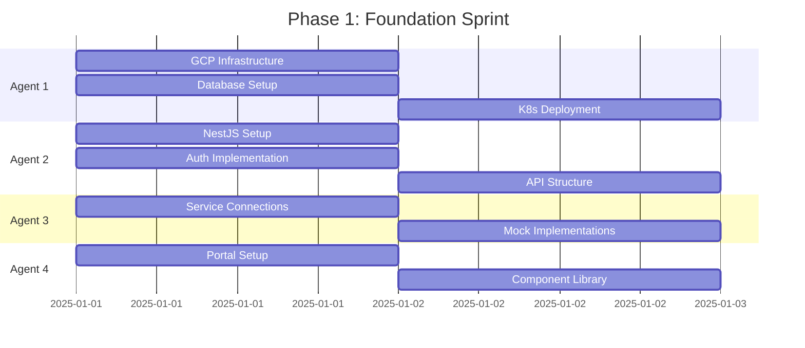
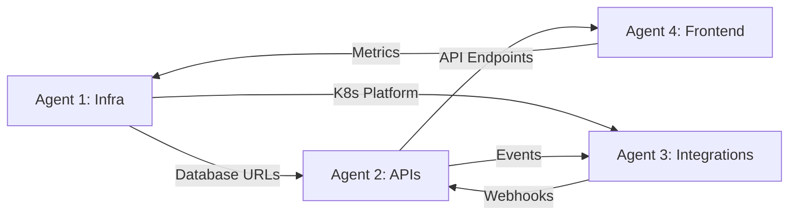

# Hive-Mind Orchestration Guide for WARP Platform

## Project Status: READY FOR EXECUTION ✅

### Prerequisites Completed
- ✅ GCP Project: `ringer-472421`
- ✅ Framework Decisions: NestJS + Prisma + npm
- ✅ Database Schemas: PostgreSQL defined
- ✅ API Documentation: 100% coverage (except deferred ACH)
- ✅ Frontend Structure: Dual portals configured
- ✅ Development Environment: `.env.development` template ready
- ✅ SIP Network Architecture: Shared infrastructure, IP strategy defined

## Agent Assignment & Responsibilities

### Agent 1: Infrastructure & Data Foundation
**Ownership**: Database, GCP infrastructure, CI/CD, Terraform, Kubernetes

**Key Directories**:
- `/warp/terraform/` - Infrastructure as Code
- `/warp/database/schemas/` - PostgreSQL schema (exists)
- `/docker/` - Docker compose files (exists)
- `/.github/workflows/` - CI/CD pipelines (to create)

**Primary Tasks**:
1. Deploy GCP infrastructure using Terraform
2. Set up Cloud SQL with PostgreSQL schema
3. Configure BigQuery for CDR/MDR streaming
4. Create CI/CD pipelines for automated deployment
5. Set up Kubernetes manifests for all services

### Agent 2: Core Services & Business Logic
**Ownership**: API Gateway, Routing Engine, Rating Engine, Core Business Logic

**Key Directories**:
- `/warp/services/api-gateway/` - Main API service (to create)
- `/warp/services/routing-engine/` - LCR implementation (to create)
- `/warp/services/billing-engine/` - Rating & billing (to create)
- `/warp/services/trunk-manager/` - Trunk CRUD (to create)

**Primary Tasks**:
1. Implement NestJS API structure with Prisma ORM
2. Build hybrid authentication system:
   - Google Identity Platform for portals (OAuth2)
   - JWT caching in Redis for management APIs
   - API key validation via Cloud Armor for Telco APIs
3. Create trunk management APIs (customer & vendor)
4. Implement LCR routing algorithm
5. Build real-time rating engine

### Agent 3: Integrations & External Systems
**Ownership**: All external service integrations

**Key Directories**:
- `/warp/services/integrations/hubspot/` - CRM sync (to create)
- `/warp/services/integrations/netsuite/` - ERP/billing (to create)
- `/warp/services/integrations/sinch/` - SMS gateway (to create)
- `/warp/services/integrations/telique/` - LRN/LERG (to create)
- `/warp/services/integrations/somos/` - Toll-free (to create)

**Primary Tasks**:
1. HubSpot CRM bidirectional sync
2. NetSuite invoice generation and sync
3. Authorize.Net payment processing
4. Sinch SMS/MMS integration
5. Telique LRN/LERG lookups
6. Somos toll-free management

### Agent 4: Frontend & Monitoring
**Ownership**: Customer portal, Admin portal, Monitoring

**Key Directories**:
- `/customer-frontend/` - Customer portal (exists, needs connection)
- `/admin-frontend/` - Admin portal (exists, needs implementation)
- `/warp/monitoring/` - Prometheus/Grafana configs (to create)
- `/warp/k8s/homer/` - SIP capture setup (partial)

**Primary Tasks**:
1. Complete customer portal API integration
2. Build admin portal for trunk management
3. Implement real-time dashboards
4. Deploy Homer for SIP capture
5. Create Grafana dashboards from Prometheus metrics

## Execution Timeline

### Phase 0: Initial Setup (Hours 1-4)
All agents work in parallel:
- Read all documentation
- Set up development environment
- Create service skeletons
- Define API contracts

### Phase 1: Foundation (Days 1-2)


### Phase 2: Core Implementation (Days 3-7)
- Agent 1: Kamailio configuration, RTPEngine deployment
- Agent 2: Complete CRUD APIs, LCR algorithm
- Agent 3: Real service integrations replacing mocks
- Agent 4: Feature implementation in both portals

### Phase 3: Integration (Week 2)
- Cross-service testing
- Performance optimization
- Documentation generation
- Production hardening

## Inter-Agent Communication

### Coordination Files
```yaml
/docs/coordination/
├── INTERFACES.md      # API contracts between services
├── DECISIONS.md       # Architectural decisions log
├── BLOCKERS.md        # Issues requiring resolution
└── PROGRESS.md        # Daily status updates
```

### Dependency Management


## Success Criteria

### Week 1 Deliverables
- [ ] GCP infrastructure operational
- [ ] Database schemas deployed and seeded
- [ ] Authentication working end-to-end
- [ ] Basic CRUD APIs for customers/trunks
- [ ] Customer portal login functional
- [ ] Admin portal structure complete

### Week 2 Deliverables
- [ ] LCR routing algorithm working
- [ ] CDR pipeline to BigQuery
- [ ] HubSpot sync operational
- [ ] SMS sending functional
- [ ] Real-time dashboards
- [ ] Homer capturing SIP traffic

### Final Checklist
- [ ] All 100+ API endpoints implemented
- [ ] 70%+ test coverage
- [ ] Documentation auto-generated
- [ ] Monitoring & alerting configured
- [ ] Security scan passed
- [ ] Load test achieving 1000 CPS

## Known Constraints & Mitigations

### Technical Constraints
1. **Complex Kamailio routing**: Preserve existing SQL procedures, wrap in APIs
2. **External service dependencies**: Use mocks initially, swap when ready
3. **Performance requirements**: Optimize after functional completion

### Resource Constraints
1. **API rate limits**: Implement caching layer
2. **Development credentials**: Use sandbox/mock where production not available
3. **Testing environments**: Use Docker for local testing

## Project Structure

```
ringer-warp/
├── customer-frontend/      # Customer portal (React/Next.js)
├── admin-frontend/         # Admin portal (React/Next.js)
├── warp/
│   ├── api/               # OpenAPI specifications
│   ├── database/          # Schemas and migrations
│   ├── services/          # Microservices (NestJS)
│   ├── terraform/         # Infrastructure as Code
│   ├── k8s/              # Kubernetes manifests
│   └── monitoring/        # Observability configs
├── docker/                # Docker compose files
├── docs/
│   ├── api_docs/         # External API documentation
│   └── coordination/      # Agent coordination files
└── .env.development       # Development configuration
```

## Critical Path Items

### Must Complete First (Blocking Others)
1. Database schemas (Agent 1) → Blocks all API development
2. API structure (Agent 2) → Blocks frontend development
3. Authentication (Agent 2) → Blocks all secured endpoints
4. GCP project (Agent 1) → Blocks all cloud resources

### Can Parallelize
- Frontend components (Agent 4)
- External service mocks (Agent 3)
- Monitoring setup (Agent 4)
- Documentation (All agents)

## Risk Management

### High Risk Items
1. **Kamailio routing complexity**: May need human expertise
2. **NetSuite integration**: Complex authentication/setup
3. **Performance targets**: May not hit 1000 CPS initially

### Mitigation Strategies
- Start with simple implementations
- Document complex areas for human review
- Use existing SQL procedures where possible
- Implement caching aggressively

## Post Hive-Mind Requirements

### Human Tasks (Week 3-4)
1. Security audit and penetration testing
2. Performance optimization of hot paths
3. UI/UX polish and design system
4. Complex business logic validation
5. Production deployment and monitoring

### Expected Output
- ~50,000 lines of code
- 15+ microservices
- 100+ API endpoints
- Comprehensive test suite
- Full documentation
- Working MVP platform

## Environment Variables Required

Critical configs needed in `.env.development`:
```bash
# GCP (Required)
GCP_PROJECT_ID=ringer-472421
GCP_SERVICE_ACCOUNT_KEY_PATH=/path/to/key.json

# Database (Required)
POSTGRES_HOST=localhost:5432
POSTGRES_DB=warp_dev
POSTGRES_USER=warp_dev
POSTGRES_PASSWORD=[FILL_IN]

# Auth (Required)
FIREBASE_AUTH_DOMAIN=[FILL_IN]
FIREBASE_API_KEY=[FILL_IN]
FIREBASE_PROJECT_ID=[FILL_IN]

# External Services (Can mock if not available)
TELIQUE_API_KEY=[FILL_IN or set MOCK_LRN_LOOKUPS=true]
HUBSPOT_API_KEY=[FILL_IN or set MOCK_EXTERNAL_SERVICES=true]
SINCH_APP_KEY=[FILL_IN or set MOCK_SMS_PROVIDER=true]
```

---

## Ready to Execute

The project is fully documented and ready for hive-mind execution. Ensure:
1. ✅ `.env.development` is populated with available credentials
2. ✅ GCP project access is configured
3. ✅ Git repository is initialized
4. ✅ Docker is available locally

**To start hive-mind**: Deploy 4 Claude agents with this guide and let them begin parallel execution.