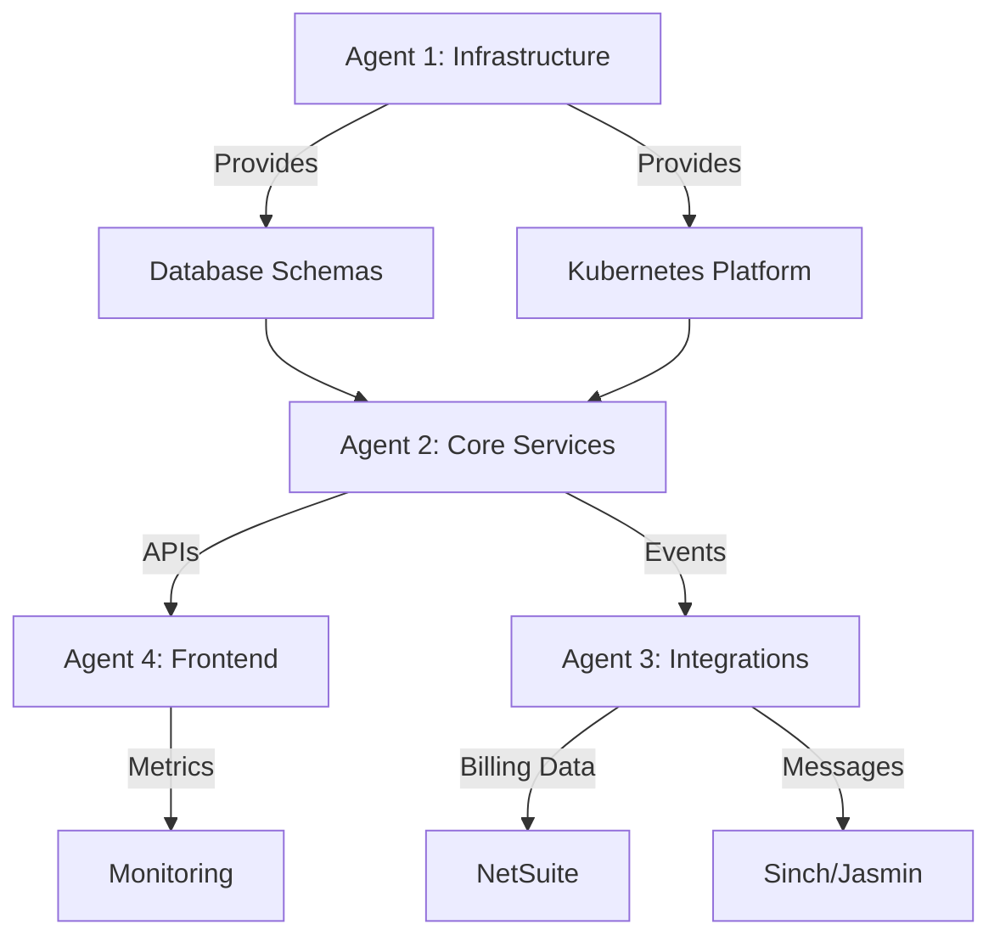

# Hive-Mind Orchestration Guide for WARP Platform

## Overview
This document defines how multiple Claude Flow agents should collaborate to build the WARP platform based on PRD and architectural requirements.

## Agent Assignment & Boundaries

### Agent 1: Infrastructure & Data Foundation
**Ownership**: Database schemas, GCP infrastructure, Terraform, Kubernetes
**Key Files**:
- `/warp/terraform/`
- `/database/` (to be created)
- `/infrastructure/` (to be created)

**Phase 0-1 Tasks**:
1. Review `.env.example` for all GCP/database requirements
2. Create PostgreSQL schemas for customers, trunks, routing, billing
3. Design BigQuery tables for CDR/MDR streaming
4. Implement Terraform modules for GKE, Cloud SQL, Pub/Sub

### Agent 2: Core Services & Business Logic
**Ownership**: API Gateway, Customer Service, Routing Engine, Rating Engine
**Key Files**:
- `/services/api-gateway/` (to be created)
- `/services/billing-engine/` (to be created)
- `/services/routing-engine/` (to be created)

**Phase 2-3 Tasks**:
1. Implement authentication using OpenAPI spec
2. Build customer/trunk CRUD operations
3. Create LCR algorithm for routing
4. Develop real-time rating engine

### Agent 3: Integration & External Systems
**Ownership**: NetSuite, Sinch, Telique, Jasmin SMSC
**Key Files**:
- `/services/messaging-gateway/` (to be created)
- `/services/integrations/` (to be created)

**Phase 4-5 Tasks**:
1. NetSuite customer sync and billing export
2. Sinch SMPP connector for SMS/MMS
3. Telique API for LRN/CNAM lookups
4. Jasmin SMSC configuration

### Agent 4: Frontend & Monitoring
**Ownership**: Customer portal, Admin portal, Homer, Grafana
**Key Files**:
- `/frontend/` (customer portal - exists)
- `/admin-frontend/` (to be created)
- `/infrastructure/monitoring/` (to be created)

**Phase 6-7 Tasks**:
1. Connect frontend to backend APIs
2. Build admin portal for system management
3. Deploy Homer for SIP capture
4. Create Grafana dashboards

## Critical Architectural Decisions Required

### 1. Service Communication Pattern
**Decision Needed**: gRPC vs REST for internal services
- **Option A**: REST everywhere (simpler, OpenAPI defined)
- **Option B**: gRPC for high-performance paths (rating, routing)
- **Recommendation**: REST for external, gRPC for internal high-volume

### 2. State Management
**Decision Needed**: Distributed state handling
- **Option A**: Redis for all session/cache
- **Option B**: CockroachDB for global state
- **Option C**: Mixed approach based on use case
- **Recommendation**: Redis for cache/sessions, CockroachDB for global config

### 3. Message Queue Architecture
**Decision Needed**: Event streaming approach
- **Option A**: Pub/Sub for everything
- **Option B**: Cloud Tasks for async jobs, Pub/Sub for streaming
- **Recommendation**: Pub/Sub for CDR/MDR, Cloud Tasks for billing jobs

### 4. Multi-tenancy Strategy
**Decision Needed**: Data isolation approach
- **Option A**: Schema-per-customer
- **Option B**: Row-level security with partition keys
- **Option C**: Separate databases for large customers
- **Recommendation**: Row-level with partition keys, option for dedicated

### 5. Authentication Architecture
**Decision Needed**: Auth provider and token strategy
- **Option A**: Auth0 for all authentication
- **Option B**: Keycloak self-hosted
- **Option C**: Custom JWT with refresh tokens
- **Recommendation**: Auth0 for customers, Keycloak for admin

## Inter-Agent Dependencies & Coordination

## Synchronization Points

### Week 1 Checkpoint
- Agent 1: Database schemas complete
- Agent 2: API structure defined
- Agent 3: Integration requirements documented
- Agent 4: Frontend API client prepared

### Week 2 Checkpoint
- Agent 1: GKE cluster operational
- Agent 2: Auth + Customer API working
- Agent 3: NetSuite connection tested
- Agent 4: Login flow functional

### Week 3 Checkpoint
- Agent 2: Trunk management complete
- Agent 3: SMS gateway configured
- Agent 4: Dashboard with real data

## Parallel Work Enablers

### Interfaces First
Each agent must define interfaces before implementation:

1. **Agent 2** publishes API contracts (OpenAPI)
2. **Agent 3** defines webhook payloads
3. **Agent 4** mocks API responses for development
4. **Agent 1** provides connection strings early

### Mock Services
Create mock services to unblock dependencies:
- Mock NetSuite API for billing development
- Mock Sinch SMPP for messaging testing
- Mock CDR stream for dashboard development

## Communication Protocol

### File-based Coordination
Agents communicate through documentation:
- `DECISIONS.md` - Architectural decisions log
- `PROGRESS.md` - Daily progress updates
- `BLOCKERS.md` - Issues requiring resolution
- `INTERFACES.md` - API contracts and schemas

### Success Criteria Validation

Before marking a task complete, verify:
1. **Functional**: Feature works as specified in PRD
2. **Integrated**: Connects with dependent services
3. **Documented**: README and API docs updated
4. **Tested**: Unit tests pass
5. **Deployable**: Runs in Kubernetes

## Priority Conflicts Resolution

When agents have conflicting priorities:
1. **Customer-facing features first** (Phase 2-3)
2. **Revenue-generating second** (billing, Phase 4)
3. **Operational third** (monitoring, Phase 6)
4. **Optimizations last**

## Next Orchestration Steps

1. **Confirm architectural decisions** listed above
2. **Create service skeleton** with READMEs
3. **Define exact API contracts** from OpenAPI
4. **Establish mock data standards**
5. **Set up CI/CD pipeline** for continuous validation

## Questions for Product Owner

1. **Performance Requirements**: What are the SLA targets?
   - API response time?
   - Call setup time?
   - Message delivery time?

2. **Scale Requirements**: Initial capacity planning?
   - Concurrent calls target?
   - Messages per second?
   - Number of customers?

3. **Compliance Requirements**: Regulatory considerations?
   - STIR/SHAKEN timeline?
   - E911 requirements?
   - Data retention policies?

4. **Business Priorities**: Feature importance ranking?
   - Voice vs Messaging?
   - Billing accuracy vs speed?
   - Portal features priority?

5. **Integration Priorities**: Which external system first?
   - NetSuite critical path?
   - Sinch vs other SMS providers?
   - Homer vs other monitoring?