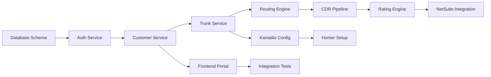

# WARP Platform Implementation Roadmap

## Executive Summary
This roadmap provides a structured approach for Claude Flow/Hive-mind to implement the WARP platform, with clear milestones, dependencies, and success criteria.

## Implementation Phases

### 🏗️ Phase 0: Project Setup (Day 1-2)
**Objective**: Establish development environment and validate access

#### Tasks:
- [ ] Validate GCP project access
- [ ] Set up development cluster
- [ ] Create Cloud SQL instances
- [ ] Configure BigQuery datasets
- [ ] Set up Artifact Registry
- [ ] Initialize Terraform state

#### Deliverables:
- Working GCP project
- Development environment accessible
- CI/CD pipeline configured

#### Success Criteria:
- Can deploy a test container to GKE
- Can connect to Cloud SQL
- Can write to BigQuery

---

### 🗄️ Phase 1: Database Foundation (Day 3-5)
**Objective**: Implement complete database schema

#### PostgreSQL Tables:
```sql
-- Priority Order:
1. customers.accounts
2. customers.users
3. trunks.configurations
4. trunks.ip_whitelist
5. routing.partitions
6. routing.providers
7. routing.routes
8. billing.rate_plans
9. billing.contracts
```

#### BigQuery Tables:
```sql
1. warp_telecom.cdrs
2. warp_telecom.mdrs
3. warp_telecom.cdrs_streaming
4. warp_telecom.daily_usage_summary
```

#### Deliverables:
- All SQL schemas created
- Migration scripts ready
- Test data loaded

---

### 🔐 Phase 2: Authentication & Gateway (Day 6-10)
**Objective**: Secure API gateway with authentication

#### Components:
1. **API Gateway Service** (Go)
   - JWT validation
   - Rate limiting
   - Request routing
   - CORS handling

2. **Auth Service** (Go)
   - Google Identity Platform/Keycloak integration
   - Token generation
   - RBAC enforcement
   - Session management

#### Endpoints to Implement:
```
POST /auth/login
POST /auth/refresh
POST /auth/logout
GET  /auth/profile
```

#### Deliverables:
- Working authentication flow
- Protected API endpoints
- RBAC middleware

---

### 📞 Phase 3: Core SIP Services (Day 11-20)
**Objective**: SIP control plane and media processing

#### Components:

1. **Customer Service** (Go)
   ```
   GET    /customers
   POST   /customers
   GET    /customers/:id
   PATCH  /customers/:id
   DELETE /customers/:id
   ```

2. **Trunk Service** (Go)
   ```
   GET    /customers/:id/trunks
   POST   /customers/:id/trunks
   GET    /trunks/:id
   PATCH  /trunks/:id
   DELETE /trunks/:id
   POST   /trunks/:id/ips
   ```

3. **Kamailio Configuration** (Lua/Config)
   - Database-driven routing
   - HEP to Homer
   - Partition-based routing
   - Rate limiting

4. **RTPEngine Deployment**
   - Auto-scaling configuration
   - Consul registration
   - DTMF handling
   - Recording setup

#### Deliverables:
- Customer/trunk CRUD operations
- Kamailio routing working
- RTPEngine transcoding functional
- Test calls successful

---

### 💰 Phase 4: Rating & Billing (Day 21-30)
**Objective**: Implement rating engine and NetSuite integration

#### Components:

1. **Rating Engine** (Rust for performance)
   - Real-time rating
   - LCR algorithm
   - Zone determination
   - Margin calculation

2. **CDR Pipeline** (Go + Dataflow)
   - Kamailio → Pub/Sub → BigQuery
   - Real-time enrichment
   - Deduplication
   - Rating application

3. **NetSuite Sync** (Go)
   - Customer synchronization
   - Usage export
   - Invoice triggers
   - Payment updates

#### Key Algorithms:
```go
// LCR Implementation
func calculateBestRoute(request RatingRequest) Route {
    // 1. Determine zone (INTERSTATE/INTRASTATE/LOCAL)
    // 2. Query available routes
    // 3. Apply rate limits
    // 4. Sort by cost
    // 5. Return best route
}
```

#### Deliverables:
- CDRs flowing to BigQuery
- Rating applied in real-time
- NetSuite customer sync working
- Test invoice generated

---

### 💬 Phase 5: Messaging Platform (Day 31-40)
**Objective**: SMS/MMS/RCS capabilities

#### Components:

1. **Jasmin SMSC** (Python/Config)
   - SMPP connector to Sinch
   - HTTP API for submission
   - DLR handling
   - Message queuing

2. **Messaging API** (Go)
   ```
   POST /messaging/sms
   POST /messaging/mms
   POST /messaging/rcs
   GET  /messaging/messages/:id
   ```

3. **MDR Pipeline** (Go)
   - Jasmin → Pub/Sub → BigQuery
   - Delivery tracking
   - Rating application

#### Deliverables:
- SMS sending working
- DLR tracking functional
- MDRs in BigQuery
- A2P compliance configured

---

### 🔍 Phase 6: Monitoring & Support (Day 41-45)
**Objective**: Observability and troubleshooting tools

#### Components:

1. **Homer Deployment**
   - SIP capture working
   - Web UI accessible
   - Search functional
   - PCAP export working

2. **Prometheus/Grafana**
   - Metrics collection
   - Dashboard creation
   - Alert rules configured
   - SLO tracking

3. **Support Tools** (Go)
   - Call search API
   - Quality metrics API
   - Troubleshooting CLI

#### Dashboards Needed:
- System Overview
- Call Quality (ASR/ACD)
- Billing & Usage
- Error Tracking
- SIP Traffic

#### Deliverables:
- Homer capturing SIP
- Grafana dashboards live
- Alerts configured
- Support tools deployed

---

### 🎨 Phase 7: Customer Portal (Day 46-55)
**Objective**: Next.js frontend application

#### Pages to Implement:

1. **Authentication**
   - Login/Logout
   - MFA setup
   - Password reset

2. **Dashboard**
   - Usage overview
   - Recent calls
   - Current spend
   - Alerts

3. **Trunk Management**
   - List trunks
   - Configure IPs
   - View settings
   - Test calls

4. **Numbers**
   - Inventory
   - Purchase
   - Port requests
   - E911 config

5. **Billing**
   - Current usage
   - Invoices
   - Payment methods
   - Usage reports

6. **Support**
   - CDR search
   - Ticket creation
   - Documentation

#### Deliverables:
- Portal deployed to Vercel
- All CRUD operations working
- Real-time updates via WebSocket
- Responsive design complete

---

### ✅ Phase 8: Testing & Validation (Day 56-60)
**Objective**: Comprehensive testing and validation

#### Test Suites:

1. **Unit Tests** (Per service)
   - Business logic coverage
   - Error handling
   - Edge cases

2. **Integration Tests**
   - API endpoint testing
   - Service communication
   - Database operations

3. **End-to-End Tests**
   - Complete call flow
   - Billing cycle
   - Customer journey

4. **Load Tests**
   - 1000 CPS target
   - 100k concurrent calls
   - Message throughput

5. **Security Tests**
   - Authentication bypass
   - SQL injection
   - Rate limiting

#### Deliverables:
- 80% code coverage
- All integration tests passing
- Load test targets met
- Security scan clean

---

## Parallel Work Streams

### Stream A: Infrastructure (Hive-mind Agent 1)
- Terraform provisioning
- Kubernetes setup
- Network configuration
- Security policies

### Stream B: Backend Services (Hive-mind Agent 2)
- API development
- Business logic
- Database operations
- External integrations

### Stream C: Data Pipeline (Hive-mind Agent 3)
- BigQuery setup
- Dataflow pipelines
- Real-time streaming
- Analytics views

### Stream D: Frontend (Hive-mind Agent 4)
- React components
- API integration
- State management
- UI/UX implementation

## Critical Path Dependencies



## Risk Mitigation

### High-Risk Areas:
1. **NetSuite Integration** - Start early, have fallback
2. **Kamailio Routing** - Extensive testing needed
3. **Real-time Rating** - Performance critical
4. **Sinch SMPP** - External dependency

### Mitigation Strategies:
- Build mock services first
- Implement circuit breakers
- Have manual fallback procedures
- Extensive logging and monitoring

## Success Metrics

### Week 1-2: Foundation
- [ ] All databases accessible
- [ ] Basic API responding
- [ ] Auth working

### Week 3-4: Core Services
- [ ] Can create customer
- [ ] Can provision trunk
- [ ] Test call successful

### Week 5-6: Billing
- [ ] CDRs in BigQuery
- [ ] Rating calculated
- [ ] NetSuite sync working

### Week 7-8: Complete Platform
- [ ] SMS working
- [ ] Portal deployed
- [ ] Monitoring active

### Week 9: Production Ready
- [ ] All tests passing
- [ ] Documentation complete
- [ ] Runbooks created

## Rollout Strategy

### 1. Development Environment
- Complete all phases
- Internal testing
- Bug fixes

### 2. Staging Environment
- Deploy all services
- Load testing
- Security audit
- Partner testing

### 3. Production Pilot
- Limited customers
- Gradual migration
- Monitor closely
- Gather feedback

### 4. General Availability
- Full deployment
- Marketing launch
- Support ready
- Scale as needed

## Daily Standup Questions for Claude Flow

1. What was completed yesterday?
2. What will be worked on today?
3. Are there any blockers?
4. Are we on track for the weekly milestone?
5. Any discoveries that change the approach?

## Weekly Checkpoints

### Every Friday:
- Review completed work
- Update documentation
- Run integration tests
- Demo to stakeholders
- Plan next week

## Definition of Done

A feature is complete when:
- [ ] Code is written and reviewed
- [ ] Unit tests pass
- [ ] Integration tests pass
- [ ] Documentation updated
- [ ] Deployed to dev environment
- [ ] Monitoring added
- [ ] Runbook entry created

## Emergency Procedures

If blocked:
1. Check documentation first
2. Review similar implementations
3. Create mock/stub to continue
4. Document the blocker
5. Move to next priority task

## Communication Protocols

### Documentation Updates:
- Update README when service created
- Add to API docs when endpoint added
- Update runbook for operations
- Create troubleshooting guide

### Progress Tracking:
- Daily updates in PROGRESS.md
- Weekly summary in CHANGELOG.md
- Blocker tracking in ISSUES.md
- Decision log in DECISIONS.md

This roadmap provides Claude Flow with a clear path to implement the complete WARP platform in approximately 60 days.