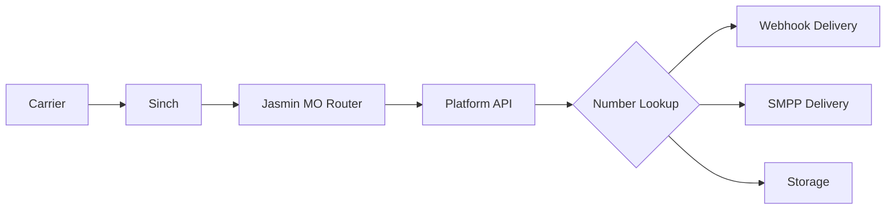

# SMS/MMS Architecture Documentation

## Overview
This document defines the complete SMS/MMS architecture using Jasmin SMSC as the core message router, Sinch as the upstream vendor, and both REST and SMPP interfaces for customers.

## Architecture Components

### Core SMS Stack
```yaml
Components:
  Jasmin SMSC:
    - Role: Message routing and queuing
    - Deployment: Kubernetes (GKE)
    - Storage: Redis for queues, RabbitMQ for events

  Sinch (Vendor):
    - Role: A2P message delivery to carriers
    - Protocol: SMPP 3.4/5.0
    - Connection: Multiple binds for redundancy

  Customer Interfaces:
    - REST API: Standard customers (90%)
    - SMPP: High-volume customers (10%)
```

## Vendor Integration (Jasmin → Sinch)

### SMPP Bind Configuration
```yaml
Primary Connection:
  Host: smpp1.sinch.com
  Port: 2775
  System ID: [From Sinch]
  Password: [From Sinch]
  Bind Type: Transceiver
  Throughput: 100 msg/sec

Backup Connection:
  Host: smpp2.sinch.com
  Port: 2775
  [Same credentials]

TLS Connection (Optional):
  Port: 2776
  TLS Version: 1.2+
  Certificate: Mutual TLS optional
```

### Jasmin Connector Configuration
```python
# Created via Admin UI, executed in Jasmin
smppccm -a
cid sinch_primary
host smpp1.sinch.com
port 2775
username YOUR_SINCH_ACCOUNT
password YOUR_SINCH_PASSWORD
bind transceiver
submit_throughput 100
systemType "production"
coding 0
validity 1440
priority 0
ok
```

## Customer Integration Options

### Option 1: REST API (Recommended)
```yaml
Endpoint: POST https://api.ringer.tel/v1/messages
Authentication: Bearer token (JWT)
Rate Limit: 10 msg/sec (default)
Features:
  - Simple integration
  - Webhook delivery
  - Automatic DLR handling
  - Media support (MMS)
```

#### REST API Flow
```javascript
// Customer sends message
POST /v1/messages
Authorization: Bearer <token>
{
  "from": "+14155551234",
  "to": "+16505556789",
  "body": "Hello",
  "webhook_url": "https://customer.com/dlr"
}

// Platform validates and routes to Jasmin
POST jasmin:8080/send
{
  "to": "16505556789",
  "from": "14155551234",
  "content": "Hello",
  "dlr": "yes",
  "dlr-level": 3,
  "username": "customer_123"
}
```

### Option 2: SMPP Bind (Enterprise)
```yaml
Connection: customer.ringer.tel:2775
Authentication: System ID + Password
Rate Limit: 500 msg/sec (negotiable)
Features:
  - High throughput
  - Lower latency
  - Bulk messaging
  - Direct DLR delivery
```

#### SMPP User Configuration
```python
# Created in Jasmin for customer
user -a
uid customer_123
gid enterprise
username cust123_smpp
password [generated]
mt_messaging_cred authorization dlr_level 3
mt_messaging_cred value_filter dst_addr ^1.*
mt_messaging_cred default_source_addr 14155551234
smpps_cred authorization bind yes
smpps_cred quota 500
ok
```

## Message Routing

### Outbound Routing (Customer → Carrier)

#### Routing Decision Tree
```python
def route_outbound_message(message, customer):
    # 1. Ownership validation
    if not verify_number_ownership(customer.id, message.from):
        raise UnauthorizedSender()

    # 2. Compliance checks
    if is_us_longcode(message.from):
        campaign = get_10dlc_campaign(message.from)
        if not campaign or campaign.status != 'ACTIVE':
            raise UnregisteredCampaign()

    # 3. Rate limiting
    if exceeds_rate_limit(customer, message):
        return queue_for_throttling(message)

    # 4. Content filtering
    if contains_prohibited_content(message.body):
        raise ProhibitedContent()

    # 5. Route selection
    if is_toll_free(message.from):
        route = 'sinch_tollfree'
    elif is_shortcode(message.from):
        route = 'sinch_shortcode'
    else:
        route = 'sinch_primary'

    # 6. Send to Jasmin
    return jasmin.submit(route, message)
```

#### Jasmin Routing Table
```python
# MT Router configuration
mtrouter -a
order 10
type StaticMTRoute
filters <dst_addr=^1.*;smpp_credential=customer_123>
connector smppc(sinch_primary)
rate 0.0045
ok

mtrouter -a
order 20
type StaticMTRoute
filters <dst_addr=^44.*;smpp_credential=customer_123>
connector smppc(sinch_international)
rate 0.0180
ok

# Default route
mtrouter -a
order 100
type DefaultRoute
connector smppc(sinch_primary)
rate 0.0050
ok
```

### Inbound Routing (Carrier → Customer)

#### Inbound Message Flow


#### Database Lookup for Routing
```sql
-- Find customer and delivery method
SELECT
    a.account_id,
    a.company_name,
    d.number,
    d.sms_enabled,
    sr.delivery_method,
    sr.webhook_url,
    sr.webhook_secret,
    sr.smpp_user
FROM numbers.dids d
JOIN accounts.accounts a ON d.account_id = a.id
LEFT JOIN messaging.sms_routes sr ON sr.number = d.number
WHERE d.number = '+14155551234'
AND d.sms_enabled = true;
```

#### Delivery Methods
```python
def deliver_inbound_message(message, customer_config):
    if customer_config.delivery_method == 'webhook':
        # HTTP POST to customer
        response = requests.post(
            customer_config.webhook_url,
            json={
                'from': message.source_addr,
                'to': message.destination_addr,
                'body': message.short_message,
                'message_id': message.id,
                'received_at': message.timestamp
            },
            headers={
                'X-Signature': generate_signature(
                    message,
                    customer_config.webhook_secret
                )
            }
        )

    elif customer_config.delivery_method == 'smpp':
        # Deliver via SMPP (enterprise)
        jasmin.deliver_sm(
            customer_config.smpp_user,
            message
        )

    else:  # storage
        # Store for retrieval via API
        store_message(customer_config.account_id, message)
```

## Database Schema

```sql
-- SMS configuration and routing
CREATE SCHEMA IF NOT EXISTS messaging;

-- Vendor SMPP connectors (managed by admin)
CREATE TABLE messaging.vendor_connectors (
    id UUID PRIMARY KEY DEFAULT uuid_generate_v4(),
    connector_name VARCHAR(50) UNIQUE NOT NULL,
    vendor VARCHAR(50) NOT NULL, -- 'sinch', 'twilio', etc
    host VARCHAR(255) NOT NULL,
    port INTEGER NOT NULL,
    system_id VARCHAR(100) NOT NULL,
    password_encrypted TEXT NOT NULL,
    bind_type VARCHAR(20) CHECK (bind_type IN ('transmitter', 'receiver', 'transceiver')),
    max_throughput INTEGER DEFAULT 100,
    priority INTEGER DEFAULT 100,
    cost_per_sms DECIMAL(10,6),
    cost_per_mms DECIMAL(10,6),
    supports_alphanumeric BOOLEAN DEFAULT false,
    supports_unicode BOOLEAN DEFAULT true,
    active BOOLEAN DEFAULT true,
    last_bind_time TIMESTAMPTZ,
    created_at TIMESTAMPTZ DEFAULT NOW(),
    updated_at TIMESTAMPTZ DEFAULT NOW()
);

-- Customer SMS authentication
CREATE TABLE messaging.customer_sms_auth (
    id UUID PRIMARY KEY DEFAULT uuid_generate_v4(),
    account_id UUID REFERENCES accounts.accounts(id) ON DELETE CASCADE,
    auth_type VARCHAR(20) CHECK (auth_type IN ('API_KEY', 'SMPP', 'BOTH')),

    -- API authentication
    api_key VARCHAR(100) UNIQUE,
    api_secret_hash VARCHAR(255),
    api_rate_limit INTEGER DEFAULT 10, -- per second

    -- SMPP authentication
    smpp_system_id VARCHAR(50) UNIQUE,
    smpp_password_hash VARCHAR(255),
    smpp_allowed_ips INET[],
    smpp_max_binds INTEGER DEFAULT 2,
    smpp_throughput INTEGER DEFAULT 100,

    -- Common settings
    allowed_source_addresses TEXT[], -- Allowed sender IDs
    force_source_address VARCHAR(20), -- Override sender

    active BOOLEAN DEFAULT true,
    created_at TIMESTAMPTZ DEFAULT NOW(),
    UNIQUE(account_id)
);

-- Inbound message routing
CREATE TABLE messaging.inbound_routes (
    id UUID PRIMARY KEY DEFAULT uuid_generate_v4(),
    did VARCHAR(20) REFERENCES numbers.dids(number),
    account_id UUID REFERENCES accounts.accounts(id),
    delivery_method VARCHAR(20) CHECK (delivery_method IN ('webhook', 'smpp', 'storage', 'email')),

    -- Webhook delivery
    webhook_url VARCHAR(500),
    webhook_method VARCHAR(10) DEFAULT 'POST',
    webhook_secret VARCHAR(255),
    webhook_retry_count INTEGER DEFAULT 3,

    -- SMPP delivery
    smpp_system_id VARCHAR(50),

    -- Email forwarding
    email_address VARCHAR(255),

    active BOOLEAN DEFAULT true,
    created_at TIMESTAMPTZ DEFAULT NOW(),
    UNIQUE(did)
);

-- Message logs (for UI display)
CREATE TABLE messaging.message_log (
    id UUID PRIMARY KEY DEFAULT uuid_generate_v4(),
    account_id UUID REFERENCES accounts.accounts(id),
    message_id VARCHAR(100) UNIQUE, -- Jasmin message ID
    direction VARCHAR(10) CHECK (direction IN ('inbound', 'outbound')),
    source_addr VARCHAR(50),
    dest_addr VARCHAR(50),
    message_body TEXT,
    message_type VARCHAR(10) CHECK (message_type IN ('sms', 'mms')),
    media_urls TEXT[],
    status VARCHAR(50),
    dlr_status VARCHAR(50),
    segments INTEGER DEFAULT 1,
    cost DECIMAL(10,6),
    vendor_connector VARCHAR(50),
    submitted_at TIMESTAMPTZ,
    delivered_at TIMESTAMPTZ,
    created_at TIMESTAMPTZ DEFAULT NOW()
);

-- 10DLC Campaign tracking
CREATE TABLE messaging.campaigns_10dlc (
    id UUID PRIMARY KEY DEFAULT uuid_generate_v4(),
    account_id UUID REFERENCES accounts.accounts(id),
    campaign_id VARCHAR(100) UNIQUE, -- TCR campaign ID
    brand_id VARCHAR(100), -- TCR brand ID
    use_case VARCHAR(100),
    description TEXT,
    sample_messages TEXT[],
    phone_numbers TEXT[], -- Numbers registered to campaign
    throughput_limit INTEGER,
    daily_cap INTEGER,
    status VARCHAR(50),
    tcr_submission_date DATE,
    tcr_approval_date DATE,
    created_at TIMESTAMPTZ DEFAULT NOW()
);
```

## Admin UI Management

### Vendor Connector Management
```typescript
interface VendorConnectorManagement {
  // CRUD for Sinch connectors
  connectors: VendorConnector[];

  // Real-time status
  status: {
    connector_id: string;
    bind_status: 'connected' | 'disconnected' | 'connecting';
    throughput_current: number;
    throughput_max: number;
    queue_size: number;
    error_rate: number;
  }[];

  // Actions
  actions: {
    test_connection: (connector_id: string) => Promise<boolean>;
    restart_connector: (connector_id: string) => Promise<void>;
    update_throughput: (connector_id: string, tps: number) => Promise<void>;
  };

  // Routing rules
  routing: {
    add_route: (pattern: string, connector: string, priority: number) => Promise<void>;
    test_route: (phone_number: string) => Promise<string>; // Returns selected connector
  };
}
```

### Jasmin Management Interface
```typescript
interface JasminManagement {
  // Direct Jasmin API wrapper
  jasmin: {
    // Connector operations
    list_connectors: () => Promise<Connector[]>;
    add_connector: (config: ConnectorConfig) => Promise<void>;
    update_connector: (id: string, config: Partial<ConnectorConfig>) => Promise<void>;
    delete_connector: (id: string) => Promise<void>;

    // User operations (for SMPP customers)
    list_users: () => Promise<SMPPUser[]>;
    add_user: (user: SMPPUserConfig) => Promise<void>;
    update_user_quota: (uid: string, quota: number) => Promise<void>;

    // Router operations
    list_routes: () => Promise<Route[]>;
    add_route: (route: RouteConfig) => Promise<void>;
    test_route: (from: string, to: string) => Promise<RouteResult>;
  };

  // Monitoring
  metrics: {
    get_queue_size: () => Promise<number>;
    get_throughput: () => Promise<{in: number, out: number}>;
    get_error_rate: () => Promise<number>;
  };
}
```

## Customer Portal Features

### SMS Configuration Interface
```typescript
interface CustomerSMSConfiguration {
  // Phone number management
  numbers: {
    number: string;
    sms_enabled: boolean;
    mms_enabled: boolean;
    campaign_id?: string; // 10DLC
  }[];

  // Delivery configuration
  delivery: {
    method: 'webhook' | 'api_pull' | 'email';
    webhook_url?: string;
    webhook_secret?: string; // For signature validation
    email?: string;
  };

  // API credentials
  api: {
    key: string;
    secret: string; // Hidden, only shown once
    regenerate: () => Promise<{key: string, secret: string}>;
  };

  // SMPP access (enterprise only)
  smpp?: {
    enabled: boolean;
    system_id: string;
    password: string; // Hidden, only shown once
    allowed_ips: string[];
    connection_info: {
      host: string;
      port: number;
      tls_port: number;
    };
  };

  // Usage & logs
  usage: {
    messages_sent_today: number;
    messages_received_today: number;
    current_balance: number;
    view_logs: () => Promise<MessageLog[]>;
  };
}
```

### 10DLC Campaign Management
```typescript
interface CampaignManagement {
  // Brand registration
  brand: {
    status: 'unregistered' | 'pending' | 'approved';
    register: (brandInfo: BrandInfo) => Promise<void>;
  };

  // Campaign management
  campaigns: {
    list: () => Promise<Campaign[]>;
    create: (campaign: CampaignRequest) => Promise<void>;
    assign_numbers: (campaign_id: string, numbers: string[]) => Promise<void>;
    status: (campaign_id: string) => Promise<CampaignStatus>;
  };
}
```

## Message Flow Diagrams

### Complete Outbound Flow
```
1. Customer Portal/API
   ├─ Validate sender ownership
   ├─ Check 10DLC registration
   └─ Check rate limits

2. Platform API → Jasmin HTTP
   ├─ Format message
   ├─ Set routing hints
   └─ Request DLR

3. Jasmin Processing
   ├─ User authentication
   ├─ Route selection
   ├─ Queue if needed
   └─ Submit to vendor

4. Sinch SMPP
   ├─ Accept message
   ├─ Route to carrier
   └─ Return submit_sm_resp

5. Carrier Delivery
   ├─ Deliver to handset
   └─ Generate DLR

6. DLR Flow Back
   Carrier → Sinch → Jasmin → Platform → Customer
```

### Complete Inbound Flow
```
1. End User sends message

2. Carrier → Sinch
   ├─ Receive SMS/MMS
   └─ Route to customer DID

3. Sinch → Jasmin
   ├─ deliver_sm via SMPP
   └─ Include all metadata

4. Jasmin → Platform API
   ├─ HTTP callback
   └─ Message + metadata

5. Platform Processing
   ├─ Look up DID owner
   ├─ Check SMS enabled
   ├─ Get delivery prefs
   └─ Apply filters/routing

6. Delivery to Customer
   ├─ Webhook POST
   ├─ SMPP deliver_sm
   └─ Store for retrieval
```

## Configuration Management

### Environment Variables
```bash
# Jasmin Configuration
JASMIN_HOST=jasmin.warp.local
JASMIN_HTTP_PORT=8080
JASMIN_ADMIN_PORT=8990
JASMIN_ADMIN_USER=admin
JASMIN_ADMIN_PASSWORD=secure_password

# Sinch SMPP Configuration
SINCH_SMPP_HOST=smpp1.sinch.com
SINCH_SMPP_PORT=2775
SINCH_SMPP_SYSTEM_ID=your_account
SINCH_SMPP_PASSWORD=your_password
SINCH_SMPP_THROUGHPUT=100

# Customer Defaults
DEFAULT_SMS_RATE_LIMIT=10
DEFAULT_SMPP_THROUGHPUT=100
DEFAULT_WEBHOOK_TIMEOUT=5000
DEFAULT_WEBHOOK_RETRIES=3
```

### Jasmin Kubernetes Deployment
```yaml
apiVersion: apps/v1
kind: Deployment
metadata:
  name: jasmin-smsc
  namespace: messaging
spec:
  replicas: 2
  selector:
    matchLabels:
      app: jasmin
  template:
    metadata:
      labels:
        app: jasmin
    spec:
      containers:
      - name: jasmin
        image: jookies/jasmin:0.10
        ports:
        - containerPort: 2775  # SMPP
        - containerPort: 8990  # Admin
        - containerPort: 1401  # jCli
        - containerPort: 8080  # HTTP
        env:
        - name: REDIS_HOST
          value: redis-service
        - name: AMQP_HOST
          value: rabbitmq-service
        volumeMounts:
        - name: jasmin-config
          mountPath: /etc/jasmin
      volumes:
      - name: jasmin-config
        configMap:
          name: jasmin-config
```

## Monitoring & Alerting

### Prometheus Metrics
```yaml
Jasmin Metrics:
  - jasmin_connectors_status
  - jasmin_submit_sm_total
  - jasmin_deliver_sm_total
  - jasmin_queue_size
  - jasmin_throughput_current
  - jasmin_error_rate

Business Metrics:
  - sms_sent_per_customer
  - sms_received_per_customer
  - sms_cost_per_customer
  - sms_delivery_rate
  - sms_10dlc_violations
```

### Grafana Dashboards
1. **Vendor Performance**: Throughput, errors, latency per Sinch connector
2. **Customer Usage**: Messages sent/received, costs, patterns
3. **System Health**: Queue sizes, processing rates, errors
4. **Compliance**: 10DLC limits, violations, campaign status

## Security Considerations

### Message Security
1. **TLS for SMPP**: Use port 2776 for encrypted SMPP
2. **Webhook Signatures**: HMAC-SHA256 for webhook validation
3. **API Rate Limiting**: Per-customer limits
4. **Content Filtering**: Block spam/phishing
5. **Number Verification**: Strict ownership validation

### Access Control
1. **Admin UI**: Role-based access for connector management
2. **Customer API**: JWT tokens with scope limitations
3. **SMPP**: IP whitelisting + credentials
4. **Jasmin jCli**: Restricted to admin pods only

---

## Summary

This architecture provides:
1. **Scalable SMS/MMS delivery** via Jasmin and Sinch
2. **Flexible customer integration** (REST and SMPP)
3. **Comprehensive routing** for inbound and outbound
4. **Full admin control** via UI and Jasmin APIs
5. **10DLC compliance** built-in
6. **Real-time monitoring** and alerting

The admin UI manages vendor connections and routing, while the customer portal handles their specific SMS settings and delivery preferences.