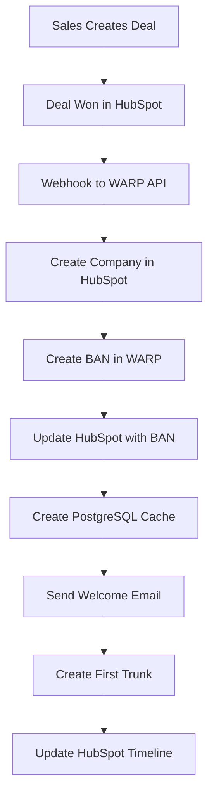

# HubSpot CRM Integration Architecture

## Overview
HubSpot serves as the single source of truth for all customer data in the WARP platform. This document defines the integration patterns and data synchronization strategy.

## Data Model Mapping

### HubSpot Objects → WARP Entities

#### Companies (HubSpot) → Customers (WARP)
```javascript
{
  // HubSpot Company Properties
  "name": "Acme Corp",
  "domain": "acme.com",
  "industry": "Technology",

  // Custom WARP Properties
  "warp_ban": "12345",                    // Billing Account Number
  "warp_status": "active",                // active, suspended, churned
  "warp_tier": "enterprise",              // starter, growth, enterprise
  "warp_mrr": 5000,                       // Monthly Recurring Revenue
  "warp_contract_end": "2025-12-31",
  "warp_credit_limit": 10000,
  "warp_payment_terms": "NET30"
}
```

#### Contacts (HubSpot) → Users (WARP)
```javascript
{
  // Standard HubSpot Properties
  "email": "john@acme.com",
  "firstname": "John",
  "lastname": "Doe",
  "phone": "+13035551234",

  // Custom WARP Properties
  "warp_user_id": "usr_123",
  "warp_role": "admin",                   // admin, developer, billing, readonly
  "warp_api_keys": ["sk_live_..."],
  "warp_2fa_enabled": true,
  "warp_last_login": "2025-01-17T10:00:00Z"
}
```

#### Custom Objects

##### Trunks (Custom Object)
```javascript
{
  "name": "Production SIP Trunk",
  "trunk_id": "trunk_456",
  "company_id": "12345",                  // Links to Company
  "status": "active",
  "ip_addresses": ["198.51.100.10"],
  "concurrent_calls": 100,
  "monthly_minutes": 1000000,
  "created_date": "2025-01-15",
  "partition_id": "ABC123"
}
```

##### Numbers (Custom Object)
```javascript
{
  "number": "+13035551000",
  "company_id": "12345",
  "trunk_id": "trunk_456",
  "type": "local",                        // local, tollfree, mobile
  "capabilities": ["voice", "sms"],
  "monthly_cost": 1.00,
  "e911_address": "123 Main St",
  "cnam": "ACME CORP"
}
```

## Integration Patterns

### 1. Customer Onboarding Flow



### 2. Real-time Sync Pattern

#### HubSpot → WARP
```javascript
// Webhook from HubSpot
POST /api/v1/webhooks/hubspot
{
  "eventType": "company.propertyChange",
  "objectId": "12345",
  "propertyName": "warp_credit_limit",
  "propertyValue": 15000,
  "timestamp": "2025-01-17T10:00:00Z"
}

// WARP processes:
1. Validate webhook signature
2. Update PostgreSQL cache
3. Trigger dependent updates (e.g., trunk limits)
4. Log to audit trail
```

#### WARP → HubSpot
```javascript
// When trunk is created in WARP
POST https://api.hubapi.com/crm/v3/objects/trunks
{
  "properties": {
    "name": "Production Trunk",
    "trunk_id": "trunk_789",
    "company_id": "12345",
    "status": "active"
  }
}

// Also create timeline event
POST https://api.hubapi.com/crm/v3/timeline/events
{
  "objectType": "company",
  "objectId": "12345",
  "eventTemplateId": "trunk_created",
  "tokens": {
    "trunk_id": "trunk_789",
    "trunk_name": "Production Trunk"
  }
}
```

## API Endpoints for CRM Sync

### Customer Management
```yaml
# Sync from HubSpot
POST   /api/v1/sync/customers/hubspot
GET    /api/v1/sync/customers/status
POST   /api/v1/sync/customers/reconcile

# Webhook receivers
POST   /api/v1/webhooks/hubspot/company
POST   /api/v1/webhooks/hubspot/contact
POST   /api/v1/webhooks/hubspot/deal
```

### Usage Data to HubSpot
```javascript
// Daily usage sync to HubSpot
{
  "company_id": "12345",
  "date": "2025-01-16",
  "metrics": {
    "calls_completed": 10000,
    "minutes_used": 50000,
    "sms_sent": 5000,
    "daily_spend": 450.00,
    "asr": 0.65,
    "acd": 4.5
  }
}
```

## Service Hub Integration

### Ticket Custom Properties
```javascript
{
  "warp_issue_type": "dropdown",        // voice, sms, billing, api, portal
  "warp_trunk_id": "text",             // Associated trunk
  "warp_call_id": "text",              // Related call ID
  "warp_severity": "dropdown",          // critical, high, medium, low
  "warp_sla_breach": "datetime",        // When SLA will breach
  "warp_technical_details": "text",     // JSON of technical data
}
```

### Ticket Categories
1. **Voice Issues**
   - Call quality
   - Call failures
   - Routing problems
   - Codec issues

2. **Messaging Issues**
   - SMS delivery failures
   - 10DLC registration
   - MMS problems
   - Campaign issues

3. **Billing Issues**
   - Invoice disputes
   - Payment failures
   - Tax questions
   - Rate inquiries

4. **Technical Support**
   - API errors
   - Integration help
   - Configuration assistance
   - Number porting

### Automated Ticket Creation
```javascript
// Auto-create ticket for critical issues
POST /api/v1/support/auto-ticket
{
  "trigger": "asr_below_threshold",
  "customer_id": "12345",
  "data": {
    "trunk_id": "trunk_456",
    "current_asr": 0.35,
    "threshold": 0.50,
    "period": "last_hour"
  }
}

// Creates HubSpot ticket
POST https://api.hubapi.com/crm/v3/objects/tickets
{
  "properties": {
    "subject": "Low ASR Alert - Trunk trunk_456",
    "content": "ASR dropped to 35% in the last hour",
    "priority": "HIGH",
    "warp_issue_type": "voice",
    "warp_trunk_id": "trunk_456",
    "warp_severity": "high"
  }
}
```

## Timeline Events

### Events to Track in HubSpot

1. **Account Events**
   - Account created
   - Account suspended/reactivated
   - Credit limit changed
   - Payment method updated

2. **Service Events**
   - Trunk created/modified/deleted
   - Numbers purchased/ported/released
   - Campaign registered (10DLC)
   - E911 address updated

3. **Usage Events**
   - First successful call
   - Daily usage summary
   - Threshold alerts (80% of limit)
   - Invoice generated

4. **Support Events**
   - Ticket created
   - Ticket resolved
   - Escalation triggered
   - Chat conversation started
   - Knowledge base article viewed

## Custom Properties Required in HubSpot

### Company Properties
```javascript
{
  // Billing
  "warp_ban": "text",
  "warp_credit_limit": "number",
  "warp_payment_method": "dropdown", // card, ach, wire
  "warp_payment_status": "dropdown", // current, past_due, suspended

  // Usage
  "warp_mtd_minutes": "number",        // Month-to-date minutes
  "warp_mtd_spend": "currency",        // Month-to-date spend
  "warp_trunk_count": "number",
  "warp_number_count": "number",

  // Service
  "warp_service_tier": "dropdown",     // starter, growth, enterprise
  "warp_api_enabled": "boolean",
  "warp_sms_enabled": "boolean",

  // Compliance
  "warp_tcr_brand_id": "text",
  "warp_resporg_status": "dropdown"    // none, pending, active
}
```

### Contact Properties
```javascript
{
  "warp_user_id": "text",
  "warp_role": "dropdown",             // admin, developer, billing, readonly
  "warp_2fa_enabled": "boolean",
  "warp_api_key_count": "number",
  "warp_last_api_call": "datetime"
}
```

## Sync Schedule

### Real-time (Webhooks)
- Customer creation/updates
- Contact changes
- Deal stage changes
- Payment status changes

### Every 5 Minutes
- Active call counts
- Current spend tracking

### Hourly
- Usage aggregation
- Trunk utilization

### Daily
- Full customer reconciliation
- Usage reports to timeline
- MRR calculation

### Monthly
- Invoice records
- Churn analysis
- Growth metrics

## Error Handling

### Webhook Failures
1. Retry with exponential backoff (up to 3 times)
2. Queue failed updates in PostgreSQL
3. Alert ops team after 3 failures
4. Run reconciliation job

### Data Conflicts
- HubSpot always wins for customer master data
- WARP always wins for technical configuration
- Log all conflicts for review

### API Rate Limits
- HubSpot: 100 requests/10 seconds
- Implement token bucket algorithm
- Queue updates during high volume

## Security Considerations

1. **Webhook Validation**
   - Verify HubSpot signature on all webhooks
   - Validate source IP addresses
   - Check timestamp (reject if > 5 minutes old)

2. **Data Privacy**
   - No PII in logs
   - Encrypt API keys in transit
   - PCI data never sent to HubSpot

3. **Access Control**
   - Separate API keys for read/write
   - Scoped permissions per integration
   - Audit log all changes

## Implementation Priority

### Phase 1: Basic Sync (Week 1)
- Company creation webhook
- Contact sync
- Basic properties

### Phase 2: Custom Objects (Week 2)
- Trunk custom object
- Number custom object
- Timeline events

### Phase 3: Usage Tracking (Week 3)
- Daily usage sync
- MRR calculation
- Threshold alerts

### Phase 4: Full Integration (Week 4)
- Bidirectional sync
- Reconciliation jobs
- Support ticket integration

---
*HubSpot integration is critical for sales visibility and customer success management*