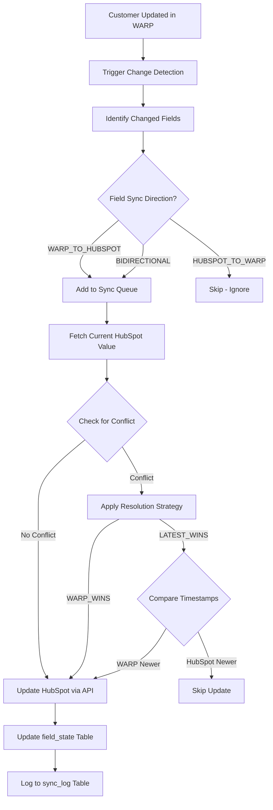
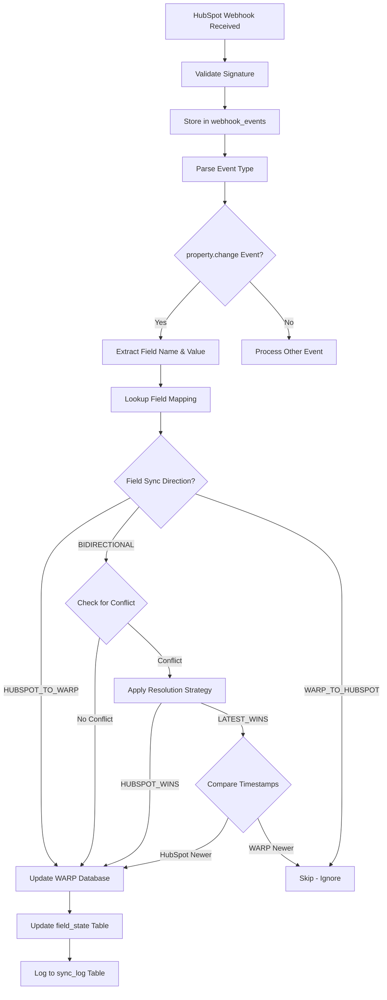

# HubSpot Bidirectional Sync Strategy

## Overview

This document defines the **attribute-level bidirectional synchronization** strategy between WARP (Go backend + PostgreSQL) and HubSpot CRM. The sync system ensures data consistency while respecting the authoritative source for each field.

---

## Core Principles

### 1. Field-Level Granularity
- Sync operates at the **individual field level**, not object level
- Each field has its own sync direction and conflict resolution policy
- Changes to one field don't trigger full object syncs

### 2. Authoritative Source per Field
- **WARP Authoritative**: Technical configuration, usage data, billing state
- **HubSpot Authoritative**: Sales data, CRM-managed attributes, marketing data
- **Bidirectional**: Operational data that can be updated from either system

### 3. Conflict Resolution Strategies

| Strategy | Behavior | Use Case |
|----------|----------|----------|
| `WARP_WINS` | WARP always overwrites HubSpot | Technical config (BAN, partition_id) |
| `HUBSPOT_WINS` | HubSpot always overwrites WARP | CRM data (tier, credit_limit) |
| `LATEST_WINS` | Most recent change wins (timestamp-based) | Company name, address |
| `MANUAL` | Flag for human review | Critical data with conflicts |

---

## Field Mapping Configuration

### Customer Object Mapping

```typescript
{
  // === WARP AUTHORITATIVE (WARP → HubSpot only) ===
  "ban": {
    "hubspot_property": "warp_ban",
    "warp_field": "ban",
    "sync_direction": "WARP_TO_HUBSPOT",
    "conflict_resolution": "WARP_WINS",
    "description": "Billing Account Number - generated by WARP"
  },

  "current_balance": {
    "hubspot_property": "warp_current_balance",
    "warp_field": "current_balance",
    "sync_direction": "WARP_TO_HUBSPOT",
    "conflict_resolution": "WARP_WINS",
    "update_frequency": "real-time",
    "description": "Current account balance from billing system"
  },

  "prepaid_balance": {
    "hubspot_property": "warp_prepaid_balance",
    "warp_field": "prepaid_balance",
    "sync_direction": "WARP_TO_HUBSPOT",
    "conflict_resolution": "WARP_WINS",
    "update_frequency": "real-time"
  },

  "status": {
    "hubspot_property": "warp_status",
    "warp_field": "status",
    "sync_direction": "WARP_TO_HUBSPOT",
    "conflict_resolution": "WARP_WINS",
    "description": "Service status managed by WARP (ACTIVE, SUSPENDED, etc.)",
    "enum_values": ["ACTIVE", "SUSPENDED", "TRIAL", "CLOSED"]
  },

  // === HUBSPOT AUTHORITATIVE (HubSpot → WARP only) ===
  "tier": {
    "hubspot_property": "warp_tier",
    "warp_field": "tier",
    "sync_direction": "HUBSPOT_TO_WARP",
    "conflict_resolution": "HUBSPOT_WINS",
    "description": "Service tier set by sales team",
    "enum_values": ["STANDARD", "PREMIUM", "ENTERPRISE"]
  },

  "credit_limit": {
    "hubspot_property": "warp_credit_limit",
    "warp_field": "credit_limit",
    "sync_direction": "HUBSPOT_TO_WARP",
    "conflict_resolution": "HUBSPOT_WINS",
    "description": "Credit limit approved by finance team in HubSpot",
    "transform": "hubspot_value_in_cents_to_dollars"
  },

  "payment_terms": {
    "hubspot_property": "warp_payment_terms",
    "warp_field": "payment_terms",
    "sync_direction": "HUBSPOT_TO_WARP",
    "conflict_resolution": "HUBSPOT_WINS",
    "description": "Payment terms (e.g., NET30) set by sales"
  },

  // === BIDIRECTIONAL (both systems can update) ===
  "company_name": {
    "hubspot_property": "name",
    "warp_field": "company_name",
    "sync_direction": "BIDIRECTIONAL",
    "conflict_resolution": "LATEST_WINS",
    "description": "Company name can be updated from either system"
  },

  "legal_name": {
    "hubspot_property": "warp_legal_name",
    "warp_field": "legal_name",
    "sync_direction": "BIDIRECTIONAL",
    "conflict_resolution": "LATEST_WINS"
  },

  "contact_email": {
    "hubspot_property": "domain",
    "warp_field": "contact",
    "warp_field_path": "contact->>'email'",
    "sync_direction": "BIDIRECTIONAL",
    "conflict_resolution": "LATEST_WINS",
    "description": "Primary contact email"
  },

  "contact_phone": {
    "hubspot_property": "phone",
    "warp_field": "contact",
    "warp_field_path": "contact->>'phone'",
    "sync_direction": "BIDIRECTIONAL",
    "conflict_resolution": "LATEST_WINS"
  },

  "address": {
    "hubspot_property": "address",
    "warp_field": "address",
    "sync_direction": "BIDIRECTIONAL",
    "conflict_resolution": "LATEST_WINS",
    "is_complex": true,
    "sub_mappings": {
      "street": "address->>'line1'",
      "city": "address->>'city'",
      "state": "address->>'state'",
      "zip": "address->>'zip'",
      "country": "address->>'country'"
    }
  },

  // === METADATA (no sync, tracking only) ===
  "hubspot_company_id": {
    "hubspot_property": "hs_object_id",
    "warp_field": "external_ids",
    "warp_field_path": "external_ids->>'hubspot_company_id'",
    "sync_direction": "NONE",
    "description": "HubSpot company ID stored for reference"
  }
}
```

---

## Sync Flow Architecture

### 1. **WARP → HubSpot (Outbound)**



### 2. **HubSpot → WARP (Inbound)**



---

## Sync Mechanisms

### 1. **Real-Time Sync (Webhooks)**

**HubSpot → WARP**:
```bash
POST /v1/webhooks/hubspot/company
Headers:
  X-HubSpot-Signature: sha256=...

Body:
{
  "eventId": "12345",
  "subscriptionType": "company.propertyChange",
  "portalId": 123456,
  "objectId": 789,
  "propertyName": "warp_credit_limit",
  "propertyValue": "10000",
  "changeSource": "CRM",
  "occurredAt": 1705503600000
}
```

**WARP → HubSpot**:
```go
// After customer update in WARP
syncService.QueueSync(SyncRequest{
    EntityType: "customer",
    EntityID: customerID,
    ChangedFields: []string{"current_balance", "status"},
    TriggerSource: "api",
})
```

### 2. **Batch Sync (Scheduled)**

```go
// Runs every 15 minutes
func (s *SyncService) RunIncrementalSync() {
    // Fetch customers updated since last sync
    customers := s.repo.GetCustomersUpdatedSince(lastSyncTime)

    for _, customer := range customers {
        s.SyncCustomerToHubSpot(customer)
    }
}
```

### 3. **Reconciliation (Daily)**

```go
// Runs nightly at 2 AM
func (s *SyncService) RunFullReconciliation() {
    // Compare all customers in WARP vs HubSpot
    // Identify discrepancies
    // Apply conflict resolution
    // Generate reconciliation report
}
```

---

## Conflict Detection & Resolution

### Conflict Detection Logic

```go
func (s *SyncService) DetectConflict(field string, warpValue, hubspotValue interface{}, warpModifiedAt, hubspotModifiedAt time.Time) (bool, string) {
    // 1. Values match - no conflict
    if reflect.DeepEqual(warpValue, hubspotValue) {
        return false, ""
    }

    // 2. Check if both sides modified since last sync
    lastSync := s.GetLastSyncTime(field)
    warpChanged := warpModifiedAt.After(lastSync)
    hubspotChanged := hubspotModifiedAt.After(lastSync)

    if warpChanged && hubspotChanged {
        return true, "BOTH_MODIFIED"
    }

    // 3. One side changed - no conflict
    return false, ""
}
```

### Resolution Logic

```go
func (s *SyncService) ResolveConflict(field FieldMapping, warpValue, hubspotValue interface{}, warpTime, hubspotTime time.Time) (interface{}, string) {
    switch field.ConflictResolution {
    case "WARP_WINS":
        return warpValue, "WARP"

    case "HUBSPOT_WINS":
        return hubspotValue, "HUBSPOT"

    case "LATEST_WINS":
        if warpTime.After(hubspotTime) {
            return warpValue, "WARP (latest)"
        }
        return hubspotValue, "HUBSPOT (latest)"

    case "MANUAL":
        s.FlagForManualReview(field, warpValue, hubspotValue)
        return nil, "MANUAL_REVIEW"
    }
}
```

---

## Error Handling & Retry Strategy

### Retry Logic

```go
type RetryConfig struct {
    MaxRetries      int           // 3
    InitialDelay    time.Duration // 1s
    MaxDelay        time.Duration // 30s
    BackoffFactor   float64       // 2.0 (exponential)
}

func (s *SyncService) SyncWithRetry(req SyncRequest) error {
    var err error
    delay := s.retryConfig.InitialDelay

    for i := 0; i < s.retryConfig.MaxRetries; i++ {
        err = s.PerformSync(req)
        if err == nil {
            return nil
        }

        // Log retry attempt
        log.Warn("Sync failed, retrying",
            "attempt", i+1,
            "delay", delay,
            "error", err)

        time.Sleep(delay)
        delay = time.Duration(float64(delay) * s.retryConfig.BackoffFactor)
        if delay > s.retryConfig.MaxDelay {
            delay = s.retryConfig.MaxDelay
        }
    }

    // Max retries exceeded - queue for manual review
    s.QueueFailedSync(req, err)
    return err
}
```

### Error Categories

| Error Type | Retry? | Action |
|------------|--------|--------|
| Network timeout | Yes | Exponential backoff |
| Rate limit (429) | Yes | Respect retry-after header |
| Invalid data (400) | No | Log & alert |
| Auth failure (401) | No | Alert immediately |
| Not found (404) | No | Mark as missing, reconcile |
| Server error (500) | Yes | Backoff + alert if persistent |

---

## Performance Considerations

### 1. Rate Limiting

```go
// Token bucket algorithm for HubSpot API
type RateLimiter struct {
    tokens     int
    maxTokens  int           // 100
    refillRate time.Duration // 10 seconds
}

// HubSpot limit: 100 requests per 10 seconds
func (rl *RateLimiter) AllowRequest() bool {
    if rl.tokens > 0 {
        rl.tokens--
        return true
    }
    return false
}
```

### 2. Batch Operations

```go
// Batch update up to 100 properties at once
func (s *SyncService) BatchUpdateHubSpot(updates []PropertyUpdate) error {
    batchSize := 100

    for i := 0; i < len(updates); i += batchSize {
        end := min(i+batchSize, len(updates))
        batch := updates[i:end]

        err := s.hubspotClient.BatchUpdate(batch)
        if err != nil {
            return err
        }

        // Respect rate limits
        time.Sleep(100 * time.Millisecond)
    }
    return nil
}
```

### 3. Caching Strategy

```go
// Cache HubSpot data to reduce API calls
type SyncCache struct {
    customerData map[string]CachedCustomer
    ttl          time.Duration // 5 minutes
}

func (sc *SyncCache) Get(hubspotID string) (*HubSpotCustomer, bool) {
    cached, exists := sc.customerData[hubspotID]
    if !exists {
        return nil, false
    }

    if time.Since(cached.FetchedAt) > sc.ttl {
        delete(sc.customerData, hubspotID)
        return nil, false
    }

    return &cached.Data, true
}
```

---

## Monitoring & Observability

### Key Metrics

1. **Sync Latency**: Time from change detection to sync completion
2. **Conflict Rate**: Percentage of syncs with conflicts
3. **Error Rate**: Failed syncs per hour
4. **Queue Depth**: Number of pending sync operations
5. **API Call Rate**: Requests per second to HubSpot

### Alerts

```yaml
- name: HighConflictRate
  condition: conflict_rate > 5%
  duration: 15m
  severity: warning

- name: SyncQueueBacklog
  condition: queue_depth > 1000
  duration: 10m
  severity: critical

- name: HubSpotAPIErrors
  condition: error_rate > 10%
  duration: 5m
  severity: critical
```

---

## Next Steps

1. ✅ **Database schema created** (`07-hubspot-sync.sql`)
2. 🔄 **Implement Go sync service** (next task)
3. 🔄 **Create webhook handlers**
4. 🔄 **Build reconciliation job**
5. 🔄 **Add admin UI for conflict resolution**
6. 🔄 **Deploy and test with HubSpot sandbox**

---

**Status**: Architecture defined, ready for implementation
