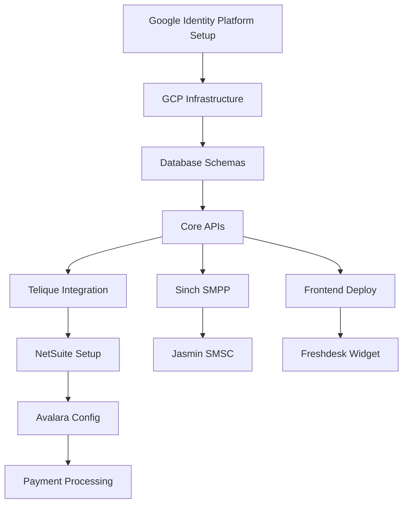

# WARP Platform Integration Matrix

## Service Integration Ownership by Agent

### Agent 1: Infrastructure & Data
**Owns GCP infrastructure and database schema including service configuration tables**

| Service | Integration Type | Priority | Implementation |
|---------|-----------------|----------|----------------|
| GCP Cloud SQL | Direct | P0 | Terraform modules |
| GCP BigQuery | Direct | P0 | Dataflow pipelines |
| GCP Pub/Sub | Direct | P0 | Event streaming |
| GCP Cloud Tasks | Direct | P1 | Job scheduling |
| Memorystore Redis | Direct | P0 | Kamailio state |
| Service Config Schema | Database | P0 | PostgreSQL tables for dynamic vendor management |

### Agent 2: Core Services
**Owns authentication and telecom data**

| Service | Integration Type | Priority | Implementation |
|---------|-----------------|----------|----------------|
| Google Identity Platform | REST API | P0 | OAuth2 for portals |
| Cloud Armor | CEL Rules | P0 | API key validation for Telco APIs |
| Redis | Cache | P0 | JWT caching for Voice/SMS APIs |
| Telique | REST API | P0 | LRN/LERG lookups (Critical for LCR) |
| TransUnion CNAM | REST API | P1 | Caller ID service |
| **LCR SQL Procedures** | **Database** | **P0** | **Preserve existing Kamailio routing logic** |
| **Rate Tables** | **PostgreSQL** | **P0** | **Multi-dimensional rate lookup** |
| **Override Engine** | **Database** | **P0** | **Customer-specific routing rules** |

### Agent 3: Integrations & Billing
**Owns financial and messaging systems - all configurable via admin UI**

| Service | Integration Type | Priority | Implementation |
|---------|-----------------|----------|----------------|
| Dynamic Service Manager | Database-driven | P0 | Fetch configs from PostgreSQL |
| HubSpot CRM | REST + Webhooks | P0 | Admin-configurable |
| NetSuite | REST + SuiteScript | P0 | Admin-configurable |
| Avalara | REST API | P0 | Admin-configurable |
| Authorize.Net | SDK | P1 | Admin-configurable |
| Mustache/Plaid | REST API | P2 | Admin-configurable |
| SMPP Vendors | SMPP Binds | P1 | Multiple vendors, admin-configurable |
| TCR | REST API | P1 | Admin-configurable |
| Somos | REST/SOAP API | P1 | Admin-configurable |
| SendGrid | REST API | P1 | Admin-configurable |
| Jasmin SMSC | Internal | P1 | SMS gateway with vendor routing |

### Agent 4: Frontend & Support
**Owns customer-facing integrations**

| Service | Integration Type | Priority | Implementation |
|---------|-----------------|----------|----------------|
| HubSpot Service Hub | Widget + API | P1 | Support tickets (via CRM) |
| Vercel | CI/CD | P0 | Frontend hosting |
| Google Identity Platform | SDK | P0 | User authentication |

## Integration Sequence & Dependencies

## API Integration Patterns

### Synchronous Integrations
**Real-time response required**
- Google Identity Platform - Authentication checks
- Telique - LRN lookups during call routing
- Avalara - Tax calculation for quotes
- Authorize.Net - Payment authorization

### Asynchronous Integrations
**Can tolerate delay**
- NetSuite - Invoice generation
- Freshdesk - Ticket updates
- TransUnion - CNAM updates
- Mustache/Plaid - ACH processing

### Webhook Recipients
**We receive events from**
- Google Identity Platform - Login events
- Authorize.Net - Payment events
- Mustache/Plaid - ACH status
- Freshdesk - Ticket updates
- Sinch - DLR receipts

### Webhook Providers
**We send events to customers**
- Call events (start/end)
- Message delivery status
- Trunk status changes
- Payment received
- Invoice generated

## Caching Strategy

| Service | Cache Location | TTL | Fallback |
|---------|---------------|-----|----------|
| Google Identity Platform JWT | Redis | 1 hour | Re-authenticate |
| Telique LRN | Redis | 24 hours | Direct API call |
| Telique LERG | PostgreSQL | 7 days | Batch update |
| Avalara Tax Rates | Redis | 1 hour | Direct API call |
| TransUnion CNAM | Redis | 7 days | Direct API call |
| NetSuite Customer | PostgreSQL | 1 hour | Queue for sync |

## Error Handling & Circuit Breakers

### Critical Services (No fallback)
- Google Identity Platform - Authentication fails
- GCP Core Services - Platform down

### Services with Fallback
- Telique - Use cached LRN data
- Avalara - Use default tax rates
- TransUnion - Show "Unknown" CNAM
- Freshdesk - Queue tickets locally

### Services with Retry
- NetSuite - Retry with exponential backoff
- Authorize.Net - Retry up to 3 times
- Sinch SMPP - Failover to secondary bind

## Security & Compliance

### PCI Compliance
- Authorize.Net handles all card data
- We store only tokens
- No card numbers in logs

### HIPAA Compliance
- N/A for Phase 1

### SOC 2 Requirements
- All API keys in Secret Manager
- Audit logs for all integrations
- Encryption in transit (TLS 1.3)

## Cost Optimization

### High-Volume Discounts
- Telique - Negotiate bulk LRN pricing
- TransUnion - Volume discounts at 1M+ dips
- Avalara - Enterprise pricing tier

### Caching for Cost Reduction
- Aggressive LRN caching (save $0.001/call)
- CNAM caching (save $0.0035/lookup)
- Tax rate caching (reduce Avalara calls)

## Monitoring Requirements

### SLA Monitoring
- Google Identity Platform: 99.9% uptime
- NetSuite: 99.5% uptime
- Telique: 99.99% for LRN
- Sinch: 99.95% for SMPP

### Metrics to Track
- API response times (p50, p95, p99)
- Error rates by service
- Cache hit rates
- Webhook delivery success
- Integration costs per service

## Phase 1 MVP Integrations

**Week 1-2**: Infrastructure
- GCP setup (Agent 1)
- Google Identity Platform configuration (Agent 2)

**Week 3-4**: Core Telecom
- Telique integration (Agent 2)
- Database schemas (Agent 1)

**Week 5-6**: Billing Foundation
- NetSuite setup (Agent 3)
- Avalara configuration (Agent 3)

**Week 7-8**: Messaging
- Sinch SMPP (Agent 3)
- Jasmin deployment (Agent 3)

**Week 9-10**: Payments
- Authorize.Net (Agent 3)
- Basic payment flow (Agent 4)

**Week 11-12**: Support
- Freshdesk integration (Agent 4)
- Customer portal (Agent 4)

---
*This matrix defines clear ownership and dependencies for all external integrations*