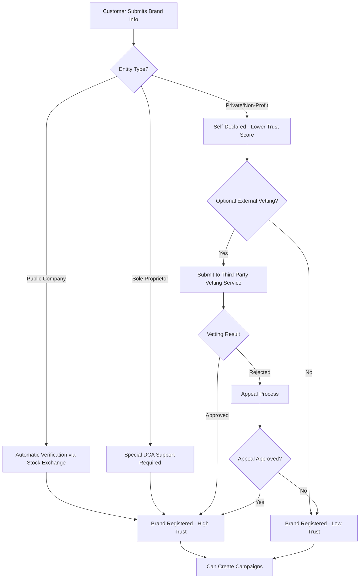
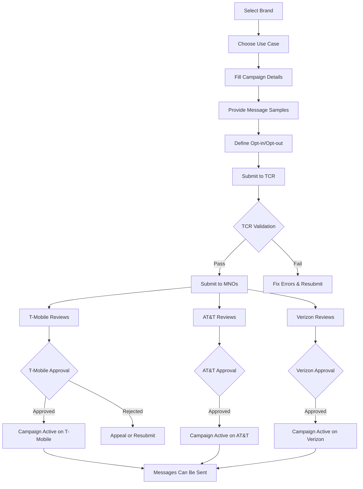

# The Campaign Registry (TCR) 10DLC Integration

**Version**: 1.0.0
**Date**: 2025-11-25
**Status**: Research Spike Complete - Ready for Implementation
**Owner**: Platform Engineering Team

## Executive Summary

This document provides comprehensive analysis of The Campaign Registry (TCR) integration for Application-to-Person (A2P) SMS messaging compliance. **A2P messages cannot be delivered to end-user devices without an approved 10DLC campaign registered with TCR.** This integration is mandatory for all US-based SMS traffic.

### Key Findings

1. **TCR API has 80 endpoints** across brand registration, campaign management, and compliance
2. **Two-phase registration required**: Brand → Campaign (sequential dependency)
3. **Brand registration is prerequisite** - campaigns cannot be created without approved brand
4. **Multiple MNO approvals needed** - Each carrier (AT&T, T-Mobile, Verizon) reviews independently
5. **Throughput limits vary by trust score** - From 75 msg/day (unverified) to 200,000+ msg/day (vetted)
6. **Database schema already exists** - `messaging.brands_10dlc` and `messaging.campaigns_10dlc` tables ready

---

## Table of Contents

1. [TCR API Overview](#tcr-api-overview)
2. [Brand Registration Workflow](#brand-registration-workflow)
3. [Campaign Registration Workflow](#campaign-registration-workflow)
4. [WARP Backend Integration Design](#warp-backend-integration-design)
5. [Frontend UI/UX Workflows](#frontend-uiux-workflows)
6. [Database Schema](#database-schema)
7. [Implementation Roadmap](#implementation-roadmap)
8. [Compliance & Best Practices](#compliance--best-practices)

---

## TCR API Overview

### API Base Information

```yaml
Base URL: https://csp-api.campaignregistry.com/v2
Authentication: Basic Auth (API Key + Secret)
Format: REST/JSON
Total Endpoints: 80
```

### Key Endpoint Categories

| Category | Endpoints | Purpose |
|----------|-----------|---------|
| **Brand Management** | 21 | Register brands, manage vetting, handle appeals |
| **Campaign Management** | 24 | Create campaigns, check status, manage sharing |
| **Enumeration** | 15 | Get valid values (use cases, entity types, etc.) |
| **Campaign Builder** | 4 | Guided campaign creation wizard |
| **MNO Operations** | 8 | Carrier-specific operations and metadata |
| **Webhooks** | 3 | Event notifications |
| **Partner/Reseller** | 5 | Reseller-specific operations |

### Critical Endpoints for WARP

#### Brand Registration
- `GET /brand` - List all registered brands
- `POST /brand` - Register new brand (**not in spec - likely different endpoint**)
- `GET /brand/{brandId}` - Get brand details
- `PATCH /brand/{brandId}` - Update brand
- `POST /brand/{brandId}/externalVetting` - Request third-party vetting
- `GET /brand/feedback/{brandId}` - Get brand rejection feedback

#### Campaign Management
- `GET /campaign` - List all campaigns
- `POST /campaign` - **Create new campaign (MISSING from spec - need to find correct endpoint)**
- `GET /campaign/{campaignId}` - Get campaign details
- `PATCH /campaign/{campaignId}` - Update campaign
- `GET /campaign/{campaignId}/operationStatus` - Check MNO approval status
- `POST /campaign/{campaignId}/resubmit` - Resubmit rejected campaign

#### Enumeration (Validation Data)
- `GET /enum/usecase` - List valid campaign use cases
- `GET /enum/entityType` - List valid entity types
- `GET /enum/vertical` - List industry verticals
- `GET /enum/mno` - List participating carriers
- `GET /enum/campaignStatus` - List campaign status values
- `GET /enum/brandIdentityStatus` - List brand verification statuses

#### Campaign Builder (Simplified Flow)
- `GET /campaignBuilder/brand/{brandId}` - Get brand info for campaign
- `GET /campaignBuilder/brand/{brandId}/usecase/{usecase}` - Get use case requirements
- `GET /campaignBuilder/termsAndConditions` - Get T&Cs for display

---

## Brand Registration Workflow

### Overview

Brand registration is the **first required step** before any campaigns can be created. A brand represents the business entity that will be sending SMS messages.

### Brand Registration Process



### Brand Data Requirements

#### Required Fields (API Spec)
```json
{
  "brandRelationship": "DIRECT_CUSTOMER|RESELLER",
  "country": "US",
  "displayName": "Company Display Name",
  "email": "contact@company.com",
  "entityType": "PRIVATE_PROFIT|PUBLIC_PROFIT|NON_PROFIT|GOVERNMENT|SOLE_PROPRIETOR",
  "phone": "+12125551234"
}
```

#### Optional but Recommended Fields
```json
{
  "companyName": "Legal Company Name",
  "ein": "123456789",  // Tax ID (US: 9-digit EIN)
  "einIssuingCountry": "US",
  "website": "https://company.com",
  "vertical": "PROFESSIONAL",  // Industry vertical
  "street": "123 Main St",
  "city": "New York",
  "state": "NY",
  "postalCode": "10001",
  "stockExchange": "NASDAQ",  // For public companies
  "stockSymbol": "COMP",
  "altBusinessId": "123456",  // DUNS number
  "altBusinessIdType": "DUNS",
  "referenceId": "customer_uuid",  // WARP customer ID
  "ipAddress": "203.0.113.1",  // Registration IP
  "firstName": "John",
  "lastName": "Doe",
  "businessContactEmail": "admin@company.com",
  "mobilePhone": "+12125555678"
}
```

#### Entity Type Details

| Entity Type | Description | Trust Score Impact | Vetting Required |
|-------------|-------------|-------------------|------------------|
| **PUBLIC_PROFIT** | Publicly traded company | High (automatic verification) | No |
| **PRIVATE_PROFIT** | Private company | Low (self-declared) | Optional (recommended) |
| **NON_PROFIT** | 501(c)(3) organization | Medium | Optional |
| **GOVERNMENT** | Government entity | High | Usually automatic |
| **SOLE_PROPRIETOR** | Individual/small business | Low | DCA must enable feature |

### Brand Statuses

| Status | Description | Next Action |
|--------|-------------|-------------|
| **SELF_DECLARED** | Brand registered, not verified | Create campaigns (low throughput) |
| **UNVERIFIED** | Automatic verification failed | Consider external vetting |
| **VERIFIED** | Automatically verified (stock symbol match) | Create campaigns (high throughput) |
| **VETTED_VERIFIED** | Third-party vetting passed | Create campaigns (highest throughput) |

### External Vetting (Optional)

External vetting increases trust score and throughput limits:

```http
POST /brand/{brandId}/externalVetting
{
  "evpId": "AEGIS",  // Vetting provider ID
  "vettingClass": "STANDARD",  // STANDARD or POLITICAL
  "vettingToken": "..."  // Obtained from vetting provider
}
```

**Vetting Providers:**
- AEGIS
- WMC Global
- Others listed in `/enum/extVettingProvider`

**Cost:** $40-500 per vetting (paid to vetting provider, not TCR)

---

## Campaign Registration Workflow

### Overview

Once a brand is registered, campaigns can be created. Each campaign represents a specific messaging use case (e.g., "Account notifications", "Marketing", "2FA").

### Campaign Creation Process



### Campaign Data Requirements

#### Required Fields
```json
{
  "brandId": "B1A2C3D4",  // TCR brand ID
  "usecase": "2FA|ACCOUNT_NOTIFICATION|MARKETING|etc",
  "resellerId": "WARP_RESELLER_ID",
  "description": "Minimum 40 characters describing campaign purpose",
  "messageFlow": "Minimum 40 characters explaining user journey"
}
```

#### Critical Optional Fields
```json
{
  "sample1": "Required: First message sample (20-1024 chars)",
  "sample2": "Some use cases require 2+ samples",
  "sample3": "Some use cases require 3+ samples",
  "sample4": "Some use cases require 4+ samples",
  "sample5": "Some use cases require 5 samples",

  "subscriberOptin": true,  // Does campaign require opt-in?
  "subscriberOptout": true,  // Does campaign support opt-out?
  "subscriberHelp": true,   // Does campaign respond to HELP?

  "optinKeywords": "START,YES",  // Comma-separated
  "optinMessage": "Reply YES to confirm. Msg&data rates may apply.",
  "optoutKeywords": "STOP,CANCEL,UNSUBSCRIBE",
  "optoutMessage": "You have been unsubscribed. Reply START to re-subscribe.",
  "helpKeywords": "HELP,INFO",
  "helpMessage": "For help, reply HELP or contact support@example.com",

  "embeddedLink": true,  // Does message include URLs?
  "embeddedPhone": true, // Does message include phone numbers?
  "numberPool": false,   // Using phone number pool?
  "ageGated": false,     // Age-restricted content?
  "directLending": false, // Loan/lending related?

  "privacyPolicyLink": "https://example.com/privacy",
  "termsAndConditionsLink": "https://example.com/terms",

  "autoRenewal": true,  // Auto-renew annually
  "referenceId": "warp_campaign_uuid",  // Internal reference

  "mnoIds": [10017, 10035, 10036]  // Specific carriers (default: all)
}
```

### Campaign Use Cases

Common use cases (get full list from `/enum/usecase`):

| Use Case | Description | Sample Count | Approval Difficulty |
|----------|-------------|--------------|---------------------|
| **2FA** | Two-factor authentication codes | 2 | Easy |
| **ACCOUNT_NOTIFICATION** | Account alerts, updates | 3 | Easy |
| **CUSTOMER_CARE** | Support, service messages | 3 | Easy |
| **DELIVERY_NOTIFICATION** | Shipping updates | 2 | Easy |
| **FRAUD_ALERT** | Fraud/security alerts | 2 | Easy |
| **MARKETING** | Promotional messages | 5 | Medium (requires opt-in) |
| **POLLING_VOTING** | Surveys, polls | 3 | Medium |
| **PUBLIC_SERVICE_ANNOUNCEMENT** | Emergency alerts | 2 | Easy |
| **SECURITY_ALERT** | Security notifications | 2 | Easy |
| **CHARITY** | Non-profit fundraising | 5 | Medium |
| **POLITICAL** | Political campaigns | 5 | Hard (requires vetting) |
| **SWEEPSTAKE** | Contests, giveaways | 5 | Hard (compliance heavy) |

### Campaign Statuses

| Status | Description | Action Required |
|--------|-------------|-----------------|
| **ACTIVE** | Campaign approved and running | None - send messages |
| **REVIEW** | Under MNO review | Wait for approval |
| **REJECTED** | MNO rejected campaign | Review feedback, fix issues |
| **SUSPENDED** | Campaign suspended by MNO | Contact support, appeal |
| **EXPIRED** | Annual renewal not processed | Renew campaign |

### MNO Operation Status

Check per-carrier status:
```http
GET /campaign/{campaignId}/operationStatus

Response:
{
  "10017": "REGISTERED",  // T-Mobile
  "10035": "REVIEW",      // AT&T
  "10036": "REGISTERED"   // Verizon
}
```

**Statuses:**
- **REGISTERED** - Approved, can send messages
- **REVIEW** - Pending approval
- **REJECTED** - Denied by carrier
- **SUSPENDED** - Temporarily blocked

### Throughput Limits

Throughput limits are set by carrier based on brand trust score and campaign use case:

| Brand Verification | Daily Cap | Throughput (msg/sec) |
|-------------------|-----------|----------------------|
| **Unverified** | 2,000-3,000 | ~0.75 |
| **Self-Declared** | 6,000 | ~2 |
| **Verified** | 40,000 | ~15 |
| **Vetted** | 200,000+ | ~75+ |

---

## WARP Backend Integration Design

### Architecture Overview

```
┌─────────────────┐
│  Admin Portal   │
│ Customer Portal │
└────────┬────────┘
         │ HTTPS/JWT
         ↓
┌─────────────────┐
│  WARP API       │
│  Gateway        │
└────────┬────────┘
         │ Internal
         ↓
┌─────────────────┐
│  TCR Proxy      │  ← NEW SERVICE
│  Service        │
└────────┬────────┘
         │ HTTPS/Basic Auth
         ↓
┌─────────────────┐
│  The Campaign   │
│  Registry API   │
└─────────────────┘
```

### API Gateway Endpoints (New)

#### Brand Management

```http
# List customer's brands
GET /api/v1/messaging/brands
Authorization: Bearer <customer_jwt>

Response:
{
  "brands": [
    {
      "id": "uuid",
      "tcr_brand_id": "B1A2C3D4",
      "display_name": "ACME Corp",
      "entity_type": "PRIVATE_PROFIT",
      "status": "VERIFIED",
      "identity_status": "VERIFIED",
      "trust_score": 85,
      "created_at": "2025-01-15T10:30:00Z"
    }
  ]
}

# Get brand details
GET /api/v1/messaging/brands/{brand_id}

# Register new brand
POST /api/v1/messaging/brands
{
  "display_name": "ACME Corporation",
  "legal_name": "ACME Corporation Inc.",
  "entity_type": "PRIVATE_PROFIT",
  "tax_id": "123456789",
  "website": "https://acme.com",
  "vertical": "TECHNOLOGY",
  "email": "admin@acme.com",
  "phone": "+12125551234",
  "address": {
    "street": "123 Main St",
    "city": "New York",
    "state": "NY",
    "postal_code": "10001",
    "country": "US"
  },
  "contact": {
    "first_name": "John",
    "last_name": "Doe",
    "email": "john@acme.com",
    "phone": "+12125555678"
  }
}

Response:
{
  "brand_id": "uuid",
  "tcr_brand_id": "B1A2C3D4",
  "status": "PENDING",
  "message": "Brand registered successfully. Awaiting verification."
}

# Update brand
PATCH /api/v1/messaging/brands/{brand_id}

# Request external vetting
POST /api/v1/messaging/brands/{brand_id}/vetting
{
  "provider": "AEGIS",
  "vetting_class": "STANDARD"
}

# Get brand vetting status
GET /api/v1/messaging/brands/{brand_id}/vetting
```

#### Campaign Management

```http
# List customer's campaigns
GET /api/v1/messaging/campaigns
Query params:
  - brand_id (optional)
  - status (optional)
  - page, limit

Response:
{
  "campaigns": [
    {
      "id": "uuid",
      "tcr_campaign_id": "C1D2E3F4",
      "brand_id": "uuid",
      "use_case": "ACCOUNT_NOTIFICATION",
      "description": "Account alerts and notifications",
      "status": "ACTIVE",
      "mno_status": {
        "t_mobile": "REGISTERED",
        "att": "REGISTERED",
        "verizon": "REGISTERED"
      },
      "throughput_limit": 40,
      "daily_cap": 50000,
      "phone_numbers": ["+14155551234", "+14155556789"],
      "created_at": "2025-01-20T14:00:00Z"
    }
  ],
  "pagination": {
    "page": 1,
    "limit": 20,
    "total": 5
  }
}

# Get campaign details
GET /api/v1/messaging/campaigns/{campaign_id}

# Create new campaign
POST /api/v1/messaging/campaigns
{
  "brand_id": "uuid",
  "use_case": "ACCOUNT_NOTIFICATION",
  "sub_use_cases": ["ACCOUNT_ALERTS"],
  "description": "Transactional account notifications for security alerts, balance updates, and account changes.",
  "message_flow": "User creates account → Receives confirmation SMS → Subscribes to alerts → Receives notifications when account activity occurs",
  "sample_messages": [
    "ACME Alert: Your password was changed. If this wasn't you, contact support immediately at 1-800-555-0123",
    "ACME: Your account balance is low ($5.23). Add funds at acme.com/billing",
    "ACME Security: New login from New York, NY. Reply HELP for assistance or STOP to unsubscribe"
  ],
  "optin_required": false,
  "optout_supported": true,
  "help_supported": true,
  "optin_keywords": "START,YES",
  "optout_keywords": "STOP,CANCEL,UNSUBSCRIBE",
  "help_keywords": "HELP,INFO",
  "optin_message": "Reply YES to receive account alerts. Msg&data rates may apply.",
  "optout_message": "You have been unsubscribed from ACME alerts. Reply START to re-subscribe.",
  "help_message": "ACME Account Alerts. For support: support@acme.com or 1-800-555-0123. Reply STOP to unsubscribe.",
  "has_embedded_links": true,
  "has_embedded_phone": true,
  "uses_number_pool": false,
  "age_gated": false,
  "direct_lending": false,
  "privacy_policy_url": "https://acme.com/privacy",
  "terms_url": "https://acme.com/terms",
  "auto_renewal": true
}

Response:
{
  "campaign_id": "uuid",
  "tcr_campaign_id": "C1D2E3F4",
  "status": "PENDING",
  "message": "Campaign submitted to TCR for review"
}

# Update campaign
PATCH /api/v1/messaging/campaigns/{campaign_id}

# Get campaign MNO status
GET /api/v1/messaging/campaigns/{campaign_id}/mno-status

Response:
{
  "campaign_id": "uuid",
  "tcr_campaign_id": "C1D2E3F4",
  "mno_status": {
    "10017": {
      "name": "T-Mobile",
      "status": "REGISTERED",
      "updated_at": "2025-01-21T09:00:00Z"
    },
    "10035": {
      "name": "AT&T",
      "status": "REVIEW",
      "updated_at": "2025-01-21T08:30:00Z"
    },
    "10036": {
      "name": "Verizon",
      "status": "REGISTERED",
      "updated_at": "2025-01-21T09:15:00Z"
    }
  }
}

# Assign phone numbers to campaign
POST /api/v1/messaging/campaigns/{campaign_id}/numbers
{
  "phone_numbers": ["+14155551234", "+14155556789"]
}

# Remove phone numbers from campaign
DELETE /api/v1/messaging/campaigns/{campaign_id}/numbers
{
  "phone_numbers": ["+14155556789"]
}

# Resubmit rejected campaign
POST /api/v1/messaging/campaigns/{campaign_id}/resubmit
```

#### Enumeration / Helper Endpoints

```http
# Get available use cases for brand
GET /api/v1/messaging/use-cases?brand_id={brand_id}

Response:
{
  "use_cases": [
    {
      "code": "ACCOUNT_NOTIFICATION",
      "display_name": "Account Notifications",
      "description": "Notifications about account activity",
      "sample_count_required": 3,
      "approval_difficulty": "EASY"
    },
    ...
  ]
}

# Get entity types
GET /api/v1/messaging/entity-types

# Get industry verticals
GET /api/v1/messaging/verticals

# Get MNO list
GET /api/v1/messaging/carriers
```

### Database Integration

Store TCR data in existing schema (`infrastructure/database/schema/06_messaging.sql`):

#### Brand Table (`messaging.brands_10dlc`)
```sql
-- Store brand registration
INSERT INTO messaging.brands_10dlc (
    account_id,
    brand_id,  -- TCR brand ID (e.g., "B1A2C3D4")
    legal_name,
    dba_name,
    tax_id,
    vertical,
    website,
    primary_contact_name,
    primary_contact_email,
    primary_contact_phone,
    status,  -- PENDING, VERIFIED, UNVERIFIED, VETTED
    vetting_status,
    vetting_date
) VALUES (...);
```

#### Campaign Table (`messaging.campaigns_10dlc`)
```sql
-- Store campaign registration
INSERT INTO messaging.campaigns_10dlc (
    account_id,
    campaign_id,  -- TCR campaign ID
    brand_id,  -- Links to brands_10dlc.brand_id
    use_case,
    sub_use_cases,
    description,
    sample_messages,
    message_flow,
    help_message,
    stop_message,
    phone_numbers,
    throughput_limit,
    daily_cap,
    status,  -- PENDING, ACTIVE, SUSPENDED, EXPIRED
    tcr_submission_date,
    tcr_approval_date,
    trust_score
) VALUES (...);
```

#### Campaign-Number Association

We need a new junction table:

```sql
CREATE TABLE messaging.campaign_phone_numbers (
    id UUID PRIMARY KEY DEFAULT uuid_generate_v4(),
    campaign_id UUID REFERENCES messaging.campaigns_10dlc(id),
    phone_number VARCHAR(20),
    assigned_at TIMESTAMPTZ DEFAULT NOW(),
    removed_at TIMESTAMPTZ,
    is_active BOOLEAN DEFAULT TRUE,

    UNIQUE(campaign_id, phone_number)
);

CREATE INDEX idx_campaign_numbers_phone ON messaging.campaign_phone_numbers(phone_number);
CREATE INDEX idx_campaign_numbers_active ON messaging.campaign_phone_numbers(is_active);
```

### TCR Proxy Service (Internal)

Create internal service at `services/tcr-proxy/`:

```go
// services/tcr-proxy/internal/client/tcr_client.go
package client

import (
    "encoding/base64"
    "net/http"
)

type TCRClient struct {
    baseURL    string
    apiKey     string
    apiSecret  string
    httpClient *http.Client
}

func NewTCRClient(apiKey, apiSecret string) *TCRClient {
    return &TCRClient{
        baseURL:    "https://csp-api.campaignregistry.com/v2",
        apiKey:     apiKey,
        apiSecret:  apiSecret,
        httpClient: &http.Client{Timeout: 30 * time.Second},
    }
}

func (c *TCRClient) authHeader() string {
    auth := c.apiKey + ":" + c.apiSecret
    return "Basic " + base64.StdEncoding.EncodeToString([]byte(auth))
}

// Brand operations
func (c *TCRClient) ListBrands(filters BrandFilters) ([]Brand, error)
func (c *TCRClient) GetBrand(brandID string) (*Brand, error)
func (c *TCRClient) CreateBrand(req BrandRequest) (*Brand, error)
func (c *TCRClient) UpdateBrand(brandID string, req UpdateBrandRequest) (*Brand, error)
func (c *TCRClient) RequestVetting(brandID string, req VettingRequest) error

// Campaign operations
func (c *TCRClient) ListCampaigns(filters CampaignFilters) ([]Campaign, error)
func (c *TCRClient) GetCampaign(campaignID string) (*Campaign, error)
func (c *TCRClient) CreateCampaign(req CampaignRequest) (*Campaign, error)
func (c *TCRClient) UpdateCampaign(campaignID string, req UpdateCampaignRequest) (*Campaign, error)
func (c *TCRClient) GetCampaignOperationStatus(campaignID string) (map[string]string, error)
func (c *TCRClient) ResubmitCampaign(campaignID string) error

// Enumeration
func (c *TCRClient) GetUseCases() ([]UseCase, error)
func (c *TCRClient) GetEntityTypes() ([]EntityType, error)
func (c *TCRClient) GetVerticals() ([]Vertical, error)
func (c *TCRClient) GetMNOs() ([]MNO, error)
```

### Message Validation

Before sending SMS, validate campaign assignment:

```go
// services/smpp-gateway/internal/routing/campaign_validator.go
func (r *Router) ValidateCampaign(msg *Message) error {
    // 1. Check if source number has campaign assigned
    campaign, err := r.db.GetCampaignForNumber(msg.SourceAddr)
    if err != nil {
        return ErrNoCampaignAssigned
    }

    // 2. Check campaign is active
    if campaign.Status != "ACTIVE" {
        return ErrCampaignNotActive
    }

    // 3. Check rate limits
    if r.exceedsRateLimit(campaign.ID, campaign.ThroughputLimit) {
        return ErrRateLimitExceeded
    }

    // 4. Check daily cap
    if r.exceedsDailyCap(campaign.ID, campaign.DailyCap) {
        return ErrDailyCapExceeded
    }

    return nil
}
```

---

## Frontend UI/UX Workflows

### Admin Portal Workflows

#### 1. Brand Registration Page (`/admin/messaging/brands`)

**Location:** `apps/admin-portal/src/polymet/pages/messaging/brands.tsx`

```typescript
interface BrandRegistrationFlow {
  steps: [
    {
      id: 'entity-info',
      title: 'Business Information',
      fields: [
        'display_name',
        'legal_name',
        'entity_type',  // Dropdown: PUBLIC_PROFIT, PRIVATE_PROFIT, etc.
        'tax_id',
        'website',
        'vertical'  // Dropdown from /api/v1/messaging/verticals
      ]
    },
    {
      id: 'address',
      title: 'Business Address',
      fields: ['street', 'city', 'state', 'postal_code', 'country']
    },
    {
      id: 'contacts',
      title: 'Contact Information',
      fields: [
        'primary_email',
        'primary_phone',
        'contact_first_name',
        'contact_last_name',
        'contact_email',
        'contact_phone'
      ]
    },
    {
      id: 'review',
      title: 'Review & Submit',
      component: 'BrandReviewSummary'
    }
  ]
}

// Component structure
<BrandRegistrationWizard>
  <Step name="entity-info">
    <EntityTypeSelector />  // Dropdown with descriptions
    <TaxIDInput />
    <VerticalSelector />
  </Step>

  <Step name="address">
    <AddressForm />
  </Step>

  <Step name="contacts">
    <ContactForm />
  </Step>

  <Step name="review">
    <BrandSummaryCard />
    <SubmitButton />
  </Step>
</BrandRegistrationWizard>

// After submission
<BrandStatusCard>
  <StatusBadge status={brand.status} />  // PENDING, VERIFIED, etc.
  <TrustScoreDisplay score={brand.trustScore} />

  {brand.status === 'UNVERIFIED' && (
    <VettingRecommendation>
      <Alert type="info">
        Your brand is unverified. Request external vetting to increase
        throughput limits from 3,000 to 200,000+ messages per day.
      </Alert>
      <Button onClick={requestVetting}>Request Vetting ($40)</Button>
    </VettingRecommendation>
  )}
</BrandStatusCard>
```

**Key UX Elements:**

1. **Entity Type Helper**
   - Show description for each entity type
   - Explain trust score implications
   - Highlight if external vetting is recommended

2. **Tax ID Validation**
   - US: 9-digit EIN format validation
   - International: Vary by country

3. **Stock Symbol Lookup** (for PUBLIC_PROFIT)
   - Auto-verify against stock exchanges
   - Instant trust score boost if match found

4. **Progress Indicator**
   - Show estimated time to approval (2-5 business days)
   - Email notifications when status changes

#### 2. Campaign Creation Page (`/admin/messaging/campaigns`)

**Location:** `apps/admin-portal/src/polymet/pages/messaging/campaigns.tsx`

```typescript
interface CampaignCreationFlow {
  steps: [
    {
      id: 'brand-selection',
      title: 'Select Brand',
      component: 'BrandSelector'
    },
    {
      id: 'use-case',
      title: 'Campaign Type',
      component: 'UseCaseSelector'
    },
    {
      id: 'details',
      title: 'Campaign Details',
      dynamic: true  // Fields depend on selected use case
    },
    {
      id: 'message-samples',
      title: 'Message Samples',
      component: 'MessageSampleForm'
    },
    {
      id: 'compliance',
      title: 'Compliance Settings',
      component: 'ComplianceForm'
    },
    {
      id: 'review',
      title: 'Review & Submit',
      component: 'CampaignReviewSummary'
    }
  ]
}

// Step 1: Brand Selection
<BrandSelector>
  <BrandCard>
    <BrandName>ACME Corporation</BrandName>
    <BrandStatus>VERIFIED</BrandStatus>
    <TrustScore>85</TrustScore>
    <ExistingCampaigns>2 campaigns</ExistingCampaigns>
    <SelectButton />
  </BrandCard>
</BrandSelector>

// Step 2: Use Case Selection
<UseCaseSelector>
  {useCases.map(useCase => (
    <UseCaseCard
      code={useCase.code}
      displayName={useCase.display_name}
      description={useCase.description}
      difficulty={useCase.approval_difficulty}  // EASY, MEDIUM, HARD
      samplesRequired={useCase.sample_count_required}
    >
      <ApprovalDifficultyBadge difficulty={useCase.approval_difficulty} />
      <EstimatedApprovalTime difficulty={useCase.approval_difficulty} />
    </UseCaseCard>
  ))}
</UseCaseSelector>

// Step 3: Campaign Details (dynamic based on use case)
<CampaignDetailsForm>
  <TextArea
    name="description"
    label="Campaign Description"
    minLength={40}
    maxLength={4096}
    hint="Explain the purpose of this campaign"
    required
  />

  <TextArea
    name="message_flow"
    label="Message Flow"
    minLength={40}
    maxLength={4096}
    hint="Describe the user journey from opt-in to message receipt"
    required
  />

  <Checkbox name="has_embedded_links" label="Messages contain URLs" />
  <Checkbox name="has_embedded_phone" label="Messages contain phone numbers" />
  <Checkbox name="uses_number_pool" label="Using phone number pool" />
  <Checkbox name="age_gated" label="Age-restricted content (18+)" />
  <Checkbox name="direct_lending" label="Loan/lending related" />
</CampaignDetailsForm>

// Step 4: Message Samples
<MessageSampleForm sampleCount={useCaseRequirements.sample_count}>
  {[...Array(sampleCount)].map((_, i) => (
    <MessageSampleInput
      key={i}
      label={`Sample Message ${i + 1}`}
      minLength={20}
      maxLength={1024}
      required
      characterCount
      placeholder="Example: Your verification code is 123456. Valid for 10 minutes."
    />
  ))}

  <MessageSampleGuidelines>
    <Alert type="info">
      <h4>Sample Message Guidelines</h4>
      <ul>
        <li>Show real examples of messages users will receive</li>
        <li>Include brand name in each sample</li>
        <li>Demonstrate opt-out instructions if applicable</li>
        <li>Show variety (different scenarios)</li>
      </ul>
    </Alert>
  </MessageSampleGuidelines>
</MessageSampleForm>

// Step 5: Compliance Settings
<ComplianceForm>
  <FormSection title="Subscriber Opt-in">
    <Checkbox
      name="optin_required"
      label="Require opt-in before sending messages"
      onChange={toggleOptinFields}
    />

    {optinRequired && (
      <>
        <Input
          name="optin_keywords"
          label="Opt-in Keywords"
          placeholder="START,YES,SUBSCRIBE"
          hint="Comma-separated, no spaces"
        />
        <TextArea
          name="optin_message"
          label="Opt-in Confirmation Message"
          minLength={20}
          maxLength={1024}
          placeholder="Reply YES to receive alerts. Msg&data rates may apply."
        />
      </>
    )}
  </FormSection>

  <FormSection title="Subscriber Opt-out">
    <Checkbox
      name="optout_supported"
      label="Support opt-out keywords"
      defaultChecked
      required
    />

    <Input
      name="optout_keywords"
      label="Opt-out Keywords"
      defaultValue="STOP,CANCEL,UNSUBSCRIBE"
      required
    />
    <TextArea
      name="optout_message"
      label="Opt-out Confirmation Message"
      minLength={20}
      maxLength={1024}
      defaultValue="You have been unsubscribed. Reply START to re-subscribe."
      required
    />
  </FormSection>

  <FormSection title="Help Support">
    <Checkbox
      name="help_supported"
      label="Respond to HELP keywords"
      defaultChecked
    />

    {helpSupported && (
      <>
        <Input
          name="help_keywords"
          label="Help Keywords"
          defaultValue="HELP,INFO"
        />
        <TextArea
          name="help_message"
          label="Help Response Message"
          minLength={20}
          maxLength={1024}
          placeholder="For support, contact help@example.com or call 1-800-555-0123"
        />
      </>
    )}
  </FormSection>

  <FormSection title="Legal Links">
    <Input
      name="privacy_policy_url"
      label="Privacy Policy URL"
      type="url"
      required
    />
    <Input
      name="terms_url"
      label="Terms & Conditions URL"
      type="url"
      required
    />
  </FormSection>
</ComplianceForm>

// Step 6: Review & Submit
<CampaignReviewSummary>
  <SummarySection title="Brand">
    <BrandInfo brand={selectedBrand} />
  </SummarySection>

  <SummarySection title="Campaign Details">
    <DetailRow label="Use Case" value={campaign.use_case} />
    <DetailRow label="Description" value={campaign.description} />
    <DetailRow label="Message Flow" value={campaign.message_flow} />
  </SummarySection>

  <SummarySection title="Message Samples">
    {campaign.samples.map((sample, i) => (
      <MessagePreview key={i} sample={sample} />
    ))}
  </SummarySection>

  <SummarySection title="Compliance">
    <ComplianceChecklist>
      <Check label="Opt-in required" checked={campaign.optin_required} />
      <Check label="Opt-out supported" checked={campaign.optout_supported} />
      <Check label="Help supported" checked={campaign.help_supported} />
    </ComplianceChecklist>
  </SummarySection>

  <TermsAcceptance>
    <Checkbox required>
      I confirm that this campaign complies with TCPA regulations and
      The Campaign Registry terms of service.
    </Checkbox>
  </TermsAcceptance>

  <SubmitButton loading={submitting}>
    Submit Campaign for Review
  </SubmitButton>
</CampaignReviewSummary>
```

**Key UX Elements:**

1. **Use Case Selector**
   - Visual cards with difficulty badges
   - Show approval timeline estimates
   - Filter by difficulty, category

2. **Dynamic Form Fields**
   - Show/hide fields based on use case requirements
   - Real-time validation
   - Character counters for text fields

3. **Message Sample Guidelines**
   - Show examples of good vs. bad samples
   - Inline tips for each use case
   - Preview how samples appear on devices

4. **Compliance Wizard**
   - Pre-fill with best practices (STOP, HELP keywords)
   - Validate keyword format
   - Check for required elements

5. **Progress Saving**
   - Auto-save draft every 30 seconds
   - Allow returning to incomplete campaigns
   - Warn before navigating away

#### 3. Campaign Management Page (`/admin/messaging/campaigns`)

```typescript
<CampaignListPage>
  <Filters>
    <BrandFilter />
    <StatusFilter />  // ACTIVE, PENDING, REJECTED, SUSPENDED
    <UseCaseFilter />
    <SearchInput placeholder="Search campaigns..." />
  </Filters>

  <CampaignTable>
    <CampaignRow>
      <CampaignName />
      <BrandName />
      <UseCase />
      <Status />  // Badge with color coding
      <MNOStatus>  // Mini-badges for each carrier
        <Badge color="green">T-Mobile: REGISTERED</Badge>
        <Badge color="yellow">AT&T: REVIEW</Badge>
        <Badge color="green">Verizon: REGISTERED</Badge>
      </MNOStatus>
      <PhoneNumbers count={5} />
      <ThroughputLimit value={40} unit="msg/sec" />
      <DailyCap value={50000} />
      <Actions>
        <ViewButton />
        <EditButton />
        <ManageNumbersButton />
      </Actions>
    </CampaignRow>
  </CampaignTable>

  <CampaignDetailModal>
    <Tabs>
      <Tab name="overview">
        <CampaignOverview />
        <MNOStatusCard />
        <ThroughputChart />
      </Tab>

      <Tab name="numbers">
        <AssignedNumbers />
        <AddNumbersButton />
        <RemoveNumbersButton />
      </Tab>

      <Tab name="samples">
        <MessageSamples />
      </Tab>

      <Tab name="compliance">
        <ComplianceSettings />
      </Tab>

      <Tab name="history">
        <AuditLog />
      </Tab>
    </Tabs>
  </CampaignDetailModal>
</CampaignListPage>
```

**Key UX Elements:**

1. **MNO Status Indicators**
   - Color-coded badges per carrier
   - Hover tooltip with last update time
   - Click to view rejection reasons

2. **Phone Number Management**
   - Bulk assign numbers to campaign
   - Validate number ownership
   - Show warning if number used in another campaign

3. **Real-time Status Updates**
   - WebSocket for status changes
   - Toast notification when MNO approves/rejects
   - Email notification for important events

4. **Campaign Analytics**
   - Messages sent today/month
   - Throughput utilization chart
   - Daily cap progress bar
   - Rejection/suspension history

### Customer Portal Workflows

#### Customer View (Simplified)

Most customers won't directly manage TCR - admin handles it. But provide visibility:

```typescript
<MessagingSettingsPage>
  <CampaignStatusCard>
    <Alert type="info">
      Your account uses campaign "Account Notifications" for SMS delivery.
      <StatusBadge status="ACTIVE" />
    </Alert>

    <ThroughputInfo>
      <Stat label="Daily Limit" value="50,000 messages" />
      <Stat label="Sent Today" value="3,247 messages" />
      <ProgressBar value={6.5} max={100} />
    </ThroughputInfo>

    <ContactAdmin>
      Need higher limits or additional campaigns?
      <Button>Contact Support</Button>
    </ContactAdmin>
  </CampaignStatusCard>

  <NumbersList>
    {numbers.map(number => (
      <NumberCard>
        <PhoneNumber>{number.number}</PhoneNumber>
        <CampaignAssignment>{number.campaign}</CampaignAssignment>
        <Status active={number.sms_enabled} />
      </NumberCard>
    ))}
  </NumbersList>
</MessagingSettingsPage>
```

---

## Database Schema

### Current Schema (`infrastructure/database/schema/06_messaging.sql`)

Already implemented (lines 108-176):

```sql
-- Brand registration for 10DLC
CREATE TABLE messaging.brands_10dlc (
    id UUID PRIMARY KEY DEFAULT uuid_generate_v4(),
    account_id UUID REFERENCES accounts.accounts(id),

    -- TCR brand info
    brand_id VARCHAR(100) UNIQUE,  -- TCR brand ID (e.g., "B1A2C3D4")

    -- Company info
    legal_name VARCHAR(255) NOT NULL,
    dba_name VARCHAR(255),
    tax_id VARCHAR(50),

    -- Brand details
    vertical VARCHAR(100),
    website VARCHAR(500),

    -- Contacts
    primary_contact_name VARCHAR(255),
    primary_contact_email VARCHAR(255),
    primary_contact_phone VARCHAR(50),

    -- Status
    status VARCHAR(50),  -- PENDING, VERIFIED, UNVERIFIED, VETTED
    vetting_status VARCHAR(50),
    vetting_date DATE,

    created_at TIMESTAMPTZ DEFAULT NOW(),
    updated_at TIMESTAMPTZ DEFAULT NOW()
);

-- 10DLC Campaign tracking
CREATE TABLE messaging.campaigns_10dlc (
    id UUID PRIMARY KEY DEFAULT uuid_generate_v4(),
    account_id UUID REFERENCES accounts.accounts(id),

    -- TCR info
    campaign_id VARCHAR(100) UNIQUE,  -- TCR campaign ID
    brand_id VARCHAR(100),  -- Links to brands_10dlc.brand_id

    -- Campaign details
    use_case VARCHAR(100),
    sub_use_cases TEXT[],
    description TEXT,
    sample_messages TEXT[],

    -- Registration info
    message_flow TEXT,
    help_message TEXT,
    stop_message TEXT,

    -- Associated numbers
    phone_numbers TEXT[],  -- ⚠️ Should be normalized into junction table

    -- Limits
    throughput_limit INTEGER,
    daily_cap INTEGER,

    -- Status
    status VARCHAR(50),  -- PENDING, ACTIVE, SUSPENDED, EXPIRED
    tcr_submission_date DATE,
    tcr_approval_date DATE,

    -- Compliance scores
    trust_score INTEGER,

    created_at TIMESTAMPTZ DEFAULT NOW(),
    updated_at TIMESTAMPTZ DEFAULT NOW()
);
```

### Required Schema Additions

#### 1. Normalize Phone Number Assignments

Replace `campaigns_10dlc.phone_numbers` array with junction table:

```sql
-- New junction table for campaign-number associations
CREATE TABLE messaging.campaign_phone_numbers (
    id UUID PRIMARY KEY DEFAULT uuid_generate_v4(),
    campaign_id UUID REFERENCES messaging.campaigns_10dlc(id) ON DELETE CASCADE,
    phone_number VARCHAR(20) NOT NULL,

    assigned_at TIMESTAMPTZ DEFAULT NOW(),
    assigned_by UUID REFERENCES auth.users(id),
    removed_at TIMESTAMPTZ,
    removed_by UUID REFERENCES auth.users(id),

    is_active BOOLEAN GENERATED ALWAYS AS (removed_at IS NULL) STORED,

    UNIQUE(campaign_id, phone_number, removed_at),

    -- Prevent same number in multiple active campaigns
    EXCLUDE USING btree (phone_number WITH =) WHERE (is_active = true)
);

CREATE INDEX idx_campaign_numbers_phone ON messaging.campaign_phone_numbers(phone_number);
CREATE INDEX idx_campaign_numbers_campaign ON messaging.campaign_phone_numbers(campaign_id);
CREATE INDEX idx_campaign_numbers_active ON messaging.campaign_phone_numbers(is_active) WHERE is_active = true;
```

#### 2. Add Brand Details

Enhance `brands_10dlc` with missing TCR fields:

```sql
ALTER TABLE messaging.brands_10dlc
    ADD COLUMN display_name VARCHAR(255),
    ADD COLUMN entity_type VARCHAR(50),  -- PRIVATE_PROFIT, PUBLIC_PROFIT, etc.
    ADD COLUMN identity_status VARCHAR(50),  -- SELF_DECLARED, UNVERIFIED, VERIFIED, VETTED_VERIFIED
    ADD COLUMN country VARCHAR(2) DEFAULT 'US',
    ADD COLUMN state VARCHAR(2),
    ADD COLUMN city VARCHAR(100),
    ADD COLUMN street VARCHAR(255),
    ADD COLUMN postal_code VARCHAR(20),
    ADD COLUMN stock_exchange VARCHAR(50),
    ADD COLUMN stock_symbol VARCHAR(20),
    ADD COLUMN trust_score INTEGER,
    ADD COLUMN reference_id VARCHAR(50),  -- Customer's internal reference
    ADD COLUMN tcr_created_at TIMESTAMPTZ,
    ADD COLUMN tcr_updated_at TIMESTAMPTZ;

CREATE INDEX idx_brands_account ON messaging.brands_10dlc(account_id);
CREATE INDEX idx_brands_status ON messaging.brands_10dlc(status);
CREATE INDEX idx_brands_reference ON messaging.brands_10dlc(reference_id);
```

#### 3. Add Campaign Compliance Fields

Enhance `campaigns_10dlc` with opt-in/opt-out details:

```sql
ALTER TABLE messaging.campaigns_10dlc
    ADD COLUMN reference_id VARCHAR(50),
    ADD COLUMN reseller_id VARCHAR(50),

    -- Opt-in/out
    ADD COLUMN subscriber_optin BOOLEAN DEFAULT false,
    ADD COLUMN subscriber_optout BOOLEAN DEFAULT true,
    ADD COLUMN subscriber_help BOOLEAN DEFAULT true,
    ADD COLUMN optin_keywords VARCHAR(255),
    ADD COLUMN optin_message TEXT,
    ADD COLUMN optout_keywords VARCHAR(255) DEFAULT 'STOP,CANCEL,UNSUBSCRIBE',
    ADD COLUMN optout_message TEXT,
    ADD COLUMN help_keywords VARCHAR(255) DEFAULT 'HELP,INFO',

    -- Content flags
    ADD COLUMN embedded_link BOOLEAN DEFAULT false,
    ADD COLUMN embedded_phone BOOLEAN DEFAULT false,
    ADD COLUMN number_pool BOOLEAN DEFAULT false,
    ADD COLUMN age_gated BOOLEAN DEFAULT false,
    ADD COLUMN direct_lending BOOLEAN DEFAULT false,

    -- Legal links
    ADD COLUMN privacy_policy_url VARCHAR(500),
    ADD COLUMN terms_url VARCHAR(500),

    -- Renewal
    ADD COLUMN auto_renewal BOOLEAN DEFAULT true,
    ADD COLUMN expiration_date DATE,
    ADD COLUMN next_billing_date DATE,

    -- TCR timestamps
    ADD COLUMN tcr_created_at TIMESTAMPTZ,
    ADD COLUMN tcr_updated_at TIMESTAMPTZ;

CREATE INDEX idx_campaigns_account ON messaging.campaigns_10dlc(account_id);
CREATE INDEX idx_campaigns_brand ON messaging.campaigns_10dlc(brand_id);
CREATE INDEX idx_campaigns_status ON messaging.campaigns_10dlc(status);
CREATE INDEX idx_campaigns_use_case ON messaging.campaigns_10dlc(use_case);
```

#### 4. MNO Status Tracking

Track per-carrier approval status:

```sql
CREATE TABLE messaging.campaign_mno_status (
    id UUID PRIMARY KEY DEFAULT uuid_generate_v4(),
    campaign_id UUID REFERENCES messaging.campaigns_10dlc(id) ON DELETE CASCADE,
    mno_id VARCHAR(20) NOT NULL,  -- TCR MNO ID (e.g., "10017")
    mno_name VARCHAR(100),  -- "T-Mobile"

    status VARCHAR(50) NOT NULL,  -- REGISTERED, REVIEW, REJECTED, SUSPENDED
    status_updated_at TIMESTAMPTZ DEFAULT NOW(),

    rejection_reason TEXT,
    rejection_code VARCHAR(50),

    created_at TIMESTAMPTZ DEFAULT NOW(),
    updated_at TIMESTAMPTZ DEFAULT NOW(),

    UNIQUE(campaign_id, mno_id)
);

CREATE INDEX idx_mno_status_campaign ON messaging.campaign_mno_status(campaign_id);
CREATE INDEX idx_mno_status_mno ON messaging.campaign_mno_status(mno_id);
CREATE INDEX idx_mno_status_status ON messaging.campaign_mno_status(status);
```

#### 5. Audit History

Track all changes for compliance:

```sql
CREATE TABLE messaging.campaign_audit_log (
    id UUID PRIMARY KEY DEFAULT uuid_generate_v4(),

    entity_type VARCHAR(50) NOT NULL,  -- 'brand' or 'campaign'
    entity_id UUID NOT NULL,  -- brand_id or campaign_id

    action VARCHAR(50) NOT NULL,  -- CREATED, UPDATED, SUBMITTED, APPROVED, REJECTED, etc.

    changed_by UUID REFERENCES auth.users(id),
    changed_at TIMESTAMPTZ DEFAULT NOW(),

    old_values JSONB,
    new_values JSONB,

    notes TEXT
);

CREATE INDEX idx_audit_entity ON messaging.campaign_audit_log(entity_type, entity_id);
CREATE INDEX idx_audit_action ON messaging.campaign_audit_log(action);
CREATE INDEX idx_audit_timestamp ON messaging.campaign_audit_log(changed_at);
```

---

## Implementation Roadmap

### Phase 1: Backend Foundation (Week 1-2)

#### Tasks
1. **TCR Proxy Service Setup**
   - [ ] Create `services/tcr-proxy/` service structure
   - [ ] Implement TCR API client with Basic Auth
   - [ ] Add rate limiting (TCR has throttling limits)
   - [ ] Implement request/response logging
   - [ ] Add retry logic with exponential backoff
   - [ ] Create internal gRPC/REST API for API Gateway

2. **Database Schema Migration**
   - [ ] Create migration for schema additions
   - [ ] Add `campaign_phone_numbers` junction table
   - [ ] Enhance `brands_10dlc` table
   - [ ] Enhance `campaigns_10dlc` table
   - [ ] Create `campaign_mno_status` table
   - [ ] Create `campaign_audit_log` table
   - [ ] Test migration in development

3. **API Gateway Integration**
   - [ ] Implement `/api/v1/messaging/brands/*` endpoints
   - [ ] Implement `/api/v1/messaging/campaigns/*` endpoints
   - [ ] Implement `/api/v1/messaging/use-cases` endpoint
   - [ ] Add authentication & authorization checks
   - [ ] Add input validation
   - [ ] Add error handling & logging

4. **Message Routing Integration**
   - [ ] Add campaign validation to SMPP gateway
   - [ ] Implement rate limiting per campaign
   - [ ] Add daily cap enforcement
   - [ ] Log messages with campaign_id for tracking
   - [ ] Handle rejection codes from carriers

**Deliverables:**
- Working TCR API integration
- Backend endpoints ready for frontend
- Message routing validates campaigns

### Phase 2: Admin Portal UI (Week 3-4)

#### Tasks
1. **Brand Management UI**
   - [ ] Create brand registration wizard
   - [ ] Implement brand list/search page
   - [ ] Add brand detail view
   - [ ] Implement vetting request flow
   - [ ] Add status notifications

2. **Campaign Management UI**
   - [ ] Create campaign creation wizard
   - [ ] Implement use case selector
   - [ ] Add dynamic form based on use case
   - [ ] Implement message sample inputs
   - [ ] Add compliance form
   - [ ] Create review & submit step

3. **Campaign Management UI**
   - [ ] Implement campaign list page
   - [ ] Add filters & search
   - [ ] Create campaign detail modal
   - [ ] Add phone number assignment UI
   - [ ] Implement MNO status display
   - [ ] Add campaign analytics charts

4. **Integration & Testing**
   - [ ] Connect forms to API endpoints
   - [ ] Add form validation
   - [ ] Implement error handling
   - [ ] Add loading states
   - [ ] Test complete workflows

**Deliverables:**
- Fully functional admin UI for TCR
- Brand and campaign management
- Real-time status updates

### Phase 3: Customer Portal & Polish (Week 5)

#### Tasks
1. **Customer Portal Views**
   - [ ] Add campaign status card to messaging settings
   - [ ] Show throughput/daily cap usage
   - [ ] Display assigned campaign per number
   - [ ] Add "Request Campaign" support ticket flow

2. **Monitoring & Alerts**
   - [ ] Add Prometheus metrics for TCR API calls
   - [ ] Track campaign approval times
   - [ ] Alert on campaign rejections
   - [ ] Monitor rate limit usage
   - [ ] Dashboard for daily cap tracking

3. **Documentation**
   - [ ] Customer-facing 10DLC guide
   - [ ] Brand registration checklist
   - [ ] Campaign best practices
   - [ ] Troubleshooting guide
   - [ ] API documentation for developers

4. **Testing & Launch**
   - [ ] End-to-end testing
   - [ ] Load testing
   - [ ] Security review
   - [ ] Compliance review
   - [ ] Production deployment

**Deliverables:**
- Customer visibility into campaigns
- Monitoring & alerting
- Complete documentation
- Production-ready system

### Phase 4: Automation & Optimization (Ongoing)

#### Future Enhancements
- [ ] Auto-register brands from HubSpot data
- [ ] Suggest optimal use cases based on message content
- [ ] Auto-assign campaigns to new numbers
- [ ] Webhook integration for TCR status updates
- [ ] Campaign performance analytics
- [ ] A/B testing for message samples
- [ ] Compliance scoring system
- [ ] Auto-resubmit with improvements after rejection

---

## Compliance & Best Practices

### TCPA Compliance

The Telephone Consumer Protection Act (TCPA) requires:

1. **Prior Express Written Consent**
   - Must obtain written consent before sending marketing messages
   - Transactional messages (2FA, notifications) have lower requirements
   - Keep proof of consent records

2. **Opt-out Mechanism**
   - MUST support "STOP" keyword
   - Must honor opt-out immediately (next message)
   - Cannot charge for opt-out
   - Must confirm opt-out

3. **Clear Identification**
   - Include brand name in every message
   - Provide contact information
   - State purpose of messages

4. **Time Restrictions**
   - Do not send messages 9PM-8AM local time (unless urgent)
   - Respect customer preferences

### TCR Best Practices

#### Brand Registration
1. **Use Exact Legal Name** - Must match government records
2. **Verify Tax ID** - Incorrect EIN causes rejection
3. **Public Companies** - Always include stock symbol for auto-verification
4. **Consider External Vetting** - $40-500 investment increases throughput 50-100x

#### Campaign Creation
1. **Choose Correct Use Case** - Misclassification causes rejection
2. **Provide Detailed Descriptions** - Generic descriptions get rejected
3. **Realistic Message Samples** - Show actual message variations
4. **Include Brand Name** - Every sample should have company name
5. **Demonstrate Opt-out** - Include "Text STOP to unsubscribe" in samples
6. **Be Specific** - "Notifications" is too vague, use "Account security alerts"

#### Common Rejection Reasons
1. **Vague campaign description**
2. **Generic message samples** ("Your code is 123456" without brand name)
3. **Missing opt-out language**
4. **Incorrect use case selection**
5. **Insufficient message samples** (e.g., only 1 when 3 required)
6. **Prohibited content** (CBD, firearms, adult content)
7. **Misleading information**

### Prohibited Use Cases

TCR and carriers prohibit:
- Cannabis/CBD products
- Firearms and weapons
- Adult content
- Gambling (in most states)
- High-risk financial services
- Payday loans
- Debt collection (requires special approval)
- Phishing or scams (obviously)

### Rate Limit Guidelines

| Brand Type | Daily Cap | Throughput | Notes |
|------------|-----------|------------|-------|
| **Unverified** | 2,000-3,000 | 0.75 msg/sec | Starter brands |
| **Self-Declared** | 6,000 | 2 msg/sec | Default for private companies |
| **Verified** | 40,000 | 15 msg/sec | Public companies |
| **Vetted (Standard)** | 75,000 | 30 msg/sec | External vetting |
| **Vetted (High)** | 200,000+ | 75+ msg/sec | High-volume customers |

**Carrier Overrides:** Individual carriers may impose stricter limits

### Renewal & Maintenance

1. **Annual Renewal Required**
   - Campaigns expire after 1 year
   - $10/quarter renewal fee (paid to TCR)
   - Enable `auto_renewal: true` to prevent lapses

2. **Keep Information Current**
   - Update brand info if business changes
   - Update campaign if message flow changes
   - Major changes may require re-review

3. **Monitor MNO Status**
   - Carriers can suspend campaigns at any time
   - Check `/campaign/{id}/operationStatus` regularly
   - Set up alerts for status changes

---

## Appendix

### Useful TCR Resources

- **TCR Documentation:** https://www.campaignregistry.com/documentation
- **CSP API Spec:** Available in `docs/api_docs/TCR-API.json`
- **Terms of Service:** https://www.campaignregistry.com/TCR-T&Cs.pdf
- **CSP API Introduction:** https://www.campaignregistry.com/Assets/Introduction%20to%20the%20CSP%20API.pdf
- **Support:** support@campaignregistry.com

### TCR API Credentials

Stored in Google Secret Manager:
- **Secret Name:** `tcr-api-credentials`
- **Fields:**
  - `api_key`: CSP API key
  - `api_secret`: CSP API secret
  - `reseller_id`: WARP reseller ID (assigned by TCR)

### Testing

TCR provides a sandbox environment:
- **Sandbox URL:** `https://csp-api.sandbox.campaignregistry.com/v2`
- **Test Brands:** Use `mock: true` parameter
- **Test Mode:** Test brands don't submit to real MNOs

### Glossary

- **A2P:** Application-to-Person (automated messages from apps to users)
- **10DLC:** 10-Digit Long Code (standard US phone numbers for A2P)
- **TCR:** The Campaign Registry (central 10DLC registration authority)
- **CSP:** Connectivity Service Provider (TCR's term for telecom providers like WARP)
- **DCA:** Direct Connect Aggregator (telecom providers who connect directly to carriers)
- **MNO:** Mobile Network Operator (AT&T, T-Mobile, Verizon, etc.)
- **EIN:** Employer Identification Number (US tax ID)
- **DUNS:** Data Universal Numbering System (business identifier)
- **TCPA:** Telephone Consumer Protection Act (US law regulating automated messages)
- **Vetting:** Third-party verification to increase brand trust score

---

## Document Control

| Version | Date | Author | Changes |
|---------|------|--------|---------|
| 1.0.0 | 2025-11-25 | Platform Team | Initial research spike complete |

**Related Documents:**
- [SMS Architecture](../warp-services/SMS_ARCHITECTURE.md)
- [Frontend API Mapping](../api/FRONTEND_API_MAPPING.md)
- [TCR API Specification](../api_docs/TCR-API.json)
- [SMPP Gateway Architecture](../architecture/GO_SMPP_GATEWAY_ARCHITECTURE.md)

**Next Review:** 2025-12-25 (or before Phase 1 implementation)
