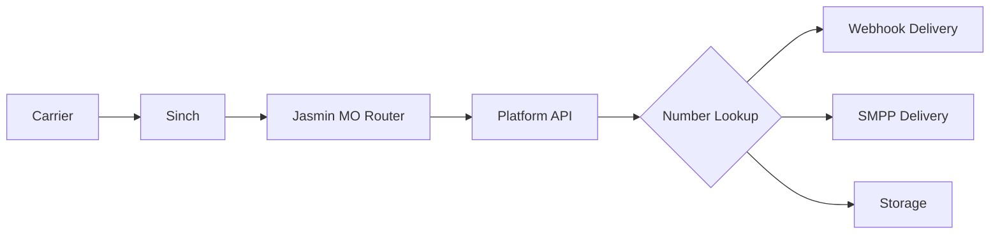

# SMS/MMS Architecture Documentation

**Last Updated:** November 25, 2025
**Status:** Production ✅

## Overview

This document defines the complete SMS/MMS architecture using a **custom Go SMPP Gateway** as the core message router, Sinch as the upstream vendor, and both REST and SMPP interfaces for customers.

> **Note:** The Go SMPP Gateway replaced Jasmin SMSC in October 2025. See [ARCHITECTURAL_DECISION_GO_SMPP.md](../architecture/ARCHITECTURAL_DECISION_GO_SMPP.md) for migration rationale.

## Architecture Components

### Core SMS Stack
```yaml
Components:
  Go SMPP Gateway:
    - Role: Message routing, vendor connections, and customer binds
    - Deployment: Kubernetes (GKE) - 3 replicas, stateless
    - Storage: PostgreSQL for vendor config, Redis for DLR tracking
    - Image: us-central1-docker.pkg.dev/ringer-warp-v01/warp-platform/smpp-gateway:v1.1.0
    - Namespace: messaging

  Sinch (Vendor):
    - Role: A2P message delivery to carriers
    - Protocol: SMPP 3.4 (TLS)
    - Connection: Sinch_Atlanta (msgbrokersmpp-atl.inteliquent.com:3601)
    - Status: Connected ✅

  Customer Interfaces:
    - REST API: Standard customers (90%)
    - SMPP: High-volume customers (10%)

  Network Egress:
    - Cloud NAT IP: 34.58.165.135 (Sinch whitelisted)
    - LoadBalancer: 34.55.43.157 (inbound customer connections)
```

## Vendor Integration (Go SMPP Gateway → Sinch)

### SMPP Bind Configuration
```yaml
Production Connection (Sinch_Atlanta):
  Host: msgbrokersmpp-atl.inteliquent.com
  Port: 3601 (TLS)
  System ID: telxMBa1
  Password: [Stored in messaging.vendors table]
  Bind Type: Transceiver
  Throughput: 100 msg/sec
  Status: Connected ✅
```

### Vendor Configuration (PostgreSQL)
```sql
-- Vendors are managed in PostgreSQL, not via CLI
-- Go SMPP Gateway auto-loads vendors on startup

SELECT instance_name, host, port, use_tls, is_active, health_status
FROM messaging.vendors
WHERE provider_type = 'smpp';

-- Result:
-- instance_name  | host                              | port | use_tls | is_active | health_status
-- Sinch_Atlanta  | msgbrokersmpp-atl.inteliquent.com | 3601 | true    | true      | healthy
```

### Adding a New Vendor
```sql
-- Simply INSERT into PostgreSQL - no CLI commands needed
INSERT INTO messaging.vendors (
    instance_name, display_name, host, port, username, password,
    use_tls, bind_type, throughput, is_active, provider_type
) VALUES (
    'Sinch_Chicago', 'Sinch Chicago', 'msgbrokersmpp-chi.inteliquent.com', 3601,
    'telxMBc1', 'encrypted_password', true, 'transceiver', 100, true, 'smpp'
);
-- Gateway will auto-connect on next startup or API call to /api/v1/admin/reload-vendors
```

## Customer Integration Options

### Option 1: REST API (Recommended)
```yaml
Endpoint: POST https://api.ringer.tel/v1/messages
Authentication: Bearer token (JWT)
Rate Limit: 10 msg/sec (default)
Features:
  - Simple integration
  - Webhook delivery
  - Automatic DLR handling
  - Media support (MMS)
```

#### REST API Flow
```javascript
// Customer sends message
POST /v1/messages
Authorization: Bearer <token>
{
  "from": "+14155551234",
  "to": "+16505556789",
  "body": "Hello",
  "webhook_url": "https://customer.com/dlr"
}

// Platform validates and routes to Go SMPP Gateway
POST smpp-gateway-api.messaging:8080/api/v1/messages
{
  "to": "16505556789",
  "from": "14155551234",
  "content": "Hello",
  "dlr_requested": true,
  "customer_id": "customer_123"
}
```

### Option 2: SMPP Bind (Enterprise)
```yaml
Connection: 34.55.43.157:2775 (smpp-gateway-server LoadBalancer)
Authentication: System ID + Password
Rate Limit: 500 msg/sec (negotiable)
Features:
  - High throughput
  - Lower latency
  - Bulk messaging
  - Direct DLR delivery
```

#### SMPP User Configuration
```sql
-- SMPP users are managed in PostgreSQL (customer_sms_auth table)
INSERT INTO messaging.customer_sms_auth (
    account_id, auth_type,
    smpp_system_id, smpp_password_hash, smpp_allowed_ips,
    smpp_max_binds, smpp_throughput
) VALUES (
    'customer_123_uuid', 'SMPP',
    'cust123_smpp', 'bcrypt_hash', ARRAY['203.0.113.0/24'],
    2, 500
);
-- Go SMPP Gateway validates binds against this table
```

## Message Routing

### Outbound Routing (Customer → Carrier)

#### Routing Decision Tree
```go
// Go SMPP Gateway routing logic (internal/routing/router.go)
func (r *Router) RouteMessage(msg *Message) (*SMPPClient, error) {
    // 1. Ownership validation
    if !r.verifyNumberOwnership(msg.CustomerID, msg.SourceAddr) {
        return nil, ErrUnauthorizedSender
    }

    // 2. Compliance checks (10DLC)
    if isUSLongcode(msg.SourceAddr) {
        campaign, err := r.get10DLCCampaign(msg.SourceAddr)
        if err != nil || campaign.Status != "ACTIVE" {
            return nil, ErrUnregisteredCampaign
        }
    }

    // 3. Rate limiting (Redis sliding window)
    if r.rateLimiter.ExceedsLimit(msg.CustomerID) {
        return nil, ErrRateLimitExceeded
    }

    // 4. Content filtering
    if containsProhibitedContent(msg.Content) {
        return nil, ErrProhibitedContent
    }

    // 5. Vendor selection (PostgreSQL-based priority routing)
    vendor, err := r.selectVendor(msg.SourceAddr, msg.DestAddr)
    if err != nil {
        return nil, err
    }

    // 6. Return vendor client for message submission
    return r.connectorMgr.GetConnector(vendor.ID)
}
```

#### Routing Table (PostgreSQL)
```sql
-- Routing rules stored in PostgreSQL, not file-based
CREATE TABLE messaging.routing_rules (
    id SERIAL PRIMARY KEY,
    priority INTEGER NOT NULL,
    dest_pattern VARCHAR(50),  -- Regex pattern (e.g., '^1.*')
    source_pattern VARCHAR(50),
    vendor_id UUID REFERENCES messaging.vendors(id),
    rate_per_msg DECIMAL(10,6),
    is_active BOOLEAN DEFAULT true
);

-- Example routes
INSERT INTO messaging.routing_rules VALUES
    (1, 10, '^1.*', NULL, 'sinch_atlanta_uuid', 0.0045, true),   -- US/Canada
    (2, 20, '^44.*', NULL, 'sinch_atlanta_uuid', 0.0180, true),  -- UK
    (3, 100, '.*', NULL, 'sinch_atlanta_uuid', 0.0050, true);    -- Default
```

### Inbound Routing (Carrier → Customer)

#### Inbound Message Flow


#### Database Lookup for Routing
```sql
-- Find customer and delivery method
SELECT
    a.account_id,
    a.company_name,
    d.number,
    d.sms_enabled,
    sr.delivery_method,
    sr.webhook_url,
    sr.webhook_secret,
    sr.smpp_user
FROM numbers.dids d
JOIN accounts.accounts a ON d.account_id = a.id
LEFT JOIN messaging.sms_routes sr ON sr.number = d.number
WHERE d.number = '+14155551234'
AND d.sms_enabled = true;
```

#### Delivery Methods
```python
def deliver_inbound_message(message, customer_config):
    if customer_config.delivery_method == 'webhook':
        # HTTP POST to customer
        response = requests.post(
            customer_config.webhook_url,
            json={
                'from': message.source_addr,
                'to': message.destination_addr,
                'body': message.short_message,
                'message_id': message.id,
                'received_at': message.timestamp
            },
            headers={
                'X-Signature': generate_signature(
                    message,
                    customer_config.webhook_secret
                )
            }
        )

    elif customer_config.delivery_method == 'smpp':
        # Deliver via SMPP (enterprise)
        jasmin.deliver_sm(
            customer_config.smpp_user,
            message
        )

    else:  # storage
        # Store for retrieval via API
        store_message(customer_config.account_id, message)
```

## Database Schema

```sql
-- SMS configuration and routing
CREATE SCHEMA IF NOT EXISTS messaging;

-- Vendor SMPP connectors (managed by admin)
CREATE TABLE messaging.vendor_connectors (
    id UUID PRIMARY KEY DEFAULT uuid_generate_v4(),
    connector_name VARCHAR(50) UNIQUE NOT NULL,
    vendor VARCHAR(50) NOT NULL, -- 'sinch', 'twilio', etc
    host VARCHAR(255) NOT NULL,
    port INTEGER NOT NULL,
    system_id VARCHAR(100) NOT NULL,
    password_encrypted TEXT NOT NULL,
    bind_type VARCHAR(20) CHECK (bind_type IN ('transmitter', 'receiver', 'transceiver')),
    max_throughput INTEGER DEFAULT 100,
    priority INTEGER DEFAULT 100,
    cost_per_sms DECIMAL(10,6),
    cost_per_mms DECIMAL(10,6),
    supports_alphanumeric BOOLEAN DEFAULT false,
    supports_unicode BOOLEAN DEFAULT true,
    active BOOLEAN DEFAULT true,
    last_bind_time TIMESTAMPTZ,
    created_at TIMESTAMPTZ DEFAULT NOW(),
    updated_at TIMESTAMPTZ DEFAULT NOW()
);

-- Customer SMS authentication
CREATE TABLE messaging.customer_sms_auth (
    id UUID PRIMARY KEY DEFAULT uuid_generate_v4(),
    account_id UUID REFERENCES accounts.accounts(id) ON DELETE CASCADE,
    auth_type VARCHAR(20) CHECK (auth_type IN ('API_KEY', 'SMPP', 'BOTH')),

    -- API authentication
    api_key VARCHAR(100) UNIQUE,
    api_secret_hash VARCHAR(255),
    api_rate_limit INTEGER DEFAULT 10, -- per second

    -- SMPP authentication
    smpp_system_id VARCHAR(50) UNIQUE,
    smpp_password_hash VARCHAR(255),
    smpp_allowed_ips INET[],
    smpp_max_binds INTEGER DEFAULT 2,
    smpp_throughput INTEGER DEFAULT 100,

    -- Common settings
    allowed_source_addresses TEXT[], -- Allowed sender IDs
    force_source_address VARCHAR(20), -- Override sender

    active BOOLEAN DEFAULT true,
    created_at TIMESTAMPTZ DEFAULT NOW(),
    UNIQUE(account_id)
);

-- Inbound message routing
CREATE TABLE messaging.inbound_routes (
    id UUID PRIMARY KEY DEFAULT uuid_generate_v4(),
    did VARCHAR(20) REFERENCES numbers.dids(number),
    account_id UUID REFERENCES accounts.accounts(id),
    delivery_method VARCHAR(20) CHECK (delivery_method IN ('webhook', 'smpp', 'storage', 'email')),

    -- Webhook delivery
    webhook_url VARCHAR(500),
    webhook_method VARCHAR(10) DEFAULT 'POST',
    webhook_secret VARCHAR(255),
    webhook_retry_count INTEGER DEFAULT 3,

    -- SMPP delivery
    smpp_system_id VARCHAR(50),

    -- Email forwarding
    email_address VARCHAR(255),

    active BOOLEAN DEFAULT true,
    created_at TIMESTAMPTZ DEFAULT NOW(),
    UNIQUE(did)
);

-- Message logs (for UI display)
CREATE TABLE messaging.message_log (
    id UUID PRIMARY KEY DEFAULT uuid_generate_v4(),
    account_id UUID REFERENCES accounts.accounts(id),
    message_id VARCHAR(100) UNIQUE, -- Jasmin message ID
    direction VARCHAR(10) CHECK (direction IN ('inbound', 'outbound')),
    source_addr VARCHAR(50),
    dest_addr VARCHAR(50),
    message_body TEXT,
    message_type VARCHAR(10) CHECK (message_type IN ('sms', 'mms')),
    media_urls TEXT[],
    status VARCHAR(50),
    dlr_status VARCHAR(50),
    segments INTEGER DEFAULT 1,
    cost DECIMAL(10,6),
    vendor_connector VARCHAR(50),
    submitted_at TIMESTAMPTZ,
    delivered_at TIMESTAMPTZ,
    created_at TIMESTAMPTZ DEFAULT NOW()
);

-- 10DLC Campaign tracking
CREATE TABLE messaging.campaigns_10dlc (
    id UUID PRIMARY KEY DEFAULT uuid_generate_v4(),
    account_id UUID REFERENCES accounts.accounts(id),
    campaign_id VARCHAR(100) UNIQUE, -- TCR campaign ID
    brand_id VARCHAR(100), -- TCR brand ID
    use_case VARCHAR(100),
    description TEXT,
    sample_messages TEXT[],
    phone_numbers TEXT[], -- Numbers registered to campaign
    throughput_limit INTEGER,
    daily_cap INTEGER,
    status VARCHAR(50),
    tcr_submission_date DATE,
    tcr_approval_date DATE,
    created_at TIMESTAMPTZ DEFAULT NOW()
);
```

## Admin UI Management

### Vendor Connector Management
```typescript
interface VendorConnectorManagement {
  // CRUD for Sinch connectors
  connectors: VendorConnector[];

  // Real-time status
  status: {
    connector_id: string;
    bind_status: 'connected' | 'disconnected' | 'connecting';
    throughput_current: number;
    throughput_max: number;
    queue_size: number;
    error_rate: number;
  }[];

  // Actions
  actions: {
    test_connection: (connector_id: string) => Promise<boolean>;
    restart_connector: (connector_id: string) => Promise<void>;
    update_throughput: (connector_id: string, tps: number) => Promise<void>;
  };

  // Routing rules
  routing: {
    add_route: (pattern: string, connector: string, priority: number) => Promise<void>;
    test_route: (phone_number: string) => Promise<string>; // Returns selected connector
  };
}
```

### Jasmin Management Interface
```typescript
interface JasminManagement {
  // Direct Jasmin API wrapper
  jasmin: {
    // Connector operations
    list_connectors: () => Promise<Connector[]>;
    add_connector: (config: ConnectorConfig) => Promise<void>;
    update_connector: (id: string, config: Partial<ConnectorConfig>) => Promise<void>;
    delete_connector: (id: string) => Promise<void>;

    // User operations (for SMPP customers)
    list_users: () => Promise<SMPPUser[]>;
    add_user: (user: SMPPUserConfig) => Promise<void>;
    update_user_quota: (uid: string, quota: number) => Promise<void>;

    // Router operations
    list_routes: () => Promise<Route[]>;
    add_route: (route: RouteConfig) => Promise<void>;
    test_route: (from: string, to: string) => Promise<RouteResult>;
  };

  // Monitoring
  metrics: {
    get_queue_size: () => Promise<number>;
    get_throughput: () => Promise<{in: number, out: number}>;
    get_error_rate: () => Promise<number>;
  };
}
```

## Customer Portal Features

### SMS Configuration Interface
```typescript
interface CustomerSMSConfiguration {
  // Phone number management
  numbers: {
    number: string;
    sms_enabled: boolean;
    mms_enabled: boolean;
    campaign_id?: string; // 10DLC
  }[];

  // Delivery configuration
  delivery: {
    method: 'webhook' | 'api_pull' | 'email';
    webhook_url?: string;
    webhook_secret?: string; // For signature validation
    email?: string;
  };

  // API credentials
  api: {
    key: string;
    secret: string; // Hidden, only shown once
    regenerate: () => Promise<{key: string, secret: string}>;
  };

  // SMPP access (enterprise only)
  smpp?: {
    enabled: boolean;
    system_id: string;
    password: string; // Hidden, only shown once
    allowed_ips: string[];
    connection_info: {
      host: string;
      port: number;
      tls_port: number;
    };
  };

  // Usage & logs
  usage: {
    messages_sent_today: number;
    messages_received_today: number;
    current_balance: number;
    view_logs: () => Promise<MessageLog[]>;
  };
}
```

### 10DLC Campaign Management
```typescript
interface CampaignManagement {
  // Brand registration
  brand: {
    status: 'unregistered' | 'pending' | 'approved';
    register: (brandInfo: BrandInfo) => Promise<void>;
  };

  // Campaign management
  campaigns: {
    list: () => Promise<Campaign[]>;
    create: (campaign: CampaignRequest) => Promise<void>;
    assign_numbers: (campaign_id: string, numbers: string[]) => Promise<void>;
    status: (campaign_id: string) => Promise<CampaignStatus>;
  };
}
```

## Message Flow Diagrams

### Complete Outbound Flow
```
1. Customer Portal/API
   ├─ Validate sender ownership
   ├─ Check 10DLC registration
   └─ Check rate limits

2. Platform API → Jasmin HTTP
   ├─ Format message
   ├─ Set routing hints
   └─ Request DLR

3. Jasmin Processing
   ├─ User authentication
   ├─ Route selection
   ├─ Queue if needed
   └─ Submit to vendor

4. Sinch SMPP
   ├─ Accept message
   ├─ Route to carrier
   └─ Return submit_sm_resp

5. Carrier Delivery
   ├─ Deliver to handset
   └─ Generate DLR

6. DLR Flow Back
   Carrier → Sinch → Jasmin → Platform → Customer
```

### Complete Inbound Flow
```
1. End User sends message

2. Carrier → Sinch
   ├─ Receive SMS/MMS
   └─ Route to customer DID

3. Sinch → Jasmin
   ├─ deliver_sm via SMPP
   └─ Include all metadata

4. Jasmin → Platform API
   ├─ HTTP callback
   └─ Message + metadata

5. Platform Processing
   ├─ Look up DID owner
   ├─ Check SMS enabled
   ├─ Get delivery prefs
   └─ Apply filters/routing

6. Delivery to Customer
   ├─ Webhook POST
   ├─ SMPP deliver_sm
   └─ Store for retrieval
```

## Configuration Management

### Environment Variables
```bash
# Go SMPP Gateway Configuration
POSTGRES_HOST=10.126.0.3
POSTGRES_PORT=5432
POSTGRES_USER=warp
POSTGRES_DB=warp
REDIS_HOST=redis-service.messaging.svc.cluster.local:6379
RABBITMQ_HOST=rabbitmq-service.messaging.svc.cluster.local:5672

# SMPP Server Configuration
SMPP_HOST=0.0.0.0
SMPP_PORT=2775
SMPP_TLS_PORT=2776
API_PORT=8080
METRICS_PORT=9090

# Vendor Configuration (loaded from PostgreSQL)
# - No hardcoded Sinch credentials
# - All vendors in messaging.vendors table
# - Auto-loaded on startup
```

### Go SMPP Gateway Kubernetes Deployment
```yaml
apiVersion: apps/v1
kind: Deployment
metadata:
  name: smpp-gateway
  namespace: messaging
spec:
  replicas: 3  # Stateless - scales horizontally
  selector:
    matchLabels:
      app: smpp-gateway
  template:
    metadata:
      labels:
        app: smpp-gateway
    spec:
      containers:
      - name: smpp-gateway
        image: us-central1-docker.pkg.dev/ringer-warp-v01/warp-platform/smpp-gateway:v1.1.0
        ports:
        - containerPort: 2775  # SMPP
        - containerPort: 2776  # SMPP TLS
        - containerPort: 8080  # Management API
        - containerPort: 9090  # Prometheus metrics
        env:
        - name: POSTGRES_HOST
          valueFrom:
            secretKeyRef:
              name: postgres-credentials
              key: host
        - name: REDIS_HOST
          value: redis-service.messaging.svc.cluster.local:6379
        resources:
          requests:
            cpu: 100m
            memory: 256Mi
          limits:
            cpu: 1000m
            memory: 1Gi
---
apiVersion: v1
kind: Service
metadata:
  name: smpp-gateway-server
  namespace: messaging
spec:
  type: LoadBalancer
  loadBalancerIP: 34.55.43.157  # Static IP for customer whitelisting
  ports:
  - name: smpp
    port: 2775
    targetPort: 2775
  - name: smpp-tls
    port: 2776
    targetPort: 2776
  selector:
    app: smpp-gateway
```

## Monitoring & Alerting

### Prometheus Metrics
```yaml
Go SMPP Gateway Metrics:
  - smpp_server_active_sessions_total
  - smpp_server_bind_requests_total{status="success|failure"}
  - smpp_server_submit_sm_total{customer_id}
  - smpp_server_deliver_sm_total{vendor_id}
  - smpp_client_connections_total{vendor_id, status}
  - smpp_client_submit_sm_total{vendor_id, status}
  - smpp_client_dlr_received_total{vendor_id, dlr_status}
  - smpp_client_throughput_current{vendor_id}
  - message_routing_duration_seconds{route}
  - message_queue_depth{priority}
  - rate_limit_exceeded_total{type="vendor|customer"}

Business Metrics:
  - sms_sent_per_customer
  - sms_received_per_customer
  - sms_cost_per_customer
  - sms_delivery_rate
  - sms_10dlc_violations
```

### Grafana Dashboards
1. **Vendor Performance**: Throughput, errors, latency per Sinch connector
2. **Customer Usage**: Messages sent/received, costs, patterns
3. **System Health**: Pod status, connection counts, errors
4. **Compliance**: 10DLC limits, violations, campaign status

## Security Considerations

### Message Security
1. **TLS for SMPP**: Use port 2776 for encrypted SMPP
2. **Webhook Signatures**: HMAC-SHA256 for webhook validation
3. **API Rate Limiting**: Per-customer limits (Redis sliding window)
4. **Content Filtering**: Block spam/phishing
5. **Number Verification**: Strict ownership validation

### Access Control
1. **Admin UI**: Role-based access for vendor management
2. **Customer API**: JWT tokens with scope limitations
3. **SMPP**: IP whitelisting + credentials
4. **Management API**: ClusterIP only (internal access)

### Network Security (Critical)
1. **Cloud NAT**: Static egress IP (34.58.165.135) for vendor whitelisting
2. **LoadBalancer**: Static IP (34.55.43.157) for customer inbound
3. **Firewall Rules**: Port 2775/2776 restricted to approved IPs

---

## Network Architecture (Cloud NAT)

### Egress IP Configuration

**Critical Requirement:** Sinch requires IP whitelisting. The Go SMPP Gateway egresses through a dedicated Cloud NAT IP.

```yaml
Cloud NAT Configuration:
  Name: warp-nat-gke
  NAT IP: 34.58.165.135 (Sinch whitelisted)
  Subnet: warp-gke-subnet (ALL_IP_RANGES)
  Purpose: GKE pod egress for SMPP vendor connections

  # Terraform configuration (infrastructure/terraform/modules/networking/main.tf)
  subnetwork {
    name                    = google_compute_subnetwork.gke_subnet.id
    source_ip_ranges_to_nat = ["ALL_IP_RANGES"]  # CRITICAL: Must cover both node and pod IPs
  }
```

**Key Lessons Learned (November 2025):**
1. `LIST_OF_SECONDARY_IP_RANGES` only NATs pod IPs, not node IPs - use `ALL_IP_RANGES` instead
2. `ENDPOINT_TYPE_GKE` doesn't exist in GCP Cloud NAT - ignore Terraform errors about this
3. GKE default SNAT must be disabled for Cloud NAT to work: `defaultSnatStatus.disabled: true`

See [SMPP_NAT_TROUBLESHOOTING_HANDOFF.md](../../SMPP_NAT_TROUBLESHOOTING_HANDOFF.md) for complete resolution details.

---

## Summary

This architecture provides:
1. **Scalable SMS/MMS delivery** via Go SMPP Gateway and Sinch
2. **Flexible customer integration** (REST and SMPP)
3. **Comprehensive routing** for inbound and outbound
4. **Full admin control** via REST API and PostgreSQL
5. **10DLC compliance** built-in
6. **Real-time monitoring** via Prometheus metrics
7. **Cloud-native design** - stateless pods, PostgreSQL config

The Go SMPP Gateway replaced Jasmin in October 2025, providing true cloud-native operation with PostgreSQL-backed configuration and multi-pod HA support.