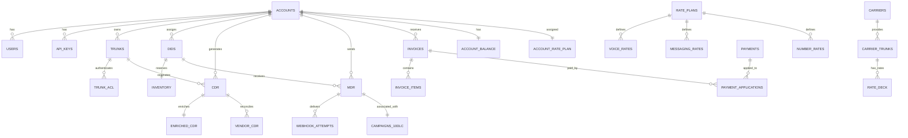

# WARP Platform Database Entity Relationship Diagram

## Overview

The WARP platform database is organized into 9 logical schemas, each responsible for a specific domain of the telecom platform. The database uses PostgreSQL 15 with extensive use of foreign key constraints, indexes, and materialized views for performance.

## Database Schemas

### 1. **accounts** - Customer Account Management
- Central schema for all customer-related data
- Links to all other schemas via account_id
- Supports hierarchical accounts for resellers

### 2. **auth** - Authentication & Authorization  
- User management and portal access
- API key management with rate limiting
- Role-based access control (RBAC)
- Session management and audit trails

### 3. **numbers** - Phone Number Inventory
- DID, toll-free, and number management
- Number porting workflow
- E911 address management
- Number availability and reservation

### 4. **routing** - SIP Routing Configuration
- Customer SIP trunks and authentication
- Carrier definitions and trunk management
- LCR (Least Cost Routing) rate decks
- Routing partitions for multi-tenancy

### 5. **cdr** - Call Detail Records
- Raw CDR storage from Kamailio
- Enriched CDR with LRN/LERG data
- Hourly summaries for reporting
- Vendor CDR for reconciliation

### 6. **messaging** - SMS/MMS Management
- Message Detail Records (MDR)
- 10DLC campaign management
- Opt-out management
- Webhook delivery tracking

### 7. **billing** - Rating & Invoicing
- Rate plans and customer assignments
- Voice, SMS, and number pricing
- Invoice generation and payments
- Tax calculation and compliance

### 8. **vendor_mgmt** - Third-Party Services
- Vendor and carrier management
- Service provider configurations (plugin architecture)
- SMPP connectors for SMS
- SLA and performance tracking

### 9. **audit** - Compliance & Logging
- Comprehensive audit trails
- API request logging
- Compliance records (STIR/SHAKEN, E911)
- Security incident tracking

## Key Entity Relationships

## Core Tables by Schema

### accounts Schema
- **accounts** - Master customer table (PK: id, UK: ban)
- **contacts** - Multiple contacts per account
- **account_hierarchy** - Parent/child relationships
- **documents** - Contracts, agreements
- **feature_flags** - Per-account feature toggles

### auth Schema
- **users** - Portal users (PK: id, UK: email)
- **api_keys** - API authentication (UK: key_prefix)
- **sessions** - Active user sessions
- **permissions** - Permission definitions
- **role_permissions** - RBAC mappings

### numbers Schema
- **inventory** - All available numbers (UK: number)
- **dids** - Customer-assigned DIDs (FK: account_id, UK: number)
- **toll_free** - Toll-free specific data
- **port_requests** - Number porting workflows
- **e911_addresses** - Emergency service addresses

### routing Schema
- **trunks** - Customer SIP trunks (FK: account_id)
- **trunk_acl** - IP whitelist for trunks
- **carriers** - Upstream carriers
- **carrier_trunks** - Carrier SIP endpoints
- **rate_deck** - LCR pricing by prefix
- **partitions** - Routing partitions
- **account_partitions** - Account-partition mapping

### cdr Schema
- **raw_cdr** - Unprocessed CDRs from Kamailio (partitioned by month)
- **enriched_cdr** - CDRs with LRN/jurisdiction data
- **hourly_summary** - Pre-aggregated metrics
- **vendor_cdr** - Carrier CDRs for reconciliation

### messaging Schema
- **mdr** - Message Detail Records
- **customer_sms_auth** - SMS API/SMPP credentials
- **inbound_routes** - DID to webhook/SMPP routing
- **campaigns_10dlc** - 10DLC campaign registration
- **opt_outs** - STOP/START management

### billing Schema
- **account_balance** - Current balance and credit
- **rate_plans** - Pricing plan definitions
- **voice_rates** - Per-minute pricing
- **messaging_rates** - Per-segment pricing
- **invoices** - Generated invoices
- **invoice_items** - Line items
- **payments** - Payment records
- **usage_summary** - Aggregated usage for billing

### vendor_mgmt Schema
- **vendors** - Third-party vendors
- **service_providers** - Plugin configurations
- **carriers** - Telecom carrier details
- **smpp_connectors** - SMS vendor connections
- **contracts** - Vendor contracts
- **performance_metrics** - SLA tracking

### audit Schema
- **audit_log** - All system changes
- **api_request_log** - API activity (partitioned)
- **compliance_records** - Regulatory compliance
- **stir_shaken_certs** - STIR/SHAKEN certificates
- **security_incidents** - Security event tracking

## Key Design Patterns

### 1. Multi-Tenancy
- All customer data tables include `account_id`
- Row-level security via foreign keys
- Routing partitions for traffic isolation

### 2. Audit Trail
- Trigger-based `updated_at` timestamps
- Comprehensive audit_log table
- Old/new value tracking for changes

### 3. Performance Optimization
- Monthly partitioning for high-volume tables (CDR, API logs)
- Materialized views for reporting
- Extensive indexing on search/join columns

### 4. Extensibility
- JSONB columns for flexible metadata
- Plugin architecture in vendor_mgmt
- Feature flags for gradual rollouts

### 5. Compliance
- Data retention policies
- Encryption references to Secret Manager
- E911 and STIR/SHAKEN tracking

## Database Conventions

### Naming Standards
- Tables: plural, snake_case (e.g., `accounts`, `raw_cdr`)
- Columns: snake_case (e.g., `account_id`, `created_at`)
- Primary keys: `id` (UUID)
- Foreign keys: `<table>_id` (e.g., `account_id`)
- Timestamps: `<action>_at` (e.g., `created_at`, `updated_at`)

### Data Types
- IDs: UUID with uuid_generate_v4()
- Money: DECIMAL(12,2) for amounts, DECIMAL(10,6) for rates
- Phone numbers: VARCHAR(32) in E.164 format
- Timestamps: TIMESTAMPTZ (always with timezone)
- IP addresses: INET type

### Constraints
- Foreign keys with appropriate CASCADE/RESTRICT
- Check constraints for enums
- Unique constraints for business keys
- NOT NULL for required fields

## Security Considerations

1. **Sensitive Data**
   - Passwords stored as hashes (bcrypt)
   - API keys stored as SHA256 hashes
   - Credentials reference Secret Manager

2. **Access Control**
   - Row-level security via account_id
   - API key scopes for fine-grained access
   - IP ACLs for trunk authentication

3. **Audit Requirements**
   - All changes logged to audit.audit_log
   - API requests logged with sanitized bodies
   - Compliance tracking for regulations

## Performance Considerations

1. **Partitioning**
   - Monthly partitions for CDR tables
   - Automatic partition creation function

2. **Indexing Strategy**
   - Primary key indexes (automatic)
   - Foreign key indexes for joins
   - Composite indexes for common queries
   - Partial indexes for filtered queries

3. **Materialized Views**
   - Hourly/daily aggregations
   - Carrier performance metrics
   - Concurrent refresh capability

4. **Connection Pooling**
   - Expected via PgBouncer
   - Connection limits per service
   - Read replicas for reporting

## Maintenance Scripts

The schema includes several maintenance functions:
- `update_updated_at_column()` - Timestamp triggers
- `calculate_lcr()` - Least cost routing
- `check_e911_compliance()` - Compliance verification
- `cleanup_expired_sessions()` - Session cleanup
- `create_monthly_partition()` - Auto-partitioning

## Migration Strategy

1. Schema files are numbered for ordered execution
2. Each file is transactional (all or nothing)
3. Seed data separated from schema
4. Backwards compatible changes only
5. Use migrations for schema updates

## Connection Information

- **Host**: 34.42.208.57 (Cloud SQL)
- **Port**: 5432
- **Database**: warp
- **SSL**: Required in production
- **Connection Pooling**: Via PgBouncer
- **Replicas**: Read replicas for analytics