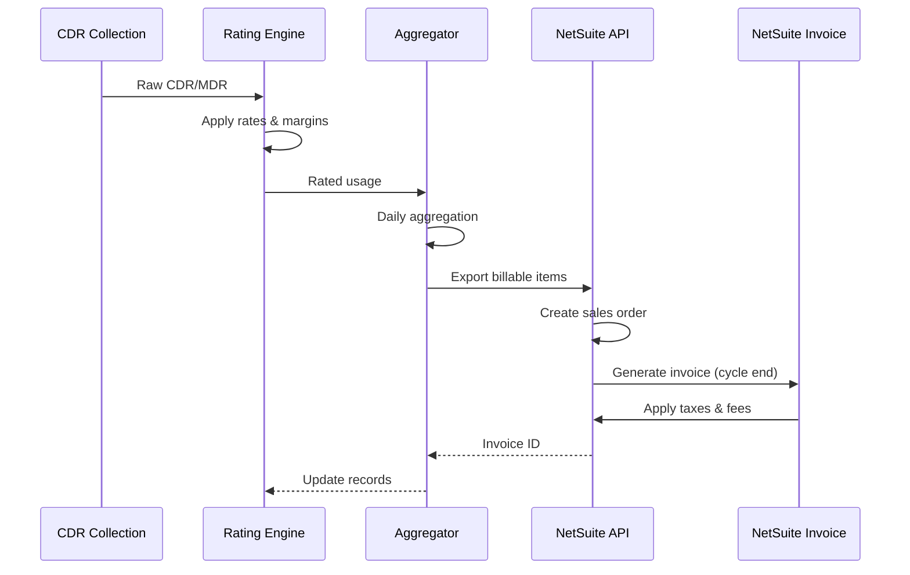

# WARP Billing & Rating System Design

## Executive Summary
Comprehensive billing system for wholesale SIP trunking and messaging services, supporting real-time rating, usage-based billing, and flexible pricing models.

## Architecture Overview

```
┌─────────────────────────────────────────────────────┐
│          Service Layer (Data Creation)               │
│  Kamailio (Voice) | Jasmin (SMS) | API Services     │
└─────────────────────────────────────────────────────┘
                        │
                        ▼
┌─────────────────────────────────────────────────────┐
│         Temporary Storage (Redis/CloudSQL)           │
│  Raw CDRs | Raw MDRs | API Usage Logs               │
└─────────────────────────────────────────────────────┘
                        │
                        ▼
┌─────────────────────────────────────────────────────┐
│      Poller Service (Enrichment & Rating)            │
│  LRN Lookup | LERG Data | Jurisdiction | Rating     │
└─────────────────────────────────────────────────────┘
                        │
                        ▼
┌─────────────────────────────────────────────────────┐
│         BigQuery (Partitioned Storage)               │
│  CDRs | MDRs | Vendor CDRs | API Usage | Analytics  │
└─────────────────────────────────────────────────────┘
                        │
                        ▼
┌─────────────────────────────────────────────────────┐
│      Biller Service (ETL to NetSuite)                │
│  Customer Terms | SKU Mapping | Usage Aggregation    │
└─────────────────────────────────────────────────────┘
                        │
                        ▼
┌─────────────────────────────────────────────────────┐
│      NetSuite (Billing & Invoicing)                  │
│  Invoice Generation | AR | Collections | Reporting   │
└─────────────────────────────────────────────────────┘
```

## 1. Data Collection Layer

### Kamailio Routing Engine Integration
```lua
-- Kamailio routing engine (LuaJIT + FFI)
function process_call(sip_msg)
    local cdr = {
        -- Core identifiers
        sip_uuid = generate_uuid(),
        sip_callid = sip_msg.callid,
        
        -- SIP headers (pseudo variables)
        sip_from = sip_msg.$fu,
        sip_rpid = sip_msg.$rpid,
        sip_contact = sip_msg.$ct,
        sip_ruri = sip_msg.$ru,
        sip_pai = sip_msg.$pai,
        sip_pci = sip_msg.$pci,
        
        -- Call details
        raw_ani = extract_ani(sip_msg),
        dni = extract_dni(sip_msg),
        
        -- Routing decision
        selected_vendor = routing_result.vendor,
        vendor_trunk = routing_result.trunk,
        routing_partition = routing_result.partition,
        
        -- Timestamps
        start_stamp = os.time(),
        customer_ban = get_customer_ban(sip_msg)
    }
    
    -- Store in Redis or CloudSQL
    store_raw_cdr(cdr)
    
    return routing_result
end
```

### Raw CDR Storage
```go
// CDR structure from routing engine
type RawCDR struct {
    // Identifiers
    ID          string    `db:"id"`
    SipUUID     string    `db:"sip_uuid"`
    SipCallID   string    `db:"sip_callid"`
    
    // SIP Headers (raw PVs)
    SipFrom     string    `db:"sip_from"`
    SipRPID     string    `db:"sip_rpid"`
    SipContact  string    `db:"sip_contact"`
    SipRURI     string    `db:"sip_ruri"`
    SipPAI      string    `db:"sip_pai"`
    SipPCI      string    `db:"sip_pci"`
    
    // Call Info
    CustomerBAN string    `db:"customer_ban"`
    RawANI      string    `db:"raw_ani"`
    DNI         string    `db:"dni"`
    Direction   string    `db:"direction"` // TERMINATING, ORIGINATING
    
    // Routing
    SelectedVendor   string `db:"selected_vendor"`
    VendorTrunk      string `db:"vendor_trunk"`
    RoutingPartition string `db:"routing_partition"`
    
    // Timestamps
    StartStamp    time.Time `db:"start_stamp"`
    ProgressStamp *time.Time `db:"progress_stamp"`
    AnswerStamp   *time.Time `db:"answer_stamp"`
    EndStamp      *time.Time `db:"end_stamp"`
    
    // Processing flags
    Enriched      bool `db:"enriched"`
    Rated         bool `db:"rated"`
    ExportedToBQ  bool `db:"exported_to_bq"`
}

type RatingResponse struct {
    VendorRate      float64
    CustomerRate    float64
    Margin          float64
    Taxes           []Tax
    Surcharges      []Surcharge
    TotalCost       float64
    Currency        string
    RatingID        string
    RuleApplied     string
}
```

### Rate Determination Logic
```sql
-- Hierarchical rate lookup with fallback
WITH rate_hierarchy AS (
  SELECT
    rate,
    priority,
    CASE
      WHEN trunk_specific_rate IS NOT NULL THEN 1
      WHEN customer_contract_rate IS NOT NULL THEN 2
      WHEN customer_class_rate IS NOT NULL THEN 3
      WHEN zone_default_rate IS NOT NULL THEN 4
      ELSE 5
    END as precedence
  FROM rating_tables
  WHERE
    customer_id = :customer_id
    AND prefix = :prefix
    AND zone = :zone
    AND effective_date <= NOW()
    AND (expiry_date IS NULL OR expiry_date > NOW())
)
SELECT * FROM rate_hierarchy
ORDER BY precedence, priority
LIMIT 1;
```

### Pricing Models

#### 1. Voice Calling
```yaml
Billing Models:
  - Per-Minute: Standard duration-based
  - Per-Second: Granular billing (6/6, 1/1)
  - Flat Rate: Unlimited calling packages
  - Tiered: Volume-based discounts
  - Committed: Pre-purchased minutes

Rate Components:
  - Base Rate: Core per-minute charge
  - Connection Fee: Per-call setup charge
  - Minimum Duration: Minimum billable seconds
  - Increment: Billing increment (1, 6, 60 seconds)
```

#### 2. SMS/MMS/RCS Messaging
```yaml
Billing Models:
  - Per-Message: Standard per-segment
  - Volume Packages: Bulk message bundles
  - Unlimited: Flat monthly rate
  - Campaign-Based: Special event pricing

Rate Components:
  - Segment Rate: Per 160-character segment
  - MMS Surcharge: Additional for multimedia
  - RCS Premium: Enhanced messaging rate
  - International Multiplier: Country-specific
  - DLR Charge: Delivery receipt fee
```

### Margin Calculation
```javascript
// Dynamic margin calculation based on volume and commitment
function calculateMargin(vendorRate, customerProfile) {
  const baseMargin = customerProfile.baseMarginPercent || 40;
  const volumeDiscount = getVolumeDiscount(customerProfile.monthlyVolume);
  const commitmentDiscount = getCommitmentDiscount(customerProfile.commitment);

  let effectiveMargin = baseMargin;
  effectiveMargin -= volumeDiscount;
  effectiveMargin -= commitmentDiscount;

  // Floor margin to ensure profitability
  effectiveMargin = Math.max(effectiveMargin, 15);

  const marginAmount = vendorRate * (effectiveMargin / 100);
  const customerRate = vendorRate + marginAmount;

  // Apply minimum rate
  return Math.max(customerRate, 0.005);
}
```

## 2. Poller Service (Enrichment & Rating)

### CDR Enrichment Pipeline
```python
class CDRPoller:
    """Harvests raw CDRs, enriches them, rates them, and stores in BigQuery"""
    
    def __init__(self):
        self.redis_client = Redis()
        self.db = CloudSQL()
        self.bq_client = BigQueryClient()
        self.telique_api = TeliqueAPI()
        self.lerg_db = LERGDatabase()
        self.somos_api = SomosAPI()
    
    def poll_and_process(self):
        """Main polling loop - runs every minute"""
        # Harvest raw CDRs
        raw_cdrs = self.harvest_raw_cdrs()
        
        for cdr in raw_cdrs:
            try:
                # Enrich based on call type
                enriched = self.enrich_cdr(cdr)
                
                # Apply rating
                rated = self.rate_cdr(enriched)
                
                # Store in BigQuery
                self.store_in_bigquery(rated)
                
                # Mark as processed
                self.mark_processed(cdr['id'])
                
            except Exception as e:
                self.handle_error(cdr, e)
    
    def harvest_raw_cdrs(self):
        """Fetch unprocessed CDRs from Redis/CloudSQL"""
        return self.db.query("""
            SELECT * FROM billing.raw_cdr 
            WHERE enriched = FALSE 
            AND created_at >= NOW() - INTERVAL '1 hour'
            ORDER BY created_at 
            LIMIT 1000
        """)
    
    def enrich_cdr(self, cdr):
        """Add LRN, LERG, jurisdiction data for BOTH ANI and DNI"""
        enriched = cdr.copy()
        
        # For ANI (Calling Party) - NANPA calls
        if self.is_nanpa(cdr['raw_ani']):
            # LRN lookup via Telique for ANI
            ani_lrn_data = self.telique_api.lookup_lrn(cdr['raw_ani'])
            enriched['ani_lrn'] = ani_lrn_data['lrn']
            enriched['ani_spid'] = ani_lrn_data['spid']
            enriched['ani_ocn'] = ani_lrn_data['ocn']
            enriched['ani_lata'] = ani_lrn_data['lata']
            
            # LERG data enrichment for ANI
            ani_lerg_data = self.lerg_db.lookup(enriched['ani_lrn'])
            enriched['ani_rate_center'] = ani_lerg_data['rate_center']
            enriched['ani_state'] = ani_lerg_data['state']
            enriched['ani_carrier_name'] = ani_lerg_data['carrier_name']
        
        # For DNI (Called Party) - NANPA calls
        if self.is_nanpa(cdr['dni']):
            # LRN lookup via Telique for DNI
            dni_lrn_data = self.telique_api.lookup_lrn(cdr['dni'])
            enriched['dni_lrn'] = dni_lrn_data['lrn']
            enriched['dni_spid'] = dni_lrn_data['spid']
            enriched['dni_ocn'] = dni_lrn_data['ocn']
            enriched['dni_lata'] = dni_lrn_data['lata']
            
            # LERG data enrichment for DNI
            dni_lerg_data = self.lerg_db.lookup(enriched['dni_lrn'])
            enriched['dni_rate_center'] = dni_lerg_data['rate_center']
            enriched['dni_state'] = dni_lerg_data['state']
            enriched['dni_carrier_name'] = dni_lerg_data['carrier_name']
            
            # Jurisdiction determination (comparing ANI vs DNI)
            enriched['jurisdiction'] = self.determine_jurisdiction(
                enriched.get('ani_ocn'), enriched.get('dni_ocn'),
                enriched.get('ani_state'), enriched.get('dni_state'),
                enriched.get('ani_lata'), enriched.get('dni_lata')
            )
        
        # For toll-free calls
        elif self.is_tollfree(cdr['dni']):
            # Get RespOrg info
            ror_data = self.somos_api.lookup_resporg(cdr['dni'])
            enriched['ror_id'] = ror_data['id']
            enriched['ror_name'] = ror_data['name']
            enriched['call_type'] = 'TOLLFREE'
        
        # For international calls
        elif self.is_international(cdr['dni']):
            enriched['call_type'] = 'INTERNATIONAL'
            enriched['country_code'] = self.extract_country_code(cdr['dni'])
        
        return enriched
    
    def determine_jurisdiction(self, ani_ocn, dni_ocn, ani_state, dni_state, ani_lata, dni_lata):
        """Determine interstate/intrastate/local jurisdiction"""
        # Local: Same OCN or same LATA
        if ani_ocn and dni_ocn and ani_ocn == dni_ocn:
            return 'LOCAL'
        if ani_lata and dni_lata and ani_lata == dni_lata:
            return 'LOCAL'
        
        # Intrastate: Same state but different OCN/LATA
        if ani_state and dni_state and ani_state == dni_state:
            return 'INTRASTATE'
        
        # Interstate: Different states
        return 'INTERSTATE'

## 3. Rating Engine

### Rate Application
```python
class RatingEngine:
    """Applies customer rates and calculates charges"""
    
    def rate_cdr(self, cdr):
        """Apply rating to enriched CDR"""
        rated = cdr.copy()
        
        # Lookup customer rate
        rate_key = self.build_rate_key(cdr)
        customer_rate = self.lookup_customer_rate(rate_key)
        
        # Lookup vendor cost
        vendor_cost = self.lookup_vendor_cost(cdr['selected_vendor'], rate_key)
        
        # Calculate billable duration
        raw_seconds = (cdr['end_stamp'] - cdr['answer_stamp']).total_seconds()
        billed_seconds = self.apply_billing_increment(raw_seconds, customer_rate['increment'])
        
        # Calculate charges
        rated['customer_rate'] = customer_rate['rate']
        rated['vendor_cost'] = vendor_cost
        rated['margin'] = customer_rate['rate'] - vendor_cost
        rated['billed_seconds'] = billed_seconds
        rated['total_charge'] = (billed_seconds / 60.0) * customer_rate['rate']
        
        # Add rating metadata
        rated['rate_zone'] = rate_key['zone']
        rated['rated_at'] = datetime.now()
        rated['rated'] = True
        
        return rated
    
    def build_rate_key(self, cdr):
        """Build rate lookup key based on call attributes"""
        return {
            'customer_ban': cdr['customer_ban'],
            'direction': cdr['direction'],
            'call_type': cdr.get('call_type', 'DOMESTIC'),
            'jurisdiction': cdr.get('jurisdiction', 'INTERSTATE'),
            'npanxx': cdr['dni'][:6] if len(cdr['dni']) >= 6 else None,
            'zone': self.determine_rate_zone(cdr)
        }
    
    def apply_billing_increment(self, seconds, increment):
        """Apply billing increment (1/1 or 6/6)"""
        if increment == 1:
            # Bill in 1-second increments
            return math.ceil(seconds)
        elif increment == 6:
            # Bill in 6-second increments
            return math.ceil(seconds / 6.0) * 6
        else:
            return math.ceil(seconds)
```

### Real-Time Usage Tracking
```sql
-- Real-time usage aggregation table
CREATE TABLE usage_metrics (
    customer_id UUID,
    trunk_id UUID,
    metric_type VARCHAR(20), -- CALLS, MINUTES, MESSAGES
    period_start TIMESTAMP,
    period_end TIMESTAMP,
    value DECIMAL(15,4),
    cost DECIMAL(15,4),
    updated_at TIMESTAMP DEFAULT NOW(),
    PRIMARY KEY (customer_id, trunk_id, metric_type, period_start)
);

-- Streaming aggregation for current billing period
CREATE MATERIALIZED VIEW current_usage AS
SELECT
    customer_id,
    trunk_id,
    SUM(CASE WHEN type = 'VOICE' THEN duration ELSE 0 END) as total_minutes,
    SUM(CASE WHEN type = 'SMS' THEN segments ELSE 0 END) as total_segments,
    COUNT(DISTINCT CASE WHEN type = 'VOICE' THEN call_id END) as total_calls,
    COUNT(DISTINCT CASE WHEN type IN ('SMS','MMS') THEN message_id END) as total_messages,
    SUM(rated_cost) as total_cost,
    MAX(updated_at) as last_update
FROM usage_metrics
WHERE period_start >= date_trunc('month', CURRENT_DATE)
GROUP BY customer_id, trunk_id
WITH NO DATA;

-- Refresh every minute
CREATE UNIQUE INDEX ON current_usage (customer_id, trunk_id);
REFRESH MATERIALIZED VIEW CONCURRENTLY current_usage;
```

## 4. BigQuery Storage Layer

### Partitioned Table Structure
```sql
-- Main CDR table (partitioned by date)
CREATE TABLE `warp_billing.cdrs_partitioned`
(
  -- Identifiers
  id STRING NOT NULL,
  sip_uuid STRING NOT NULL,
  sip_callid STRING NOT NULL,
  customer_ban STRING NOT NULL,
  
  -- Call details
  direction STRING,  -- TERMINATING, ORIGINATING
  call_type STRING,  -- DOMESTIC, TOLLFREE, INTERNATIONAL
  jurisdiction STRING,  -- INTERSTATE, INTRASTATE, LOCAL
  
  -- Timestamps
  start_stamp TIMESTAMP NOT NULL,
  answer_stamp TIMESTAMP,
  end_stamp TIMESTAMP NOT NULL,
  
  -- Party info
  raw_ani STRING,
  dni STRING,
  lrn STRING,
  
  -- ANI (Calling Party) enrichment data
  ani_lrn STRING,
  ani_spid STRING,
  ani_ocn STRING,
  ani_lata INT64,
  ani_rate_center STRING,
  ani_state STRING,
  ani_carrier_name STRING,
  
  -- DNI (Called Party) enrichment data
  dni_lrn STRING,
  dni_spid STRING,
  dni_ocn STRING,
  dni_lata INT64,
  dni_rate_center STRING,
  dni_state STRING,
  dni_carrier_name STRING,
  
  -- Rating
  customer_rate NUMERIC,
  vendor_cost NUMERIC,
  margin NUMERIC,
  billed_seconds INT64,
  total_charge NUMERIC,
  
  -- Vendor info
  selected_vendor STRING,
  vendor_trunk STRING,
  routing_partition STRING,
  
  -- Processing metadata
  rated_at TIMESTAMP,
  exported_to_ns BOOLEAN,
  netsuite_invoice_id STRING
)
PARTITION BY DATE(start_stamp)
CLUSTER BY customer_ban, direction, call_type;

-- Vendor CDR table (for performance tracking)
CREATE TABLE `warp_billing.vendor_cdrs`
(
  id STRING NOT NULL,
  customer_cdr_id STRING,
  vendor_name STRING NOT NULL,
  vendor_trunk STRING,
  
  -- Attempt info
  attempt_number INT64,
  start_stamp TIMESTAMP,
  end_stamp TIMESTAMP,
  duration_seconds INT64,
  
  -- Result
  disposition STRING,
  sip_response_code INT64,
  failure_reason STRING,
  
  -- Cost
  vendor_rate NUMERIC,
  vendor_cost NUMERIC,
  
  -- Performance
  pdd_ms INT64,
  mos_score NUMERIC,
  packet_loss NUMERIC,
  jitter_ms INT64
)
PARTITION BY DATE(start_stamp)
CLUSTER BY vendor_name, customer_cdr_id;
```

## 5. Biller Service (ETL to NetSuite)

### Daily Billing Process
```python
class BillerService:
    """ETL service that extracts usage from BigQuery and loads to NetSuite"""
    
    def __init__(self):
        self.bq_client = BigQueryClient()
        self.netsuite_api = NetSuiteAPI()
        self.customer_db = CustomerDatabase()
    
    def run_daily_billing(self):
        """Main billing process - runs daily at 2 AM"""
        # Identify customers to bill today
        customers = self.get_customers_to_bill()
        
        for customer in customers:
            try:
                # Extract usage from BigQuery
                usage = self.extract_customer_usage(customer)
                
                # Map to NetSuite SKUs
                line_items = self.map_to_skus(usage)
                
                # Send to NetSuite
                self.export_to_netsuite(customer, line_items)
                
            except Exception as e:
                self.handle_billing_error(customer, e)
    
    def get_customers_to_bill(self):
        """Find customers whose billing cycle runs today"""
        today = datetime.now()
        
        # Weekly billing (e.g., every Monday)
        weekly = self.customer_db.query("""
            SELECT * FROM customers 
            WHERE billing_cycle = 'WEEKLY' 
            AND billing_day_of_week = %s
        """, today.weekday())
        
        # Monthly billing (e.g., 1st of month)
        monthly = self.customer_db.query("""
            SELECT * FROM customers 
            WHERE billing_cycle = 'MONTHLY' 
            AND billing_day_of_month = %s
        """, today.day)
        
        return weekly + monthly
    
    def extract_customer_usage(self, customer):
        """Extract usage data from BigQuery"""
        period_start, period_end = self.get_billing_period(customer)
        
        query = """
            SELECT 
                direction,
                call_type,
                jurisdiction,
                COUNT(*) as call_count,
                SUM(billed_seconds)/60 as minutes,
                SUM(total_charge) as amount
            FROM `warp_billing.cdrs_partitioned`
            WHERE customer_ban = @customer_ban
                AND DATE(start_stamp) >= @period_start
                AND DATE(start_stamp) <= @period_end
                AND exported_to_ns = FALSE
            GROUP BY direction, call_type, jurisdiction
        """
        
        return self.bq_client.query(query, {
            'customer_ban': customer['ban'],
            'period_start': period_start,
            'period_end': period_end
        })
    
    def map_to_skus(self, usage_data):
        """Map usage to NetSuite SKUs"""
        sku_mapping = {
            ('TERMINATING', 'DOMESTIC', 'INTERSTATE'): 'SKU001',
            ('TERMINATING', 'DOMESTIC', 'INTRASTATE'): 'SKU002',
            ('TERMINATING', 'DOMESTIC', 'LOCAL'): 'SKU003',
            ('TERMINATING', 'TOLLFREE', None): 'SKU004',
            ('TERMINATING', 'INTERNATIONAL', None): 'SKU005',
            ('ORIGINATING', 'DOMESTIC', None): 'SKU006',
            ('ORIGINATING', 'TOLLFREE', None): 'SKU007',
        }
        
        line_items = []
        for row in usage_data:
            key = (row['direction'], row['call_type'], row.get('jurisdiction'))
            sku = sku_mapping.get(key, 'SKU999')  # Default SKU
            
            line_items.append({
                'sku': sku,
                'description': f"{row['direction']} {row['call_type']} {row.get('jurisdiction', '')}",
                'quantity': row['minutes'],
                'amount': row['amount'],
                'metadata': {
                    'call_count': row['call_count'],
                    'direction': row['direction'],
                    'call_type': row['call_type']
                }
            })
        
        return line_items
```

## 6. NetSuite Integration

### NetSuite API Client
```python
class NetSuiteAPI:
    """NetSuite SuiteTalk REST API integration"""
    
    def export_usage(self, customer, line_items):
        """Export usage data to NetSuite"""
        # Create usage record in NetSuite
        usage_record = {
            'recordtype': 'customrecord_warp_usage',
            'custrecord_customer': customer['netsuite_id'],
            'custrecord_period_start': customer['period_start'],
            'custrecord_period_end': customer['period_end'],
            'custrecord_line_items': json.dumps(line_items),
            'custrecord_total_amount': sum(item['amount'] for item in line_items)
        }
        
        response = self.client.post('/record/v1/customrecord_warp_usage', usage_record)
        
        # Mark CDRs as exported
        self.mark_cdrs_exported(customer, customer['period_start'], customer['period_end'])
        
        return response
```

### NetSuite Integration Points

#### 1. Customer Synchronization
```go
type NetSuiteCustomerSync struct {
    WARPCustomerID   string
    NetSuiteID       string
    SyncDirection    string  // BIDIRECTIONAL, WARP_TO_NS, NS_TO_WARP
    LastSync         time.Time
}

func (ns *NetSuiteIntegration) SyncCustomer(customer Customer) error {
    // Map WARP customer to NetSuite customer record
    nsCustomer := &NetSuiteCustomer{
        EntityID:        customer.AccountNumber,
        CompanyName:     customer.Name,
        Email:           customer.BillingEmail,
        Phone:           customer.Phone,
        Terms:           ns.mapPaymentTerms(customer.PaymentTerms),
        CreditLimit:     customer.CreditLimit,
        CustomFields: map[string]interface{}{
            "custentity_warp_id":        customer.ID,
            "custentity_trunk_count":    customer.TrunkCount,
            "custentity_billing_type":   customer.BillingType, // PREPAID, POSTPAID
            "custentity_rate_plan":      customer.RatePlanID,
        },
    }

    return ns.client.UpsertCustomer(nsCustomer)
}
```

#### 2. Usage Data Export
```python
class NetSuiteUsageExporter:
    """Exports rated usage data to NetSuite for billing"""

    def export_daily_usage(self, date):
        """Export daily usage summary to NetSuite"""

        # 1. Aggregate rated CDRs by customer
        usage_summary = self.aggregate_usage(date)

        # 2. Create billable items for NetSuite
        billable_items = []
        for customer_id, usage in usage_summary.items():
            items = self.create_billable_items(customer_id, usage, date)
            billable_items.extend(items)

        # 3. Export to NetSuite
        return self.send_to_netsuite(billable_items)

    def create_billable_items(self, customer_id, usage, date):
        """Create NetSuite billable items from usage data"""
        items = []

        # Voice usage
        if usage.voice_minutes > 0:
            items.append({
                'customer': self.get_netsuite_customer_id(customer_id),
                'item': 'VOICE_USAGE',
                'quantity': usage.voice_minutes,
                'rate': usage.voice_rate,
                'amount': usage.voice_charges,
                'description': f'Voice Usage - {date}',
                'department': 'WHOLESALE_VOICE',
                'class': usage.jurisdiction,  # INTERSTATE, INTRASTATE, etc.
                'location': usage.origination_state,
                'custom_fields': {
                    'custcol_warp_trunk_id': usage.trunk_id,
                    'custcol_call_count': usage.call_count,
                    'custcol_asr': usage.answer_seizure_ratio,
                    'custcol_acd': usage.avg_call_duration
                }
            })

        # SMS usage
        if usage.sms_segments > 0:
            items.append({
                'customer': self.get_netsuite_customer_id(customer_id),
                'item': 'SMS_USAGE',
                'quantity': usage.sms_segments,
                'rate': usage.sms_rate,
                'amount': usage.sms_charges,
                'description': f'SMS Usage - {date}',
                'department': 'MESSAGING',
                'custom_fields': {
                    'custcol_message_count': usage.message_count,
                    'custcol_delivery_rate': usage.delivery_rate
                }
            })

        # Recurring charges (handled monthly)
        if date.day == 1:  # First of month
            items.extend(self.get_recurring_charges(customer_id))

        return items

    def send_to_netsuite(self, billable_items):
        """Send billable items to NetSuite via SuiteTalk API"""

        # Batch items by customer for efficiency
        batches = self.batch_by_customer(billable_items)

        results = []
        for customer_id, items in batches.items():
            # Create sales order or invoice directly
            try:
                if self.should_create_invoice(customer_id):
                    result = self.create_invoice(customer_id, items)
                else:
                    result = self.create_sales_order(customer_id, items)
                results.append(result)
            except Exception as e:
                self.handle_export_error(customer_id, items, e)

        return results
```

### Billing Cycle Management with NetSuite
```go
type BillingCycle struct {
    CustomerID      string
    CycleType       string    // MONTHLY, SEMI_MONTHLY, WEEKLY
    CycleDay        int       // Day of month/week
    CurrentPeriod   Period
    NextBillDate    time.Time
    ProrationRules  Proration
    CutoffTime      string    // UTC time for daily cutoff
    NetSuiteConfig  NetSuiteBillingConfig
}

type NetSuiteBillingConfig struct {
    AutoCreateInvoice   bool
    InvoiceTemplate     string
    DunningLevel        int
    PaymentTerms        string
    InvoiceGrouping     string  // DAILY, WEEKLY, MONTHLY
}

func (bc *BillingCycle) ProcessBillingPeriod() error {
    // 1. Close current period in WARP
    usage := bc.collectPeriodUsage()

    // 2. Apply WARP rating engine
    ratedUsage := bc.rateUsage(usage)

    // 3. Apply adjustments/credits in WARP
    ratedUsage = bc.applyAdjustments(ratedUsage)

    // 4. Export to NetSuite for invoice generation
    nsExport := &NetSuiteExport{
        CustomerID:     bc.CustomerID,
        PeriodStart:    bc.CurrentPeriod.Start,
        PeriodEnd:      bc.CurrentPeriod.End,
        RatedItems:     ratedUsage,
        InvoiceDate:    bc.NextBillDate,
        DueDate:        bc.calculateDueDate(),
    }

    // 5. NetSuite handles invoice generation, taxes, and AR
    invoiceID, err := bc.exportToNetSuite(nsExport)
    if err != nil {
        return err
    }

    // 6. Store NetSuite invoice reference in WARP
    bc.CurrentPeriod.NetSuiteInvoiceID = invoiceID

    return nil
}
```

### NetSuite Configuration

#### 3. NetSuite API Integration
```javascript
// NetSuite SuiteTalk REST API configuration
const NetSuiteConfig = {
  account_id: process.env.NETSUITE_ACCOUNT_ID,
  consumer_key: process.env.NETSUITE_CONSUMER_KEY,
  consumer_secret: process.env.NETSUITE_CONSUMER_SECRET,
  token_id: process.env.NETSUITE_TOKEN_ID,
  token_secret: process.env.NETSUITE_TOKEN_SECRET,

  // Custom record types for telecom billing
  custom_records: {
    rated_cdr: 'customrecord_warp_rated_cdr',
    usage_summary: 'customrecord_warp_usage_summary',
    trunk_config: 'customrecord_warp_trunk'
  },

  // Item definitions for billing
  billing_items: {
    VOICE_INTERSTATE: { id: '1001', tax_code: 'TELECOM' },
    VOICE_INTRASTATE: { id: '1002', tax_code: 'TELECOM' },
    VOICE_LOCAL: { id: '1003', tax_code: 'TELECOM_LOCAL' },
    VOICE_INTL: { id: '1004', tax_code: 'INTL' },
    SMS_DOMESTIC: { id: '2001', tax_code: 'TELECOM' },
    SMS_INTL: { id: '2002', tax_code: 'INTL' },
    MMS_DOMESTIC: { id: '2003', tax_code: 'TELECOM' },
    TOLLFREE_INBOUND: { id: '3001', tax_code: 'TOLLFREE' },
    DID_RENTAL: { id: '4001', tax_code: 'RECURRING' },
    TRUNK_RENTAL: { id: '4002', tax_code: 'RECURRING' },
    E911_SERVICE: { id: '4003', tax_code: 'E911' }
  }
};
```

#### 4. SuiteScript for Custom Billing Logic
```javascript
/**
 * @NApiVersion 2.1
 * @NScriptType ScheduledScript
 * @NModuleScope SameAccount
 */
define(['N/record', 'N/search', 'N/runtime'], function(record, search, runtime) {

  function execute(context) {
    // Process daily usage data from WARP
    const usageData = getWARPUsageData();

    usageData.forEach(function(customerUsage) {
      try {
        // Check if invoice should be created
        if (shouldCreateInvoice(customerUsage)) {
          createInvoice(customerUsage);
        } else {
          // Add to pending charges
          addToPendingCharges(customerUsage);
        }
      } catch (e) {
        log.error('Invoice Creation Error', {
          customer: customerUsage.customerId,
          error: e.message
        });
      }
    });
  }

  function createInvoice(usage) {
    const invoice = record.create({
      type: record.Type.INVOICE,
      isDynamic: true
    });

    // Set customer
    invoice.setValue({
      fieldId: 'entity',
      value: usage.netsuiteCustomerId
    });

    // Add usage line items
    usage.lineItems.forEach(function(item) {
      invoice.selectNewLine({ sublistId: 'item' });

      invoice.setCurrentSublistValue({
        sublistId: 'item',
        fieldId: 'item',
        value: item.itemId
      });

      invoice.setCurrentSublistValue({
        sublistId: 'item',
        fieldId: 'quantity',
        value: item.quantity
      });

      invoice.setCurrentSublistValue({
        sublistId: 'item',
        fieldId: 'rate',
        value: item.rate
      });

      // Add custom fields for telecom metadata
      invoice.setCurrentSublistValue({
        sublistId: 'item',
        fieldId: 'custcol_jurisdiction',
        value: item.jurisdiction
      });

      invoice.setCurrentSublistValue({
        sublistId: 'item',
        fieldId: 'custcol_trunk_id',
        value: item.trunkId
      });

      invoice.commitLine({ sublistId: 'item' });
    });

    // Save invoice
    const invoiceId = invoice.save();

    // Update WARP with NetSuite invoice ID
    updateWARPInvoiceReference(usage.customerId, invoiceId);

    return invoiceId;
  }

  return {
    execute: execute
  };
});
```

### WARP Rating Engine → NetSuite Flow



### Invoice Structure in NetSuite
```json
{
  "invoice_id": "INV-2025-01-0001",
  "customer_id": "cust_abc123",
  "invoice_date": "2025-01-31",
  "due_date": "2025-02-15",
  "billing_period": {
    "start": "2025-01-01",
    "end": "2025-01-31"
  },
  "line_items": [
    {
      "category": "VOICE_OUTBOUND",
      "description": "Outbound Voice Calls - US/Canada",
      "quantity": 145632,
      "unit": "minutes",
      "rate": 0.0065,
      "amount": 946.61,
      "details": {
        "interstate": {"minutes": 98543, "amount": 640.53},
        "intrastate": {"minutes": 47089, "amount": 306.08}
      }
    },
    {
      "category": "TOLLFREE_INBOUND",
      "description": "Toll-Free Inbound",
      "quantity": 23456,
      "unit": "minutes",
      "rate": 0.018,
      "amount": 422.21
    },
    {
      "category": "SMS_OUTBOUND",
      "description": "SMS Messages - A2P",
      "quantity": 567890,
      "unit": "segments",
      "rate": 0.0075,
      "amount": 4259.18
    },
    {
      "category": "MMS_OUTBOUND",
      "description": "MMS Messages",
      "quantity": 12345,
      "unit": "messages",
      "rate": 0.025,
      "amount": 308.63
    },
    {
      "category": "NUMBER_RENTAL",
      "description": "DID Number Rental (125 numbers)",
      "quantity": 125,
      "unit": "numbers",
      "rate": 1.00,
      "amount": 125.00
    },
    {
      "category": "TRUNK_RENTAL",
      "description": "SIP Trunk Monthly Fee",
      "quantity": 5,
      "unit": "trunks",
      "rate": 25.00,
      "amount": 125.00
    }
  ],
  "usage_summary": {
    "total_calls": 45678,
    "total_minutes": 169088,
    "total_messages": 580235,
    "peak_concurrent_calls": 234,
    "countries_called": 15
  },
  "taxes_and_fees": [
    {
      "type": "FCC_USF",
      "description": "Federal Universal Service Fund",
      "rate": 0.334,
      "amount": 2068.51
    },
    {
      "type": "STATE_TAX",
      "description": "State Telecommunications Tax",
      "rate": 0.065,
      "amount": 402.51
    },
    {
      "type": "E911_FEE",
      "description": "E911 Service Fee",
      "rate": 0.75,
      "amount": 93.75
    },
    {
      "type": "REGULATORY_FEE",
      "description": "Regulatory Recovery Fee",
      "amount": 15.00
    }
  ],
  "adjustments": [
    {
      "type": "CREDIT",
      "description": "Service Credit - January Outage",
      "amount": -100.00
    },
    {
      "type": "PRORATION",
      "description": "Prorated charges for new service",
      "amount": 45.67
    }
  ],
  "payment_info": {
    "subtotal": 6186.63,
    "taxes_total": 2579.77,
    "adjustments_total": -54.33,
    "total_due": 8712.07,
    "currency": "USD",
    "payment_method": "ACH",
    "payment_terms": "NET15"
  },
  "status": "PENDING"
}
```

## 4. Payment Processing (NetSuite AR)

### NetSuite AR Integration
Payment processing is handled through NetSuite's Accounts Receivable module, with WARP providing real-time balance updates for prepaid accounts.

```go
type NetSuitePaymentSync struct {
    WARPCustomerID      string
    NetSuiteCustomerID  string
    PaymentMethod       string
    LastPaymentSync     time.Time
}

func (ns *NetSuitePaymentSync) ProcessPayment(payment Payment) error {
    // 1. Record payment in NetSuite
    nsPayment := &NetSuitePayment{
        Customer:       ns.NetSuiteCustomerID,
        Amount:         payment.Amount,
        PaymentMethod:  payment.Method,
        Reference:      payment.ReferenceNumber,
        AppliedTo:      payment.InvoiceID,
    }

    paymentID, err := ns.client.CreatePayment(nsPayment)
    if err != nil {
        return err
    }

    // 2. Update WARP for prepaid accounts
    if payment.AccountType == "PREPAID" {
        return ns.updatePrepaidBalance(payment)
    }

    // 3. Update credit exposure for postpaid
    return ns.updateCreditExposure(payment)
}
```

### Payment Methods
```yaml
Supported Methods:
  - ACH/Bank Transfer:
      processing_time: 3-5 days
      fees: $0.50 per transaction
      limits: $100,000 per transaction

  - Credit Card:
      processing_time: Immediate
      fees: 2.9% + $0.30
      limits: $50,000 per transaction

  - Wire Transfer:
      processing_time: 1-2 days
      fees: $25 per transaction
      limits: No limit

  - Prepaid Balance:
      processing_time: Immediate
      fees: None
      auto_recharge: Available
```

### Prepaid vs Postpaid
```go
type AccountType string

const (
    PREPAID  AccountType = "PREPAID"
    POSTPAID AccountType = "POSTPAID"
    HYBRID   AccountType = "HYBRID"  // Postpaid with prepaid international
)

type BillingAccount struct {
    CustomerID      string
    AccountType     AccountType
    CreditLimit     float64      // For postpaid
    PrepaidBalance  float64      // For prepaid
    AutoRecharge    *AutoRecharge
    PaymentMethod   PaymentMethod
    BillingCycle    BillingCycle
}

type AutoRecharge struct {
    Enabled         bool
    Threshold       float64  // Recharge when balance below
    Amount          float64  // Amount to recharge
    MaxPerMonth     float64  // Monthly limit
    PaymentMethod   string
}

// Real-time balance check for prepaid
func (ba *BillingAccount) AuthorizeUsage(amount float64) (bool, error) {
    if ba.AccountType == PREPAID {
        if ba.PrepaidBalance < amount {
            if ba.AutoRecharge != nil && ba.AutoRecharge.Enabled {
                if err := ba.triggerAutoRecharge(); err != nil {
                    return false, err
                }
            } else {
                return false, ErrInsufficientBalance
            }
        }
        ba.PrepaidBalance -= amount
        return true, nil
    }

    // Postpaid credit check
    currentUsage := ba.getCurrentPeriodUsage()
    if currentUsage + amount > ba.CreditLimit {
        return false, ErrCreditLimitExceeded
    }

    return true, nil
}
```

## 5. Tax & Regulatory Compliance

### Tax Calculation Engine
```python
class TaxCalculator:
    def calculate_taxes(self, invoice_lines, customer):
        taxes = []

        # Federal USF (Universal Service Fund)
        usf_rate = self.get_current_usf_rate()  # Updated quarterly
        usf_base = self.calculate_interstate_revenue(invoice_lines)
        taxes.append({
            'type': 'FCC_USF',
            'rate': usf_rate,
            'base': usf_base,
            'amount': usf_base * usf_rate
        })

        # State taxes
        state_tax = self.calculate_state_tax(
            customer.state,
            invoice_lines
        )
        taxes.extend(state_tax)

        # Local taxes
        local_tax = self.calculate_local_tax(
            customer.city,
            customer.county,
            invoice_lines
        )
        taxes.extend(local_tax)

        # E911 fees
        e911_fee = self.calculate_e911_fee(
            customer.state,
            customer.did_count
        )
        taxes.append(e911_fee)

        # Regulatory recovery fees
        regulatory_fee = self.calculate_regulatory_fee(invoice_lines)
        taxes.append(regulatory_fee)

        return taxes

    def calculate_interstate_revenue(self, lines):
        # Only interstate/international revenue subject to USF
        interstate_revenue = sum(
            line.amount for line in lines
            if line.jurisdiction in ['INTERSTATE', 'INTERNATIONAL']
        )
        return interstate_revenue * 0.645  # Safe harbor percentage
```

### Surcharge Management
```sql
-- Configurable surcharges table
CREATE TABLE surcharges (
    id UUID PRIMARY KEY,
    name VARCHAR(100),
    type VARCHAR(50), -- FLAT, PERCENTAGE, PER_UNIT
    category VARCHAR(50), -- REGULATORY, OPERATIONAL, CUSTOM
    value DECIMAL(10,4),
    unit VARCHAR(20), -- INVOICE, LINE, MINUTE, MESSAGE
    effective_date DATE,
    expiry_date DATE,
    jurisdiction VARCHAR(50),
    customer_class VARCHAR(50),
    description TEXT
);

-- Example surcharges
INSERT INTO surcharges VALUES
    ('Carrier Cost Recovery', 'PERCENTAGE', 'OPERATIONAL', 2.5, 'INVOICE'),
    ('Number Portability', 'FLAT', 'REGULATORY', 0.50, 'LINE'),
    ('STIR/SHAKEN', 'PER_UNIT', 'REGULATORY', 0.001, 'MINUTE');
```

## 6. Credit Management

### Credit Scoring & Limits
```go
type CreditProfile struct {
    CustomerID          string
    CreditScore         int
    CreditLimit         float64
    CurrentExposure     float64
    PaymentHistory      []PaymentRecord
    RiskCategory        string  // LOW, MEDIUM, HIGH
    RequiresDeposit     bool
    DepositAmount       float64
    ReviewDate          time.Time
}

func (cp *CreditProfile) CalculateCreditLimit() float64 {
    baseLimit := 1000.0

    // Credit score factor
    if cp.CreditScore > 750 {
        baseLimit *= 10
    } else if cp.CreditScore > 650 {
        baseLimit *= 5
    } else if cp.CreditScore > 550 {
        baseLimit *= 2
    }

    // Payment history factor
    onTimePayments := cp.countOnTimePayments()
    if onTimePayments > 12 {
        baseLimit *= 1.5
    }

    // Business size factor
    monthlyVolume := cp.getAverageMonthlyVolume()
    if monthlyVolume > 10000 {
        baseLimit = math.Max(baseLimit, monthlyVolume * 2)
    }

    // Risk adjustment
    if cp.RiskCategory == "HIGH" {
        baseLimit *= 0.5
    }

    return baseLimit
}
```

### Dunning Process
```yaml
Dunning Workflow:
  Day 0: Invoice issued
  Day 15: Payment due
  Day 16: Grace period begins
  Day 20: First reminder email
  Day 25: Second reminder + late fee applied
  Day 30: Final notice
  Day 35: Service suspension warning
  Day 40: Automatic service suspension
  Day 45: Collections handoff

Late Fees:
  - 1.5% monthly (18% APR)
  - Minimum $25
  - Maximum $500

Service Restoration:
  - Requires full balance payment
  - May require deposit
  - Restoration within 4 hours
```

## 7. Reporting & Analytics

### Financial Reports
```sql
-- Monthly Revenue Report
CREATE VIEW monthly_revenue AS
SELECT
    DATE_TRUNC('month', invoice_date) as month,
    COUNT(DISTINCT customer_id) as active_customers,
    SUM(subtotal) as gross_revenue,
    SUM(taxes_total) as tax_collected,
    SUM(adjustments_total) as adjustments,
    SUM(total_due) as net_revenue,
    SUM(CASE WHEN status = 'PAID' THEN total_due ELSE 0 END) as collected,
    SUM(CASE WHEN status IN ('PENDING','OVERDUE') THEN total_due ELSE 0 END) as outstanding,
    AVG(total_due) as average_invoice,
    PERCENTILE_CONT(0.5) WITHIN GROUP (ORDER BY total_due) as median_invoice
FROM invoices
GROUP BY DATE_TRUNC('month', invoice_date);

-- Customer Profitability Analysis
CREATE VIEW customer_profitability AS
SELECT
    c.customer_id,
    c.name,
    SUM(i.subtotal) as lifetime_revenue,
    SUM(u.vendor_cost) as lifetime_cost,
    SUM(i.subtotal) - SUM(u.vendor_cost) as gross_profit,
    (SUM(i.subtotal) - SUM(u.vendor_cost)) / NULLIF(SUM(i.subtotal), 0) as margin_percent,
    AVG(i.total_due) as avg_monthly_revenue,
    COUNT(DISTINCT DATE_TRUNC('month', i.invoice_date)) as months_active
FROM customers c
JOIN invoices i ON c.customer_id = i.customer_id
JOIN usage_aggregated u ON c.customer_id = u.customer_id
GROUP BY c.customer_id, c.name;
```

### Usage Analytics
```python
# Real-time usage dashboard metrics
class UsageAnalytics:
    def get_dashboard_metrics(self, customer_id):
        return {
            'current_month': {
                'minutes': self.get_current_minutes(customer_id),
                'calls': self.get_current_calls(customer_id),
                'messages': self.get_current_messages(customer_id),
                'spend': self.get_current_spend(customer_id),
                'trending': self.calculate_trend(customer_id)
            },
            'projections': {
                'end_of_month_spend': self.project_monthly_spend(customer_id),
                'credit_utilization': self.get_credit_utilization(customer_id),
                'days_until_limit': self.days_until_credit_limit(customer_id)
            },
            'comparisons': {
                'vs_last_month': self.compare_to_last_month(customer_id),
                'vs_last_year': self.compare_to_last_year(customer_id),
                'percentile': self.get_usage_percentile(customer_id)
            },
            'top_destinations': self.get_top_destinations(customer_id, limit=10),
            'peak_usage': self.get_peak_usage_times(customer_id),
            'quality_metrics': {
                'asr': self.get_answer_seizure_ratio(customer_id),
                'acd': self.get_average_call_duration(customer_id),
                'pdd': self.get_post_dial_delay(customer_id)
            }
        }
```

## 8. Integration APIs

### NetSuite Integration APIs
```yaml
# WARP to NetSuite data flow
paths:
  /billing/netsuite/sync/customers:
    post:
      summary: Sync customer to NetSuite
      requestBody:
        content:
          application/json:
            schema:
              type: object
              properties:
                customer_id: string
                create_if_missing: boolean

  /billing/netsuite/export/usage:
    post:
      summary: Export rated usage to NetSuite
      requestBody:
        content:
          application/json:
            schema:
              type: object
              properties:
                date_from: string
                date_to: string
                customer_id: string
                auto_invoice: boolean

  /billing/netsuite/invoices/{invoice_id}/sync:
    get:
      summary: Get NetSuite invoice status
      responses:
        200:
          content:
            application/json:
              schema:
                type: object
                properties:
                  netsuite_id: string
                  status: string
                  amount: number
                  payment_status: string
                  pdf_url: string
```

### Billing APIs
```yaml
# OpenAPI specification additions
paths:
  /billing/accounts/{customer_id}/balance:
    get:
      summary: Get current balance
      responses:
        200:
          content:
            application/json:
              schema:
                type: object
                properties:
                  account_type: string
                  current_balance: number
                  credit_limit: number
                  available_credit: number
                  pending_charges: number
                  last_payment: object

  /billing/accounts/{customer_id}/recharge:
    post:
      summary: Add prepaid credit
      requestBody:
        content:
          application/json:
            schema:
              type: object
              properties:
                amount: number
                payment_method: string
                auto_recharge: boolean

  /billing/rates/calculate:
    post:
      summary: Calculate rate for call/message
      requestBody:
        content:
          application/json:
            schema:
              type: object
              properties:
                customer_id: string
                trunk_id: string
                destination: string
                duration: integer
                type: string  # VOICE, SMS, MMS

  /billing/invoices/{invoice_id}/download:
    get:
      summary: Download invoice PDF
      produces:
        - application/pdf
        - text/csv

  /billing/disputes:
    post:
      summary: Create billing dispute
      requestBody:
        content:
          application/json:
            schema:
              type: object
              properties:
                invoice_id: string
                line_items: array
                reason: string
                requested_credit: number
```

### Webhooks
```json
// Invoice Generated
{
  "event": "invoice.generated",
  "invoice_id": "INV-2025-01-0001",
  "customer_id": "cust_abc123",
  "amount": 8712.07,
  "due_date": "2025-02-15",
  "invoice_url": "https://api.warp.io/invoices/INV-2025-01-0001"
}

// Payment Received
{
  "event": "payment.received",
  "payment_id": "pay_xyz789",
  "invoice_id": "INV-2025-01-0001",
  "amount": 8712.07,
  "method": "ACH",
  "timestamp": "2025-02-10T15:30:00Z"
}

// Credit Limit Warning
{
  "event": "credit.warning",
  "customer_id": "cust_abc123",
  "current_usage": 4500.00,
  "credit_limit": 5000.00,
  "utilization_percent": 90
}

// Auto-Recharge Triggered
{
  "event": "balance.recharged",
  "customer_id": "cust_abc123",
  "amount": 500.00,
  "new_balance": 523.45,
  "trigger": "auto_recharge"
}
```

## 9. Database Schema

### Core Billing Tables
```sql
-- Rate plans and contracts
CREATE TABLE rate_plans (
    id UUID PRIMARY KEY,
    name VARCHAR(100),
    type VARCHAR(50), -- STANDARD, CUSTOM, PROMOTIONAL
    status VARCHAR(20),
    effective_date DATE,
    expiry_date DATE,
    metadata JSONB
);

CREATE TABLE customer_contracts (
    id UUID PRIMARY KEY,
    customer_id UUID REFERENCES customers(id),
    rate_plan_id UUID REFERENCES rate_plans(id),
    commitment_amount DECIMAL(10,2),
    commitment_period INTEGER, -- months
    minimum_spend DECIMAL(10,2),
    start_date DATE,
    end_date DATE,
    auto_renew BOOLEAN,
    terms JSONB
);

-- Rated CDRs
CREATE TABLE rated_cdrs (
    id UUID PRIMARY KEY,
    cdr_id UUID REFERENCES cdrs(id),
    customer_id UUID,
    rated_at TIMESTAMP,
    vendor_rate DECIMAL(10,6),
    customer_rate DECIMAL(10,6),
    margin DECIMAL(10,6),
    rated_amount DECIMAL(10,4),
    taxes JSONB,
    surcharges JSONB,
    total_amount DECIMAL(10,4),
    invoice_id UUID,
    status VARCHAR(20)
);

-- Invoices
CREATE TABLE invoices (
    id UUID PRIMARY KEY,
    invoice_number VARCHAR(50) UNIQUE,
    customer_id UUID REFERENCES customers(id),
    billing_period_start DATE,
    billing_period_end DATE,
    invoice_date DATE,
    due_date DATE,
    subtotal DECIMAL(12,2),
    taxes_total DECIMAL(10,2),
    adjustments_total DECIMAL(10,2),
    total_due DECIMAL(12,2),
    currency VARCHAR(3),
    status VARCHAR(20),
    payment_status VARCHAR(20),
    line_items JSONB,
    taxes JSONB,
    metadata JSONB,
    created_at TIMESTAMP DEFAULT NOW(),
    updated_at TIMESTAMP DEFAULT NOW()
);

-- Payments
CREATE TABLE payments (
    id UUID PRIMARY KEY,
    customer_id UUID REFERENCES customers(id),
    invoice_id UUID REFERENCES invoices(id),
    amount DECIMAL(12,2),
    currency VARCHAR(3),
    method VARCHAR(50),
    reference_number VARCHAR(100),
    status VARCHAR(20),
    processed_at TIMESTAMP,
    gateway_response JSONB,
    created_at TIMESTAMP DEFAULT NOW()
);

-- Billing events audit
CREATE TABLE billing_events (
    id UUID PRIMARY KEY,
    customer_id UUID,
    event_type VARCHAR(50),
    event_data JSONB,
    user_id UUID,
    ip_address INET,
    created_at TIMESTAMP DEFAULT NOW()
);

-- Indexes for performance
CREATE INDEX idx_rated_cdrs_customer_period ON rated_cdrs(customer_id, rated_at);
CREATE INDEX idx_invoices_customer_status ON invoices(customer_id, status);
CREATE INDEX idx_payments_customer_date ON payments(customer_id, processed_at);
CREATE INDEX idx_billing_events_customer ON billing_events(customer_id, created_at);
```

## 10. Implementation Priorities

### Phase 1: Core Billing (Month 1-2)
- [ ] Basic rating engine
- [ ] CDR collection and rating
- [ ] Simple invoice generation
- [ ] Payment recording

### Phase 2: Advanced Features (Month 3-4)
- [ ] Complex rating rules
- [ ] Automated billing cycles
- [ ] Tax calculation
- [ ] Credit management

### Phase 3: Automation (Month 5-6)
- [ ] Auto-recharge
- [ ] Dunning process
- [ ] Usage alerts
- [ ] Self-service portal

### Phase 4: Analytics (Month 7-8)
- [ ] Revenue reporting
- [ ] Profitability analysis
- [ ] Usage forecasting
- [ ] Billing optimization